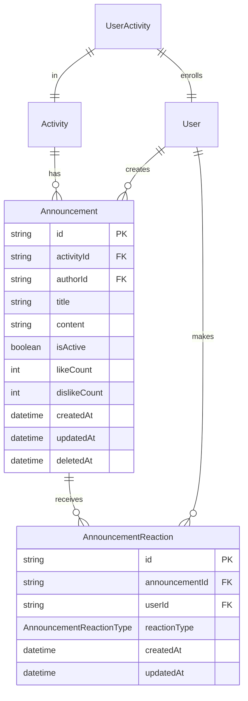

# Announcement System Data Model

## Overview

The announcement system data model consists of two primary entities: `Announcement` for storing announcement content and metadata, and `AnnouncementReaction` for tracking user reactions. The model is designed for activity-scoped communication with efficient querying and reaction tracking.

## Entity Relationship Diagram



## Prisma Schema Definition

```prisma
// File: prisma/models/announcement.prisma

model Announcement {
  id           String    @id @default(cuid())
  activityId   String
  activity     Activity  @relation(fields: [activityId], references: [id], onDelete: Cascade)
  authorId     String
  author       User      @relation("AnnouncementAuthor", fields: [authorId], references: [id], onDelete: Restrict)

  title        String    @db.VarChar(200)
  content      String    @db.Text

  isActive     Boolean   @default(true)
  likeCount    Int       @default(0)
  dislikeCount Int       @default(0)

  reactions    AnnouncementReaction[]

  createdAt    DateTime  @default(now())
  updatedAt    DateTime  @updatedAt
  deletedAt    DateTime?

  @@index([activityId, createdAt(sort: Desc)])
  @@index([authorId])
  @@index([isActive, activityId])
  @@map("announcements")
}

model AnnouncementReaction {
  id             String         @id @default(cuid())
  announcementId String
  announcement   Announcement   @relation(fields: [announcementId], references: [id], onDelete: Cascade)
  userId         String
  user           User          @relation("AnnouncementReactions", fields: [userId], references: [id], onDelete: Cascade)

  reactionType   AnnouncementReactionType

  createdAt      DateTime      @default(now())
  updatedAt      DateTime      @updatedAt

  @@unique([announcementId, userId])
  @@index([announcementId])
  @@index([userId])
  @@map("announcement_reactions")
}

enum AnnouncementReactionType {
  LIKE
  DISLIKE
}
```

## User Model Extension

```prisma
// Addition to existing User model
model User {
  // ... existing fields ...

  // Announcement relationships
  announcements         Announcement[]         @relation("AnnouncementAuthor")
  announcementReactions AnnouncementReaction[] @relation("AnnouncementReactions")

  // ... rest of model ...
}
```

## Activity Model Extension

```prisma
// Addition to existing Activity model
model Activity {
  // ... existing fields ...

  // Announcement relationship
  announcements Announcement[]

  // ... rest of model ...
}
```

## Field Specifications

### Announcement Entity

| Field | Type | Constraints | Description |
|-------|------|-------------|-------------|
| id | String | Primary Key, CUID | Unique identifier for announcement |
| activityId | String | Foreign Key, Not Null | Links announcement to specific activity |
| authorId | String | Foreign Key, Not Null | Manager who created the announcement |
| title | String | VarChar(200), Not Null | Announcement title (max 200 chars) |
| content | String | Text, Not Null | Announcement body content |
| isActive | Boolean | Default: true | Soft delete flag for announcement visibility |
| likeCount | Int | Default: 0 | Cached count of like reactions |
| dislikeCount | Int | Default: 0 | Cached count of dislike reactions |
| createdAt | DateTime | Auto-generated | Timestamp of announcement creation |
| updatedAt | DateTime | Auto-updated | Timestamp of last modification |
| deletedAt | DateTime | Nullable | Soft delete timestamp |

### AnnouncementReaction Entity

| Field | Type | Constraints | Description |
|-------|------|-------------|-------------|
| id | String | Primary Key, CUID | Unique identifier for reaction |
| announcementId | String | Foreign Key, Not Null | Links to specific announcement |
| userId | String | Foreign Key, Not Null | Student who made the reaction |
| reactionType | AnnouncementReactionType | LIKE or DISLIKE | Type of reaction |
| createdAt | DateTime | Auto-generated | Timestamp of reaction creation |
| updatedAt | DateTime | Auto-updated | Timestamp of reaction change |

## Indexes

### Performance Indexes

1. **Announcement List Query**
   - Index: `[activityId, createdAt DESC]`
   - Purpose: Efficient retrieval of announcements for an activity in chronological order

2. **Manager's Announcements**
   - Index: `[authorId]`
   - Purpose: Quick lookup of all announcements by a specific manager

3. **Active Announcements Filter**
   - Index: `[isActive, activityId]`
   - Purpose: Efficient filtering of active announcements per activity

4. **Reaction Lookups**
   - Index: `[announcementId]` on AnnouncementReaction
   - Purpose: Quick retrieval of all reactions for an announcement
   - Index: `[userId]` on AnnouncementReaction
   - Purpose: Find all reactions by a specific user

### Unique Constraints

1. **One Reaction Per User**
   - Constraint: `@@unique([announcementId, userId])`
   - Purpose: Ensures each user can have only one reaction per announcement

## Data Integrity Rules

### Cascade Rules

1. **Activity Deletion**
   - When an activity is deleted, all associated announcements are cascaded deleted
   - Ensures no orphan announcements exist

2. **Announcement Deletion**
   - When an announcement is deleted, all associated reactions are cascaded deleted
   - Maintains referential integrity

3. **User Deletion**
   - Author deletion is restricted (Restrict) to maintain announcement history
   - User reactions are cascaded deleted to allow user removal

### Soft Delete Strategy

- Announcements use soft delete pattern with `isActive` and `deletedAt` fields
- Allows audit trail maintenance and potential restoration
- Soft-deleted announcements remain in database but are excluded from normal queries

## Query Patterns

### Common Queries

```typescript
// Get active announcements for an activity
announcements = await prisma.announcement.findMany({
  where: {
    activityId: activityId,
    isActive: true
  },
  orderBy: {
    createdAt: 'desc'
  },
  include: {
    author: {
      select: {
        id: true,
        username: true,
        name: true
      }
    },
    _count: {
      select: {
        reactions: true
      }
    }
  }
});

// Get user's reaction for an announcement
reaction = await prisma.announcementReaction.findUnique({
  where: {
    announcementId_userId: {
      announcementId: announcementId,
      userId: userId
    }
  }
});

// Update reaction counts (transaction)
await prisma.$transaction([
  prisma.announcementReaction.create({
    data: {
      announcementId,
      userId,
      reactionType: 'LIKE'
    }
  }),
  prisma.announcement.update({
    where: { id: announcementId },
    data: { likeCount: { increment: 1 } }
  })
]);
```

## Migration Considerations

### Initial Migration

```sql
-- Create announcements table
CREATE TABLE announcements (
  id VARCHAR(30) PRIMARY KEY,
  activity_id VARCHAR(30) NOT NULL REFERENCES activities(id) ON DELETE CASCADE,
  author_id VARCHAR(30) NOT NULL REFERENCES users(id) ON DELETE RESTRICT,
  title VARCHAR(200) NOT NULL,
  content TEXT NOT NULL,
  is_active BOOLEAN DEFAULT true,
  like_count INTEGER DEFAULT 0,
  dislike_count INTEGER DEFAULT 0,
  created_at TIMESTAMP DEFAULT CURRENT_TIMESTAMP,
  updated_at TIMESTAMP DEFAULT CURRENT_TIMESTAMP,
  deleted_at TIMESTAMP
);

-- Create announcement_reactions table
CREATE TABLE announcement_reactions (
  id VARCHAR(30) PRIMARY KEY,
  announcement_id VARCHAR(30) NOT NULL REFERENCES announcements(id) ON DELETE CASCADE,
  user_id VARCHAR(30) NOT NULL REFERENCES users(id) ON DELETE CASCADE,
  reaction_type VARCHAR(10) NOT NULL CHECK (reaction_type IN ('LIKE', 'DISLIKE')),
  created_at TIMESTAMP DEFAULT CURRENT_TIMESTAMP,
  updated_at TIMESTAMP DEFAULT CURRENT_TIMESTAMP,
  UNIQUE(announcement_id, user_id)
);

-- Create indexes
CREATE INDEX idx_announcements_activity_created ON announcements(activity_id, created_at DESC);
CREATE INDEX idx_announcements_author ON announcements(author_id);
CREATE INDEX idx_announcements_active ON announcements(is_active, activity_id);
CREATE INDEX idx_reactions_announcement ON announcement_reactions(announcement_id);
CREATE INDEX idx_reactions_user ON announcement_reactions(user_id);
```

## Future Enhancements

### Potential Schema Extensions

1. **Announcement Categories**
   ```prisma
   model AnnouncementCategory {
     id            String @id @default(cuid())
     name          String
     color         String?
     announcements Announcement[]
   }
   ```

2. **Announcement Attachments**
   ```prisma
   model AnnouncementAttachment {
     id             String @id @default(cuid())
     announcementId String
     fileName       String
     fileUrl        String
     fileSize       Int
     mimeType       String
   }
   ```

3. **Read Receipts**
   ```prisma
   model AnnouncementRead {
     id             String @id @default(cuid())
     announcementId String
     userId         String
     readAt         DateTime @default(now())
     @@unique([announcementId, userId])
   }
   ```

4. **Scheduled Announcements**
   ```prisma
   // Additional fields for Announcement model
   publishAt      DateTime?
   expiresAt      DateTime?
   status         AnnouncementStatus @default(PUBLISHED)

   enum AnnouncementStatus {
     DRAFT
     SCHEDULED
     PUBLISHED
     EXPIRED
   }
   ```

## Performance Optimization

### Caching Strategy

1. **Reaction Counts**: Denormalized `likeCount` and `dislikeCount` avoid expensive aggregations
2. **Activity Cache**: Consider caching announcement lists per activity with TTL
3. **User Reaction Cache**: Cache user's reactions for current activity session

### Pagination

- Implement cursor-based pagination for large announcement lists
- Use `createdAt` as cursor for chronological ordering
- Limit default page size to 20 announcements

### Database Optimization

- Regular VACUUM operations for PostgreSQL
- Monitor and optimize slow queries
- Consider partitioning for high-volume activities