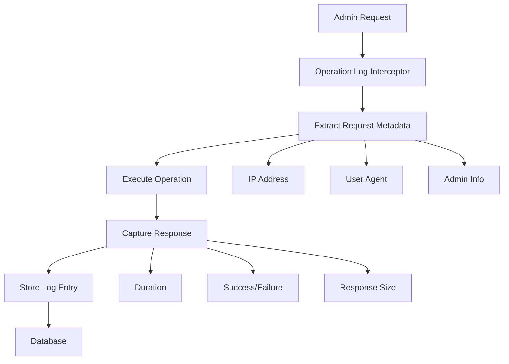

# Admin Operation Logs - Comprehensive Guide

## Overview

The Admin Operation Logs system provides comprehensive audit trails for all administrative actions performed within the system. This documentation covers all aspects of logging, monitoring, and retrieving operation logs for superadmin management.

## Table of Contents
- [Logging Architecture](#logging-architecture)
- [Log Data Structure](#log-data-structure)
- [Operation Log Types](#operation-log-types)
- [Log Retrieval APIs](#log-retrieval-apis)
- [Monitoring and Analytics](#monitoring-and-analytics)
- [Security and Compliance](#security-and-compliance)

---

## Logging Architecture

### Automatic Logging System
The system uses an interceptor-based approach to automatically log all admin operations:

```typescript
@UseInterceptors(OperationLogInterceptor)
@Controller('admin')
export class AdminController {
  // All operations are automatically logged
}
```

### Log Flow


### Components
- **OperationLogInterceptor**: Captures operation metadata
- **AdminOperationLogRepository**: Handles log storage and retrieval
- **Operation Decorators**: Mark specific operations for logging

---

## Log Data Structure

### Complete Log Entry Schema
```typescript
interface AdminOperationLog {
  id: string;                    // Unique log identifier (CUID)
  adminId: string;               // Admin who performed the action
  action: string;                // Operation type (e.g., "CREATE_ADMIN")
  resource?: string;             // Resource type (e.g., "Admin", "User")
  resourceId?: string;           // ID of affected resource
  description?: string;          // Human-readable description
  ipAddress?: string;            // Client IP address
  userAgent?: string;            // Client user agent string
  metadata: {                    // Additional operation data
    duration: number;            // Operation duration in milliseconds
    success: boolean;            // Operation success status
    responseSize?: number;       // Response size in bytes
    error?: string;              // Error message if operation failed
    errorCode?: number;          // HTTP error code if failed
    requestBody?: object;        // Sanitized request data
    changes?: object;            // Before/after values for updates
    [key: string]: any;          // Custom operation-specific data
  };
  createdAt: Date;               // Log creation timestamp
}
```

### Metadata Examples

#### Admin Creation Log
```json
{
  "id": "log_cm123456789",
  "adminId": "cm_superadmin_001",
  "action": "CREATE_ADMIN",
  "resource": "Admin",
  "resourceId": "cm_newadmin_002",
  "description": "Created new limited admin account",
  "ipAddress": "192.168.1.100",
  "userAgent": "Mozilla/5.0 (Windows NT 10.0; Win64; x64) AppleWebKit/537.36",
  "metadata": {
    "duration": 245,
    "success": true,
    "responseSize": 512,
    "newAdminType": 2,
    "newAdminUsername": "content_manager",
    "newAdminEmail": "content@company.com",
    "creator": "cm_superadmin_001"
  },
  "createdAt": "2024-01-15T10:30:00.000Z"
}
```

#### Admin Update Log
```json
{
  "id": "log_cm987654321",
  "adminId": "cm_superadmin_001",
  "action": "UPDATE_ADMIN",
  "resource": "Admin",
  "resourceId": "cm_admin_002",
  "description": "Updated admin account information",
  "ipAddress": "192.168.1.100",
  "userAgent": "Mozilla/5.0 (Windows NT 10.0; Win64; x64) AppleWebKit/537.36",
  "metadata": {
    "duration": 189,
    "success": true,
    "responseSize": 456,
    "changes": {
      "before": {
        "firstName": "John",
        "isActive": true
      },
      "after": {
        "firstName": "Jonathan",
        "isActive": false
      }
    },
    "fieldsChanged": ["firstName", "isActive"]
  },
  "createdAt": "2024-01-15T14:45:00.000Z"
}
```

#### Failed Operation Log
```json
{
  "id": "log_cm456789123",
  "adminId": "cm_admin_002",
  "action": "CREATE_ADMIN",
  "resource": "Admin",
  "resourceId": null,
  "description": "Failed to create admin - insufficient permissions",
  "ipAddress": "192.168.1.101",
  "userAgent": "Mozilla/5.0 (Mac OS X 10_15_7) AppleWebKit/605.1.15",
  "metadata": {
    "duration": 45,
    "success": false,
    "error": "Insufficient admin permissions to perform this action",
    "errorCode": 2016,
    "attemptedAdminType": 1,
    "reason": "LIMITED_ADMIN_CANNOT_CREATE_SUPER_ADMIN"
  },
  "createdAt": "2024-01-15T16:20:00.000Z"
}
```

---

## Operation Log Types

### Authentication Operations
| Action | Description | Metadata Includes |
|--------|-------------|-------------------|
| `LOGIN` | Admin login attempt | `loginMethod`, `adminType`, `sessionId` |
| `LOGOUT` | Admin logout | `sessionDuration`, `adminType` |
| `REFRESH_TOKEN` | Access token refresh | `tokenAge`, `adminType` |
| `CHANGE_PASSWORD` | Password change | `passwordStrength`, `oldPasswordAge` |

### Admin Management Operations
| Action | Description | Metadata Includes |
|--------|-------------|-------------------|
| `CREATE_ADMIN` | New admin creation | `newAdminType`, `newAdminUsername`, `creator` |
| `UPDATE_ADMIN` | Admin modification | `changes`, `fieldsChanged`, `targetAdminType` |
| `DELETE_ADMIN` | Admin deletion | `deletedAdminType`, `deletedAdminUsername`, `softDelete` |
| `ACTIVATE_ADMIN` | Admin activation | `targetAdminId`, `previousStatus` |
| `DEACTIVATE_ADMIN` | Admin deactivation | `targetAdminId`, `reason` |

### User Management Operations (by Admin)
| Action | Description | Metadata Includes |
|--------|-------------|-------------------|
| `CREATE_USER` | User creation by admin | `userType`, `userName`, `assignedRoles` |
| `UPDATE_USER` | User modification by admin | `changes`, `fieldsChanged`, `userType` |
| `DELETE_USER` | User deletion by admin | `userType`, `userName`, `deletionReason` |
| `BULK_CREATE_USERS` | Bulk user creation | `totalUsers`, `successCount`, `failureCount` |
| `BULK_UPDATE_USERS` | Bulk user updates | `affectedUsers`, `updateType` |

### System Operations
| Action | Description | Metadata Includes |
|--------|-------------|-------------------|
| `VIEW_SYSTEM_LOGS` | System log access | `logCount`, `filters`, `dateRange` |
| `EXPORT_DATA` | Data export | `exportType`, `recordCount`, `format` |
| `BULK_OPERATION` | Bulk operations | `operationType`, `affectedCount`, `successRate` |
| `SYSTEM_CONFIG_CHANGE` | Configuration changes | `configKey`, `oldValue`, `newValue` |

---

## Log Retrieval APIs

### Get Admin-Specific Logs
**Endpoint**: `GET /api/admin/:adminId/logs`

**Query Parameters**:
```typescript
{
  limit?: number;        // Default: 50, Max: 1000
  offset?: number;       // Default: 0
  action?: string;       // Filter by specific action
  resource?: string;     // Filter by resource type
  startDate?: string;    // ISO date string
  endDate?: string;      // ISO date string
  success?: boolean;     // Filter by success/failure
  sortBy?: 'createdAt' | 'action' | 'duration';
  sortOrder?: 'asc' | 'desc';
}
```

**Example Requests**:
```bash
# Get recent admin creation logs
GET /api/admin/cm_superadmin_001/logs?action=CREATE_ADMIN&limit=20

# Get failed operations in date range
GET /api/admin/cm_admin_002/logs?success=false&startDate=2024-01-01T00:00:00.000Z&endDate=2024-01-31T23:59:59.999Z

# Get logs for specific resource
GET /api/admin/cm_superadmin_001/logs?resource=Admin&action=UPDATE_ADMIN
```

### Get System-Wide Logs (Super Admin Only)
**Endpoint**: `GET /api/admin/logs/system`

**Enhanced Query Parameters**:
```typescript
{
  // All previous parameters plus:
  adminId?: string;      // Filter by specific admin
  adminType?: 1 | 2;     // Filter by admin type
  ipAddress?: string;    // Filter by IP address
  minDuration?: number;  // Filter by minimum operation duration
  maxDuration?: number;  // Filter by maximum operation duration
}
```

### Get Operation Log Analytics
**Endpoint**: `GET /api/admin/logs/analytics`  
**Access**: Super Admin Only

**Query Parameters**:
```typescript
{
  period: 'hour' | 'day' | 'week' | 'month';
  startDate?: string;
  endDate?: string;
  groupBy?: 'action' | 'admin' | 'resource' | 'success';
}
```

**Response Example**:
```json
{
  "period": "day",
  "dateRange": {
    "start": "2024-01-01T00:00:00.000Z",
    "end": "2024-01-31T23:59:59.999Z"
  },
  "totalOperations": 1247,
  "successRate": 94.5,
  "averageDuration": 156,
  "groupedData": [
    {
      "key": "CREATE_ADMIN",
      "count": 45,
      "successRate": 100,
      "avgDuration": 234
    },
    {
      "key": "UPDATE_ADMIN",
      "count": 189,
      "successRate": 96.8,
      "avgDuration": 145
    }
  ],
  "topAdmins": [
    {
      "adminId": "cm_superadmin_001",
      "username": "superadmin",
      "operationCount": 456,
      "successRate": 98.2
    }
  ]
}
```

---

## Monitoring and Analytics

### Real-Time Log Monitoring
**Endpoint**: `GET /api/admin/logs/live`  
**Access**: Super Admin Only  
**Type**: Server-Sent Events (SSE)

```javascript
const eventSource = new EventSource('/api/admin/logs/live?token=<access_token>');

eventSource.onmessage = function(event) {
  const logEntry = JSON.parse(event.data);
  console.log('New operation:', logEntry);
};
```

### Log Aggregation Endpoints

#### Operations Summary
**Endpoint**: `GET /api/admin/logs/summary`

**Response**:
```json
{
  "today": {
    "totalOperations": 142,
    "successfulOperations": 138,
    "failedOperations": 4,
    "successRate": 97.2,
    "averageDuration": 167
  },
  "thisWeek": {
    "totalOperations": 856,
    "successfulOperations": 821,
    "failedOperations": 35,
    "successRate": 95.9,
    "averageDuration": 154
  },
  "topActions": [
    {"action": "LOGIN", "count": 245},
    {"action": "UPDATE_USER", "count": 123},
    {"action": "CREATE_USER", "count": 89}
  ],
  "activeAdmins": 12,
  "systemHealth": "excellent"
}
```

#### Error Analysis
**Endpoint**: `GET /api/admin/logs/errors`

**Query Parameters**:
```typescript
{
  period?: 'day' | 'week' | 'month';
  groupBy?: 'action' | 'errorCode' | 'admin';
  limit?: number;
}
```

**Response**:
```json
{
  "period": "week",
  "totalErrors": 35,
  "errorsByType": [
    {
      "errorCode": 2016,
      "message": "Insufficient permissions",
      "count": 12,
      "percentage": 34.3
    },
    {
      "errorCode": 2018,
      "message": "Username already exists",
      "count": 8,
      "percentage": 22.9
    }
  ],
  "errorsByAdmin": [
    {
      "adminId": "cm_admin_002",
      "username": "limited_admin",
      "errorCount": 6,
      "primaryErrorType": "Insufficient permissions"
    }
  ],
  "recommendations": [
    "Review permissions for limited_admin",
    "Implement username availability check",
    "Add training for permission-related errors"
  ]
}
```

---

## Security and Compliance

### Data Protection
- **Sensitive Data Filtering**: Passwords and tokens are never logged
- **Request Sanitization**: Sensitive fields are masked in request logs
- **Data Retention**: Logs retained for configurable period (default: 2 years)
- **Access Controls**: Log access restricted by admin permissions

### Compliance Features
- **Immutable Logs**: Once created, logs cannot be modified
- **Audit Trail Integrity**: Cryptographic checksums for log verification
- **Data Export**: Compliance-ready log exports in multiple formats
- **GDPR Support**: Personal data handling and retention policies

### Security Monitoring
```json
{
  "securityEvents": [
    {
      "type": "SUSPICIOUS_LOGIN_PATTERN",
      "adminId": "cm_admin_003",
      "description": "Multiple failed login attempts from different IPs",
      "riskLevel": "HIGH",
      "timestamp": "2024-01-15T18:30:00.000Z",
      "metadata": {
        "failedAttempts": 5,
        "uniqueIPs": 3,
        "timeSpan": "15 minutes"
      }
    },
    {
      "type": "PRIVILEGE_ESCALATION_ATTEMPT",
      "adminId": "cm_admin_002",
      "description": "Attempted to create super admin account",
      "riskLevel": "CRITICAL",
      "timestamp": "2024-01-15T16:20:00.000Z",
      "metadata": {
        "attemptedAction": "CREATE_ADMIN",
        "attemptedAdminType": 1,
        "currentAdminType": 2
      }
    }
  ]
}
```

### Alerting Configuration
```typescript
interface AlertRule {
  name: string;
  condition: {
    action?: string;
    errorCode?: number;
    threshold?: number;
    timeWindow?: string;
  };
  notification: {
    email?: string[];
    webhook?: string;
    severity: 'LOW' | 'MEDIUM' | 'HIGH' | 'CRITICAL';
  };
}

// Example alert rules
const alertRules: AlertRule[] = [
  {
    name: "Multiple Failed Admin Creations",
    condition: {
      action: "CREATE_ADMIN",
      errorCode: 2016,
      threshold: 3,
      timeWindow: "1hour"
    },
    notification: {
      email: ["security@company.com"],
      severity: "HIGH"
    }
  },
  {
    name: "Bulk Operations by Limited Admin",
    condition: {
      action: "BULK_OPERATION",
      threshold: 1,
      timeWindow: "1day"
    },
    notification: {
      webhook: "https://security.company.com/webhook",
      severity: "MEDIUM"
    }
  }
];
```

---

## Performance Considerations

### Log Storage Optimization
- **Async Logging**: Non-blocking log operations
- **Batch Writes**: Bulk insert for performance
- **Indexing Strategy**: Optimized indexes for common queries
- **Archival**: Automatic archival of old logs

### Query Performance
```sql
-- Optimized indexes for common log queries
CREATE INDEX idx_admin_operation_logs_admin_action_created 
ON admin_operation_logs (admin_id, action, created_at DESC);

CREATE INDEX idx_admin_operation_logs_resource_created 
ON admin_operation_logs (resource, resource_id, created_at DESC);

CREATE INDEX idx_admin_operation_logs_created_success 
ON admin_operation_logs (created_at DESC, success);
```

### Caching Strategy
- **Recent Logs Cache**: Redis cache for frequently accessed logs
- **Analytics Cache**: Pre-computed metrics updated hourly
- **Real-time Counters**: Live operation counters for dashboards

---

## Log Retention and Archival

### Retention Policies
```typescript
interface RetentionPolicy {
  logType: string;
  retentionPeriod: string;
  archivalPeriod: string;
  compressionLevel: number;
}

const retentionPolicies: RetentionPolicy[] = [
  {
    logType: "AUTHENTICATION",
    retentionPeriod: "3years",
    archivalPeriod: "1year",
    compressionLevel: 6
  },
  {
    logType: "ADMIN_MANAGEMENT",
    retentionPeriod: "7years",
    archivalPeriod: "2years",
    compressionLevel: 9
  },
  {
    logType: "SYSTEM_OPERATIONS",
    retentionPeriod: "1year",
    archivalPeriod: "6months",
    compressionLevel: 6
  }
];
```

### Export Formats
- **JSON**: Full structured data
- **CSV**: Tabular format for analysis
- **XML**: Legacy system compatibility
- **Parquet**: Big data analytics

---

*Last Updated: January 2024*  
*Version: 1.0* 