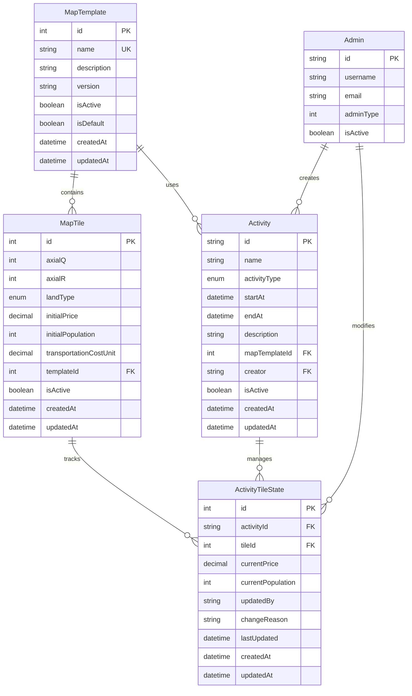

# Hexagonal Map System with Activity Tile Configuration

## Table of Contents
- [Overview](#overview)
- [Architecture](#architecture)
- [Tile Configuration System](#tile-configuration-system)
- [API Reference](#api-reference)
- [Usage Examples](#usage-examples)
- [Business Simulation Workflows](#business-simulation-workflows)
- [Migration Guide](#migration-guide)
- [Performance & Best Practices](#performance--best-practices)

## Overview

The Hexagonal Map System provides a complete implementation of a hexagonal grid-based game map for business simulation activities. The system features:

- **15x7 Hexagonal Grid**: 105 tiles per map template
- **Axial Coordinate System**: Q (column) and R (row) positioning
- **Multi-Template Support**: Different map layouts for various activity types
- **Static Tile Configuration**: Base economic and demographic data
- **Dynamic Activity States**: Real-time tile data that changes during simulations
- **Complete Audit Trail**: Track all changes with timestamps and reasons

### Key Innovation: Dual-Layer Tile Data

The system uses a unique dual-layer approach:

1. **Static Configuration Layer** (MapTile): Base template data that doesn't change
   - Initial economic values
   - Base population data
   - Infrastructure costs

2. **Dynamic State Layer** (ActivityTileState): Activity-specific data that evolves
   - Current market prices
   - Population changes
   - Real-time economic indicators

This design allows multiple activities to share the same map template while maintaining completely isolated simulation states.

## Architecture

### Core Data Models



### Component Architecture

```
Map System Architecture
├── Controllers
│   ├── MapController              # Template & tile management + tile state APIs
│   └── AdminMapTemplateController # Admin-specific template operations
├── Services
│   ├── MapService                 # Template & tile business logic
│   ├── ActivityTileStateService   # Tile state management
│   └── HexagonalGridService       # Grid calculations
├── Repositories
│   ├── MapTemplateRepository      # Template data access
│   ├── MapTileRepository          # Tile data access
│   └── ActivityTileStateRepository # Tile state data access
├── DTOs
│   ├── Map DTOs                   # Template & tile creation/updates
│   └── ActivityTileState DTOs     # Tile state operations
└── Interfaces
    └── HexagonalGrid interfaces   # Grid types & calculations
```

## Tile Configuration System

### Static Configuration (Template Level)

Each map tile includes base configuration that remains constant across activities:

| Land Type | Initial Price | Initial Population | Transportation Cost |
|-----------|--------------|-------------------|-------------------|
| Marine    | $50.00       | 0                 | $8.00/unit        |
| Coastal   | $100.00      | 500               | $5.00/unit        |
| Plain     | $150.00      | 1,000             | $3.00/unit        |

### Dynamic Configuration (Activity Level)

During activities, tiles maintain separate state that can change based on simulation events:

- **Current Price**: Market-driven pricing that fluctuates
- **Current Population**: Population that grows/shrinks based on economic conditions
- **Change Tracking**: Full audit trail of modifications
- **Administrative Controls**: Who changed what and when

### Configuration Lifecycle

```
Template Creation → Tile Definition → Activity Creation → State Initialization → Simulation Events → State Updates
       ↓                 ↓               ↓                    ↓                    ↓              ↓
   Base templates    Static config    Activity starts    Copy initial      Economic events   Price/population
   with default      per land type    with template      values to         affect tiles      changes tracked
   land types                         selection          dynamic state
```

## API Reference

### Template Management

#### Create Map Template
```http
POST /api/map/templates
Content-Type: application/json
Authorization: Bearer <admin-token>

{
  "name": "Urban Development Template",
  "description": "Template for city planning simulations",
  "version": "1.0",
  "isActive": true,
  "isDefault": false
}
```

#### Generate Template with Tiles
```http
POST /api/map/templates/generate
Content-Type: application/json
Authorization: Bearer <admin-token>

{
  "templateName": "Economic Zones Template",
  "description": "Mixed economic development zones",
  "width": 15,
  "height": 7,
  "marinePercentage": 30,
  "coastalPercentage": 35,
  "plainPercentage": 35,
  "randomSeed": 12345
}
```

### Tile Management

#### Create Tile with Custom Configuration
```http
POST /api/map/tiles
Content-Type: application/json
Authorization: Bearer <admin-token>

{
  "axialQ": 0,
  "axialR": 0,
  "landType": "PLAIN",
  "templateId": 1,
  "initialPrice": 200.00,
  "initialPopulation": 1500,
  "transportationCostUnit": 2.50
}
```

#### Query Tiles with Filters
```http
GET /api/map/tiles?templateId=1&landType=COASTAL&page=1&pageSize=20
```

### Activity Tile State Management

#### Initialize Activity Tile States
```http
POST /api/map/activities/{activityId}/tile-states/initialize
Authorization: Bearer <admin-token>

Response:
{
  "success": true,
  "data": [...],
  "count": 105,
  "message": "Activity tile states initialized successfully"
}
```

#### Update Individual Tile State
```http
PUT /api/map/activities/{activityId}/tiles/{tileId}/state
Authorization: Bearer <admin-token>
Content-Type: application/json

{
  "currentPrice": 175.50,
  "currentPopulation": 1250,
  "changeReason": "New industrial development increased demand"
}

Response:
{
  "success": true,
  "data": {
    "id": 123,
    "activityId": "activity_123",
    "tileId": 45,
    "currentPrice": 175.50,
    "currentPopulation": 1250,
    "lastUpdated": "2025-07-20T14:30:00Z",
    "changeReason": "New industrial development increased demand",
    "updatedBy": "admin_456"
  }
}
```

#### Bulk Update Tile States
```http
PUT /api/map/activities/{activityId}/tile-states/bulk
Authorization: Bearer <admin-token>
Content-Type: application/json

{
  "updates": [
    {
      "tileId": 1,
      "currentPrice": 180.00,
      "changeReason": "Economic growth in region"
    },
    {
      "tileId": 2,
      "currentPopulation": 1300,
      "changeReason": "Migration from nearby area"
    },
    {
      "tileId": 3,
      "currentPrice": 160.00,
      "currentPopulation": 900,
      "changeReason": "Industrial relocation"
    }
  ],
  "globalChangeReason": "Q2 Market Adjustment Event",
  "updatedBy": "admin_456"
}

Response:
{
  "success": true,
  "data": {
    "updated": 3,
    "failed": 0,
    "details": [
      { "tileId": 1, "success": true },
      { "tileId": 2, "success": true },
      { "tileId": 3, "success": true }
    ]
  }
}
```

#### Reset Tile States to Initial Values
```http
POST /api/map/activities/{activityId}/tile-states/reset
Authorization: Bearer <admin-token>

Response:
{
  "success": true,
  "data": { "updatedCount": 105 },
  "message": "Reset 105 tile states to initial values"
}
```

#### Get Activity Tile Statistics
```http
GET /api/map/activities/{activityId}/tile-statistics

Response:
{
  "success": true,
  "data": {
    "totalTiles": 105,
    "tilesWithPrice": 105,
    "tilesWithPopulation": 78,
    "averagePrice": 125.75,
    "averagePopulation": 650,
    "minPrice": 45.00,
    "maxPrice": 220.00,
    "minPopulation": 0,
    "maxPopulation": 1800,
    "totalPopulation": 50700
  }
}
```

#### Query Tile States with Advanced Filters
```http
GET /api/map/activity-tile-states?activityId=activity_123&minCurrentPrice=100&maxCurrentPrice=200&minCurrentPopulation=500&page=1&pageSize=20

Response:
{
  "success": true,
  "data": [...],
  "meta": {
    "total": 45,
    "page": 1,
    "pageSize": 20,
    "totalPages": 3,
    "hasNext": true,
    "hasPrev": false
  }
}
```

## Usage Examples

### Complete Activity Workflow

#### 1. Create Activity with Map Template
```typescript
// Create new activity
const activity = await activityService.createActivity({
  name: 'Q3 Strategic Planning Simulation',
  activityType: 'BizSimulation3_1',
  startAt: new Date('2025-08-01T09:00:00Z'),
  endAt: new Date('2025-08-01T17:00:00Z'),
  description: 'Advanced strategic planning with market dynamics',
  mapTemplateId: 1  // Use existing template
}, adminId);

console.log(`Created activity: ${activity.id}`);
```

#### 2. Initialize Tile States from Template
```typescript
// Initialize all tile states based on template configuration
const tileStates = await activityTileStateService.initializeTileStatesForActivity(
  activity.id,
  adminId
);

console.log(`Initialized ${tileStates.length} tile states`);
// Output: Initialized 105 tile states
```

#### 3. Simulate Market Events
```typescript
// Simulate economic boom in coastal regions
const coastalTiles = await mapService.queryTiles({
  templateId: 1,
  landType: 'COASTAL',
  pageSize: 100
});

const coastalUpdates = coastalTiles.data.map(tile => ({
  tileId: tile.id,
  currentPrice: tile.initialPrice * 1.25, // 25% price increase
  currentPopulation: Math.floor(tile.initialPopulation * 1.15), // 15% population growth
  changeReason: 'Economic boom in coastal development'
}));

const bulkResult = await activityTileStateService.bulkUpdateActivityTileStates(
  activity.id,
  {
    updates: coastalUpdates,
    globalChangeReason: 'Coastal Economic Boom Event',
    updatedBy: adminId
  },
  adminId
);

console.log(`Updated ${bulkResult.updated} coastal tiles`);
```

#### 4. Monitor Activity Progress
```typescript
// Get current statistics
const stats = await activityTileStateService.getActivityTileStatistics(activity.id);

console.log('Activity Statistics:');
console.log(`Average Price: $${stats.averagePrice}`);
console.log(`Total Population: ${stats.totalPopulation}`);
console.log(`Price Range: $${stats.minPrice} - $${stats.maxPrice}`);
```

#### 5. Reset for Alternative Scenario
```typescript
// Reset to try different strategy
const resetCount = await activityTileStateService.resetActivityTileStatesToInitial(
  activity.id,
  adminId
);

console.log(`Reset ${resetCount} tiles to initial state for new scenario`);
```

### Advanced Simulation Scenarios

#### Market Crash Simulation
```typescript
// Simulate economic downturn affecting all tiles
const allTileStates = await activityTileStateService.getActivityTileStatesByActivity(activity.id);

const crashUpdates = allTileStates.map(state => ({
  tileId: state.tileId,
  currentPrice: Math.max(state.currentPrice * 0.7, state.tile.initialPrice * 0.5), // 30% drop, min 50% of initial
  currentPopulation: Math.floor(state.currentPopulation * 0.9), // 10% population decrease
  changeReason: 'Economic recession impact'
}));

await activityTileStateService.bulkUpdateActivityTileStates(
  activity.id,
  {
    updates: crashUpdates,
    globalChangeReason: 'Market Crash Simulation',
    updatedBy: adminId
  },
  adminId
);
```

#### Infrastructure Development
```typescript
// Simulate new transportation infrastructure reducing costs
const plainTiles = await mapService.queryTiles({
  templateId: 1,
  landType: 'PLAIN',
  pageSize: 100
});

// Update plain tiles with improved transportation efficiency
for (const tile of plainTiles.data) {
  await activityTileStateService.updateActivityTileState(
    activity.id,
    tile.id,
    {
      currentPrice: tile.initialPrice * 1.1, // Slight price increase due to accessibility
      changeReason: 'New highway construction improved accessibility'
    },
    adminId
  );
}
```

## Business Simulation Workflows

### Workflow 1: Urban Development Planning

```typescript
class UrbanDevelopmentSimulation {
  async runSimulation(activityId: string, adminId: string) {
    // Phase 1: Initial assessment
    const initialStats = await this.getBaselineStatistics(activityId);
    
    // Phase 2: Zoning decisions
    await this.implementZoningChanges(activityId, adminId);
    
    // Phase 3: Infrastructure investment
    await this.buildInfrastructure(activityId, adminId);
    
    // Phase 4: Market response
    await this.simulateMarketResponse(activityId, adminId);
    
    // Phase 5: Final assessment
    const finalStats = await this.getFinalStatistics(activityId);
    
    return this.generateReport(initialStats, finalStats);
  }

  private async implementZoningChanges(activityId: string, adminId: string) {
    // Increase density in coastal areas
    const coastalUpdates = await this.prepareCoastalDevelopment();
    
    await activityTileStateService.bulkUpdateActivityTileStates(
      activityId,
      {
        updates: coastalUpdates,
        globalChangeReason: 'High-density coastal zoning implementation',
        updatedBy: adminId
      },
      adminId
    );
  }

  private async buildInfrastructure(activityId: string, adminId: string) {
    // Connect plain areas with better transportation
    const plainTiles = await this.getPlainTiles();
    
    const infrastructureUpdates = plainTiles.map(tile => ({
      tileId: tile.id,
      currentPrice: tile.currentPrice * 1.15,
      currentPopulation: Math.floor(tile.currentPopulation * 1.2),
      changeReason: 'Transportation infrastructure development'
    }));

    await activityTileStateService.bulkUpdateActivityTileStates(
      activityId,
      {
        updates: infrastructureUpdates,
        globalChangeReason: 'Infrastructure Development Phase',
        updatedBy: adminId
      },
      adminId
    );
  }
}
```

### Workflow 2: Economic Policy Impact Analysis

```typescript
class EconomicPolicySimulation {
  async testTaxPolicy(activityId: string, adminId: string, taxRate: number) {
    // Save current state for comparison
    const beforeState = await this.captureCurrentState(activityId);
    
    // Apply tax policy effects
    await this.applyTaxEffects(activityId, adminId, taxRate);
    
    // Simulate business response
    await this.simulateBusinessResponse(activityId, adminId, taxRate);
    
    // Analyze results
    const afterState = await this.captureCurrentState(activityId);
    
    return this.analyzePolicyImpact(beforeState, afterState, taxRate);
  }

  private async applyTaxEffects(activityId: string, adminId: string, taxRate: number) {
    const allStates = await activityTileStateService.getActivityTileStatesByActivity(activityId);
    
    const taxUpdates = allStates.map(state => {
      // Higher taxes reduce prices but might affect population differently by land type
      const priceMultiplier = 1 - (taxRate * 0.1); // 10% price reduction per 1% tax
      const populationEffect = this.calculatePopulationEffect(state.tile.landType, taxRate);
      
      return {
        tileId: state.tileId,
        currentPrice: state.currentPrice * priceMultiplier,
        currentPopulation: Math.floor(state.currentPopulation * populationEffect),
        changeReason: `Tax policy implementation: ${taxRate}% rate`
      };
    });

    await activityTileStateService.bulkUpdateActivityTileStates(
      activityId,
      {
        updates: taxUpdates,
        globalChangeReason: `Economic Policy Test: ${taxRate}% Tax Rate`,
        updatedBy: adminId
      },
      adminId
    );
  }

  private calculatePopulationEffect(landType: string, taxRate: number): number {
    // Different land types respond differently to tax changes
    switch (landType) {
      case 'MARINE':
        return 1.0; // No direct population effect on marine tiles
      case 'COASTAL':
        return 1 - (taxRate * 0.05); // Coastal areas more sensitive
      case 'PLAIN':
        return 1 - (taxRate * 0.03); // Plain areas less sensitive
      default:
        return 1 - (taxRate * 0.04);
    }
  }
}
```

## Migration Guide

### For Existing Systems

#### 1. Database Migration
The system automatically handles existing data:
- All existing tiles get default configuration values based on land type
- Existing activities can initialize tile states retroactively
- No data loss or breaking changes

#### 2. API Updates
```typescript
// Before: Simple tile creation
const tile = await mapService.createTile({
  axialQ: 0,
  axialR: 0,
  landType: 'PLAIN',
  templateId: 1
});

// After: Enhanced tile creation with configuration
const tile = await mapService.createTile({
  axialQ: 0,
  axialR: 0,
  landType: 'PLAIN',
  templateId: 1,
  initialPrice: 150.00,        // New: static configuration
  initialPopulation: 1000,     // New: static configuration
  transportationCostUnit: 3.00 // New: static configuration
});
```

#### 3. Activity Integration
```typescript
// After activity creation, initialize tile states
const activity = await activityService.createActivity(activityData, adminId);

// New: Initialize tile states for the activity
const tileStates = await activityTileStateService.initializeTileStatesForActivity(
  activity.id,
  adminId
);
```

### Migration Checklist

- [ ] Run database migration: `pnpm run prisma:migrate`
- [ ] Update client code to handle optional static configuration fields
- [ ] Add tile state initialization to activity creation workflows
- [ ] Update documentation and training materials
- [ ] Test bulk operations with realistic data volumes
- [ ] Verify audit trail functionality for compliance requirements

## Performance & Best Practices

### Performance Optimizations

1. **Database Indexing**
   ```sql
   -- Optimized indexes for common queries
   CREATE INDEX idx_activity_tile_state_activity ON activity_tile_states(activityId);
   CREATE INDEX idx_activity_tile_state_tile ON activity_tile_states(tileId);
   CREATE INDEX idx_activity_tile_state_price ON activity_tile_states(currentPrice);
   CREATE INDEX idx_activity_tile_state_population ON activity_tile_states(currentPopulation);
   ```

2. **Bulk Operations**
   - Use bulk update endpoints for multiple tile changes
   - Batch size recommendation: 50-100 tiles per request
   - Implement client-side batching for large updates

3. **Query Optimization**
   ```typescript
   // Efficient: Query with specific filters
   const tileStates = await activityTileStateService.getActivityTileStates({
     activityId: 'activity_123',
     minCurrentPrice: 100,
     maxCurrentPrice: 200,
     page: 1,
     pageSize: 20
   });

   // Avoid: Loading all tile states without filters
   const allStates = await activityTileStateService.getActivityTileStatesByActivity('activity_123');
   ```

### Best Practices

#### 1. Activity Lifecycle Management
```typescript
class ActivityLifecycleManager {
  async createActivity(activityData: CreateActivityDto, adminId: string) {
    // 1. Create activity
    const activity = await activityService.createActivity(activityData, adminId);
    
    // 2. Initialize tile states immediately
    await activityTileStateService.initializeTileStatesForActivity(activity.id, adminId);
    
    // 3. Log activity creation
    logger.info(`Activity ${activity.id} created with ${tileCount} tile states initialized`);
    
    return activity;
  }

  async cleanupActivity(activityId: string, adminId: string) {
    // Tile states are automatically cleaned up due to cascade delete
    await activityService.deleteActivity(activityId, adminId);
  }
}
```

#### 2. Change Tracking Standards
```typescript
// Always provide meaningful change reasons
await activityTileStateService.updateActivityTileState(
  activityId,
  tileId,
  {
    currentPrice: newPrice,
    currentPopulation: newPopulation,
    changeReason: 'Q3 market adjustment based on consumer demand analysis' // Descriptive reason
  },
  adminId
);

// Use consistent naming for bulk operations
await activityTileStateService.bulkUpdateActivityTileStates(
  activityId,
  {
    updates: updates,
    globalChangeReason: 'Infrastructure Development Phase 2', // Clear phase identifier
    updatedBy: adminId
  },
  adminId
);
```

#### 3. Error Handling
```typescript
class TileStateManager {
  async safeBulkUpdate(activityId: string, updates: TileUpdate[], adminId: string) {
    try {
      const result = await activityTileStateService.bulkUpdateActivityTileStates(
        activityId,
        { updates, updatedBy: adminId },
        adminId
      );

      if (result.failed > 0) {
        logger.warn(`Bulk update had ${result.failed} failures:`, result.details);
        // Handle partial failures appropriately
      }

      return result;
    } catch (error) {
      logger.error('Bulk update failed completely:', error);
      throw new BusinessException('BULK_UPDATE_FAILED', error.message);
    }
  }
}
```

#### 4. Monitoring and Analytics
```typescript
class ActivityAnalytics {
  async generateActivityReport(activityId: string) {
    const stats = await activityTileStateService.getActivityTileStatistics(activityId);
    const tileStates = await activityTileStateService.getActivityTileStatesByActivity(activityId);
    
    return {
      summary: stats,
      priceDistribution: this.analyzePriceDistribution(tileStates),
      populationGrowth: this.analyzePopulationGrowth(tileStates),
      landTypeAnalysis: this.analyzeLandTypePerformance(tileStates),
      changeFrequency: this.analyzeChangeFrequency(tileStates)
    };
  }

  private analyzePriceDistribution(tileStates: TileState[]) {
    // Analyze price changes by land type, region, etc.
    return {
      byLandType: this.groupByLandType(tileStates),
      priceRanges: this.calculatePriceRanges(tileStates),
      volatility: this.calculatePriceVolatility(tileStates)
    };
  }
}
```

### Security Considerations

1. **Access Control**: All tile state modifications require admin authentication
2. **Audit Trail**: Complete change history with admin identification
3. **Input Validation**: Strict validation on all price and population values
4. **Rate Limiting**: Implement rate limiting on bulk update endpoints
5. **Data Integrity**: Foreign key constraints ensure data consistency

### Monitoring & Alerts

```typescript
// Set up monitoring for critical operations
const monitoringConfig = {
  bulkUpdateThresholds: {
    maxTilesPerRequest: 100,
    maxRequestsPerMinute: 10,
    alertOnFailureRate: 0.1 // Alert if 10% of updates fail
  },
  performanceThresholds: {
    maxQueryTime: 5000, // 5 seconds
    maxBulkUpdateTime: 30000 // 30 seconds
  }
};
```

## Seed Data

The system includes comprehensive seed data for development and testing:

### Map Template Seed
- **Default Template**: A balanced hexagonal map with 105 tiles
- **Land Distribution**: 35 tiles each of MARINE, COASTAL, and PLAIN types
- **Static Configuration**: Each tile includes realistic economic parameters based on land type

### Activity Tile State Seed
- **Automatic Initialization**: Tile states are automatically created for all existing activities
- **Scenario-Based Data**: Different simulation scenarios based on activity type and timing:
  - **Initial State**: 1.0x multipliers for future activities
  - **Ongoing Activities**: 1.05-1.12x multipliers with market fluctuations
  - **Completed Activities**: 1.15-1.35x multipliers showing growth outcomes
- **Land Type Variations**: Coastal areas show higher appreciation, marine areas remain stable
- **Realistic Ranges**: Price and population variations within reasonable economic bounds

#### Seed Data Statistics
- **Activities Seeded**: 11 active business simulation activities
- **Total Tile States**: 1,155 (105 tiles × 11 activities)
- **Price Range**: $43.88 - $224.51 (varying by land type and scenario)
- **Population Range**: 0 - 1,400+ (based on land type and growth scenarios)
- **Change Tracking**: All states include audit trails with business reasons

#### Running Seed Data
```bash
# Generate all seed data including activity tile states
pnpm run prisma:seed

# Or run just the activity tile states seed
pnpm exec ts-node -r tsconfig-paths/register prisma/seeds/activity-tile-state.seed.ts
```

The seed data provides realistic test scenarios for:
- Economic simulation testing
- API endpoint validation
- Performance testing with realistic data volumes
- Business logic verification across different activity states

This comprehensive documentation provides everything needed to understand, implement, and maintain the hexagonal map system with activity tile configuration for business simulations. 