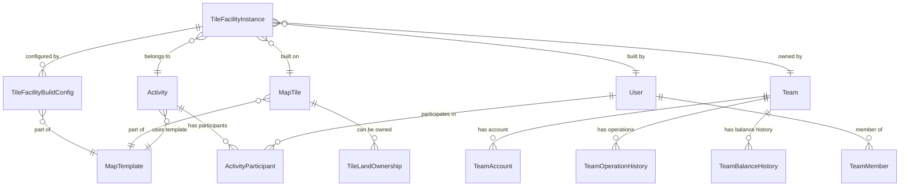

# Facility Data Model Documentation

## Overview

The Facility Data Model defines the complete database schema for the facility building system, including entity relationships, constraints, indexes, and data flow patterns. This system supports comprehensive facility management with proper audit trails, resource tracking, and integration with existing land ownership and team account systems.

## Core Entity Relationships



## Primary Entities

### TileFacilityInstance

The central entity tracking all built facility instances.

```prisma
model TileFacilityInstance {
  id               String                 @id @default(cuid())
  facilityType     FacilityType          
  level            Int                   @default(1)
  status           FacilityInstanceStatus @default(ACTIVE)
  
  // Build costs (historical record)
  buildGoldCost    Decimal               @db.Decimal(65,3)
  buildCarbonCost  Decimal               @db.Decimal(65,3)
  totalUpgradeCost Decimal               @default(0) @db.Decimal(65,3)
  
  // Timing information
  constructionStarted   DateTime          @default(now())
  constructionCompleted DateTime?
  
  // Performance metrics (nullable for future expansion)
  productionRate   Decimal?              @db.Decimal(10,3)
  capacity         Int?
  efficiency       Decimal?              @db.Decimal(5,2)
  
  // Foreign key relationships
  activityId       String
  activity         Activity              @relation(fields: [activityId], references: [id])
  
  tileId           Int
  tile             MapTile               @relation(fields: [tileId], references: [id])
  
  teamId           String
  team             Team                  @relation(fields: [teamId], references: [id])
  
  builtBy          String
  builder          User                  @relation(fields: [builtBy], references: [id])
  
  configId         String?
  buildConfig      TileFacilityBuildConfig? @relation(fields: [configId], references: [id])
  
  // Flexible data storage
  upgradeHistory   Json?                 // Array of upgrade records
  metadata         Json?                 // Additional facility-specific data
  description      String?               // User-provided description
  
  // System management fields
  isActive         Boolean               @default(true)
  createdAt        DateTime              @default(now())
  updatedAt        DateTime              @updatedAt
  deletedAt        DateTime?
  
  // Business rule constraints
  @@unique([activityId, tileId, teamId, facilityType], name: "unique_facility_per_team_tile")
  @@index([activityId, teamId], name: "idx_facility_activity_team")
  @@index([tileId], name: "idx_facility_tile")
  @@index([facilityType], name: "idx_facility_type")
  @@index([status], name: "idx_facility_status")
  @@map("tile_facility_instances")
}
```

### TileFacilityBuildConfig

Configuration templates defining which facilities can be built where and at what cost.

```prisma
model TileFacilityBuildConfig {
  id               String           @id @default(cuid())
  
  // Template relationship
  templateId       Int
  template         MapTemplate      @relation(fields: [templateId], references: [id])
  
  // Facility configuration
  landType         LandType         // MARINE, COASTAL, PLAIN
  facilityType     FacilityType     // Which facility can be built
  
  // Build requirements
  requiredGold     Decimal?         @db.Decimal(65,3)
  requiredCarbon   Decimal?         @db.Decimal(65,3)
  requiredAreas    Int?             @default(1)
  
  // Upgrade configuration
  maxLevel         Int?             @default(1)
  upgradeGoldCost  Decimal?         @db.Decimal(65,3)
  upgradeCarbonCost Decimal?        @db.Decimal(65,3)
  upgradeMultiplier Decimal?        @db.Decimal(10,2) @default(1.5)
  
  // Build constraints
  isAllowed        Boolean          @default(true)
  maxInstances     Int?             // Max instances per tile
  
  // Extended configuration data
  upgradeData      Json?            // Level-specific upgrade benefits
  buildData        Json?            // Build requirements and benefits
  
  // System management
  isActive         Boolean          @default(true)
  createdAt        DateTime         @default(now())
  updatedAt        DateTime         @updatedAt
  deletedAt        DateTime?
  
  // Reverse relationship
  instances        TileFacilityInstance[]
  
  // Business constraints
  @@unique([templateId, landType, facilityType], name: "unique_config_per_template")
  @@index([templateId], name: "idx_config_template")
  @@index([landType], name: "idx_config_land_type")
  @@index([facilityType], name: "idx_config_facility_type")
  @@map("tile_facility_build_configs")
}
```

## Enumeration Types

### FacilityType
Defines all available facility types in the system.

```prisma
enum FacilityType {
  // Raw Material Production (6 types)
  MINE              // High-value mineral extraction
  QUARRY            // Construction materials
  FOREST            // Sustainable timber production
  FARM              // Food production and agriculture
  RANCH             // Livestock and dairy products
  FISHERY           // Marine resource harvesting
  
  // Functional Facilities (4 types)
  FACTORY           // Manufacturing and processing
  MALL              // Retail and commercial operations
  WAREHOUSE         // Storage and logistics
  MEDIA_BUILDING    // Communications and media
  
  // Infrastructure (3 types)
  WATER_PLANT       // Water treatment and distribution
  POWER_PLANT       // Energy generation and distribution
  BASE_STATION      // Communications infrastructure
  
  // Other/Community (5 types)
  FIRE_STATION      // Emergency fire services
  SCHOOL            // Education services
  HOSPITAL          // Healthcare services
  PARK              // Recreation and community
  CINEMA            // Entertainment services
}
```

### FacilityInstanceStatus
Tracks the operational status of facility instances.

```prisma
enum FacilityInstanceStatus {
  UNDER_CONSTRUCTION  // Currently being built
  ACTIVE             // Operational and producing
  MAINTENANCE        // Under maintenance (temporarily disabled)
  DAMAGED            // Damaged and needs repair
  DECOMMISSIONED     // Permanently shut down
}
```

### LandType
Defines terrain types that affect facility placement.

```prisma
enum LandType {
  MARINE    // Water/ocean tiles
  COASTAL   // Shoreline/coastal tiles
  PLAIN     // Land/terrestrial tiles
}
```

## Integration Entities

### Team Account Integration

The facility system integrates with team resource management through the existing TeamAccount model.

```prisma
model TeamAccount {
  id        String   @id @default(cuid())
  teamId    String   @unique
  team      Team     @relation(fields: [teamId], references: [id])
  
  // Resource balances (used by facility system)
  gold      Decimal  @db.Decimal(65,3)
  carbon    Decimal  @db.Decimal(65,3)
  
  createdAt DateTime @default(now())
  updatedAt DateTime @updatedAt
  deletedAt DateTime?
  
  @@map("team_accounts")
}
```

### Operation History Integration

Facility operations are tracked through the existing team operation history system.

```prisma
model TeamOperationHistory {
  id            String              @id @default(cuid())
  teamId        String
  team          Team                @relation(fields: [teamId], references: [id])
  userId        String
  user          User                @relation(fields: [userId], references: [id])
  
  // Operation details (extended for facility operations)
  operationType TeamOperationType   // FACILITY_BUILD, FACILITY_UPGRADE
  amount        Decimal             @db.Decimal(65,3)
  resourceType  TeamResourceType    // GOLD, CARBON
  
  // Balance tracking
  balanceBefore Decimal             @db.Decimal(65,3)
  balanceAfter  Decimal             @db.Decimal(65,3)
  
  // Operation metadata
  description   String
  metadata      Json?               // Facility-specific operation data
  
  createdAt     DateTime            @default(now())
  
  @@index([teamId, createdAt], name: "idx_operation_team_date")
  @@map("team_operation_history")
}

enum TeamOperationType {
  // Existing operations...
  FACILITY_BUILD    // New facility construction
  FACILITY_UPGRADE  // Facility level upgrade
  // Other operation types...
}
```

### Land Ownership Integration

Facility building requires land ownership validation through the existing system.

```prisma
model TileLandOwnership {
  id          String    @id @default(cuid())
  activityId  String
  activity    Activity  @relation(fields: [activityId], references: [id])
  tileId      Int
  tile        MapTile   @relation(fields: [tileId], references: [id])
  teamId      String
  team        Team      @relation(fields: [teamId], references: [id])
  
  // Land ownership details (used for facility validation)
  ownedArea   Decimal   @db.Decimal(10,3)
  purchasePrice Decimal @db.Decimal(65,3)
  
  createdAt   DateTime  @default(now())
  updatedAt   DateTime  @updatedAt
  deletedAt   DateTime?
  
  @@unique([activityId, tileId, teamId], name: "unique_land_ownership")
  @@map("tile_land_ownership")
}
```

## Data Relationships and Constraints

### Primary Key Strategy
- **CUID Generation**: All primary keys use CUID for global uniqueness
- **Stable References**: IDs remain stable across system operations
- **URL Safe**: CUIDs are URL-safe for API endpoints

### Foreign Key Relationships

#### TileFacilityInstance Relationships
```typescript
interface FacilityInstanceRelationships {
  activity: Activity;           // Business context
  tile: MapTile;               // Physical location
  team: Team;                  // Ownership
  builder: User;               // Creator
  buildConfig?: TileFacilityBuildConfig; // Configuration template
}
```

#### Referential Integrity
- **CASCADE**: Activity deletion removes all related facilities
- **RESTRICT**: Cannot delete tiles with active facilities
- **SET NULL**: Builder deletion sets builder to null (preserve facility)

### Unique Constraints

#### Business Rule Constraints
```sql
-- Only one facility of each type per team per tile
UNIQUE (activityId, tileId, teamId, facilityType)

-- Only one build config per template/land/facility combination
UNIQUE (templateId, landType, facilityType)
```

### Database Indexes

#### Performance Indexes
```sql
-- Facility queries by team and activity
CREATE INDEX idx_facility_activity_team ON tile_facility_instances (activityId, teamId);

-- Facility queries by location
CREATE INDEX idx_facility_tile ON tile_facility_instances (tileId);

-- Facility queries by type
CREATE INDEX idx_facility_type ON tile_facility_instances (facilityType);

-- Status-based queries
CREATE INDEX idx_facility_status ON tile_facility_instances (status);

-- Configuration lookups
CREATE INDEX idx_config_template ON tile_facility_build_configs (templateId);
CREATE INDEX idx_config_land_type ON tile_facility_build_configs (landType);
CREATE INDEX idx_config_facility_type ON tile_facility_build_configs (facilityType);
```

## JSON Schema Definitions

### Upgrade History Schema
```typescript
interface UpgradeHistoryRecord {
  fromLevel: number;           // Previous facility level
  toLevel: number;             // New facility level
  goldCost: number;            // Gold cost for this upgrade
  carbonCost: number;          // Carbon cost for this upgrade
  totalCost: number;           // Combined cost
  upgradedAt: string;          // ISO timestamp
  upgradedBy: string;          // User ID who performed upgrade
  description?: string;        // Optional upgrade description
}

type UpgradeHistory = UpgradeHistoryRecord[];
```

### Facility Metadata Schema
```typescript
interface FacilityMetadata {
  // Performance metrics
  actualProductionRate?: number;
  actualEfficiency?: number;
  operationalStatus?: 'optimal' | 'degraded' | 'critical';
  
  // Maintenance tracking
  lastMaintenanceDate?: string;
  nextMaintenanceDate?: string;
  maintenanceHistory?: MaintenanceRecord[];
  
  // Custom properties
  customProperties?: Record<string, any>;
  
  // Integration data
  externalSystemIds?: Record<string, string>;
}

interface MaintenanceRecord {
  performedAt: string;
  performedBy: string;
  maintenanceType: 'routine' | 'repair' | 'upgrade';
  cost: number;
  description: string;
}
```

### Build Configuration Data Schemas

#### Upgrade Data Schema
```typescript
interface UpgradeDataConfig {
  [level: string]: {
    capacity?: number;           // Facility capacity at this level
    efficiency?: number;         // Efficiency percentage
    productionRate?: number;     // Production rate multiplier
    energyConsumption?: number;  // Energy requirements
    workerRequirements?: number; // Staff requirements
    benefits?: string[];         // Level-specific benefits
  };
}

// Example
const upgradeData: UpgradeDataConfig = {
  "level1": { capacity: 100, efficiency: 80 },
  "level2": { capacity: 180, efficiency: 88 },
  "level3": { capacity: 300, efficiency: 95 }
};
```

#### Build Data Schema
```typescript
interface BuildDataConfig {
  buildTime?: string;            // Construction time
  requirements?: string[];       // Prerequisites
  benefits?: string[];           // Facility benefits
  specialFeatures?: string[];    // Unique characteristics
  environmentalImpact?: {
    carbonFootprint: number;
    waterUsage: number;
    wasteProduction: number;
  };
  compatibility?: {
    synergiesWith?: FacilityType[];
    conflictsWith?: FacilityType[];
  };
}
```

## Data Validation Rules

### Entity Validation

#### TileFacilityInstance Validation
```typescript
interface FacilityInstanceValidation {
  // Level constraints
  level: {
    minimum: 1;
    maximum: (buildConfig?.maxLevel ?? 1);
  };
  
  // Cost constraints
  buildGoldCost: {
    minimum: 0;
    precision: 3; // Decimal places
  };
  
  buildCarbonCost: {
    minimum: 0;
    precision: 3;
  };
  
  // Status transitions
  allowedStatusTransitions: {
    UNDER_CONSTRUCTION: ['ACTIVE', 'DAMAGED'];
    ACTIVE: ['MAINTENANCE', 'DAMAGED', 'DECOMMISSIONED'];
    MAINTENANCE: ['ACTIVE', 'DAMAGED'];
    DAMAGED: ['ACTIVE', 'MAINTENANCE', 'DECOMMISSIONED'];
    DECOMMISSIONED: []; // Terminal state
  };
}
```

#### Build Configuration Validation
```typescript
interface BuildConfigValidation {
  // Cost validation
  costs: {
    requiredGold?: { minimum: 0, maximum: 999999.999 };
    requiredCarbon?: { minimum: 0, maximum: 999999.999 };
    upgradeGoldCost?: { minimum: 0, maximum: 999999.999 };
    upgradeCarbonCost?: { minimum: 0, maximum: 999999.999 };
  };
  
  // Level validation
  maxLevel: { minimum: 1, maximum: 10 };
  
  // Multiplier validation
  upgradeMultiplier: { 
    minimum: 1.0, 
    maximum: 5.0,
    precision: 2 
  };
  
  // Area validation
  requiredAreas: { minimum: 1, maximum: 10 };
  maxInstances: { minimum: 1, maximum: 10 };
}
```

### Business Logic Validation

#### Land Type Compatibility Matrix
```typescript
const FACILITY_LAND_COMPATIBILITY: Record<FacilityType, LandType[]> = {
  // Marine-only facilities
  FISHERY: ['MARINE', 'COASTAL'],
  WATER_PLANT: ['MARINE', 'PLAIN'],
  BASE_STATION: ['MARINE', 'PLAIN'],
  
  // Coastal facilities
  FARM: ['COASTAL', 'PLAIN'],
  FACTORY: ['COASTAL', 'PLAIN'],
  MALL: ['COASTAL', 'PLAIN'],
  WAREHOUSE: ['COASTAL', 'PLAIN'],
  HOSPITAL: ['COASTAL', 'PLAIN'],
  
  // Plain-only facilities
  MINE: ['PLAIN'],
  QUARRY: ['PLAIN'],
  FOREST: ['PLAIN'],
  RANCH: ['PLAIN'],
  MEDIA_BUILDING: ['PLAIN'],
  POWER_PLANT: ['PLAIN'],
  FIRE_STATION: ['PLAIN'],
  SCHOOL: ['PLAIN'],
  PARK: ['PLAIN'],
  CINEMA: ['PLAIN'],
};
```

## Data Migration and Seeding

### Seed Data Structure

#### Build Configuration Seed Data
```typescript
interface BuildConfigSeedData {
  templateId: number;
  landType: LandType;
  facilityType: FacilityType;
  requiredGold: number;
  requiredCarbon: number;
  requiredAreas: number;
  maxLevel: number;
  upgradeGoldCost: number;
  upgradeCarbonCost: number;
  upgradeMultiplier: number;
  isAllowed: boolean;
  maxInstances: number;
  upgradeData?: any;
  buildData?: any;
}

// Example seed configurations
const FACILITY_BUILD_CONFIGS: BuildConfigSeedData[] = [
  {
    templateId: 1,
    landType: 'PLAIN',
    facilityType: 'MINE',
    requiredGold: 200.0,
    requiredCarbon: 80.0,
    requiredAreas: 3,
    maxLevel: 4,
    upgradeGoldCost: 150.0,
    upgradeCarbonCost: 60.0,
    upgradeMultiplier: 1.6,
    isAllowed: true,
    maxInstances: 2,
  },
  // ... 25 more configurations
];
```

### Migration Scripts

#### Schema Migration Pattern
```sql
-- Create facility instances table
CREATE TABLE tile_facility_instances (
  id TEXT PRIMARY KEY,
  facility_type TEXT NOT NULL,
  level INTEGER DEFAULT 1,
  status TEXT DEFAULT 'ACTIVE',
  build_gold_cost DECIMAL(65,3) NOT NULL,
  build_carbon_cost DECIMAL(65,3) NOT NULL,
  total_upgrade_cost DECIMAL(65,3) DEFAULT 0,
  construction_started TIMESTAMP DEFAULT CURRENT_TIMESTAMP,
  construction_completed TIMESTAMP,
  production_rate DECIMAL(10,3),
  capacity INTEGER,
  efficiency DECIMAL(5,2),
  activity_id TEXT NOT NULL,
  tile_id INTEGER NOT NULL,
  team_id TEXT NOT NULL,
  built_by TEXT NOT NULL,
  config_id TEXT,
  upgrade_history JSON,
  metadata JSON,
  description TEXT,
  is_active BOOLEAN DEFAULT true,
  created_at TIMESTAMP DEFAULT CURRENT_TIMESTAMP,
  updated_at TIMESTAMP DEFAULT CURRENT_TIMESTAMP,
  deleted_at TIMESTAMP,
  
  FOREIGN KEY (activity_id) REFERENCES activities (id),
  FOREIGN KEY (tile_id) REFERENCES map_tiles (id),
  FOREIGN KEY (team_id) REFERENCES teams (id),
  FOREIGN KEY (built_by) REFERENCES users (id),
  FOREIGN KEY (config_id) REFERENCES tile_facility_build_configs (id)
);

-- Create indexes
CREATE INDEX idx_facility_activity_team ON tile_facility_instances (activity_id, team_id);
CREATE INDEX idx_facility_tile ON tile_facility_instances (tile_id);
CREATE INDEX idx_facility_type ON tile_facility_instances (facility_type);
CREATE INDEX idx_facility_status ON tile_facility_instances (status);

-- Create unique constraint
CREATE UNIQUE INDEX unique_facility_per_team_tile 
ON tile_facility_instances (activity_id, tile_id, team_id, facility_type);
```

## Performance Considerations

### Query Optimization

#### Common Query Patterns
```sql
-- Get all facilities for a team in an activity
SELECT * FROM tile_facility_instances 
WHERE activity_id = ? AND team_id = ? 
ORDER BY created_at DESC;

-- Get facilities on a specific tile
SELECT * FROM tile_facility_instances 
WHERE tile_id = ? AND deleted_at IS NULL;

-- Get facilities by type with upgrade history
SELECT *, JSON_EXTRACT(upgrade_history, '$') as upgrades
FROM tile_facility_instances 
WHERE facility_type = ? AND status = 'ACTIVE';

-- Get team facility statistics
SELECT 
  facility_type,
  COUNT(*) as count,
  AVG(level) as avg_level,
  SUM(build_gold_cost + total_upgrade_cost) as total_investment
FROM tile_facility_instances 
WHERE team_id = ? AND deleted_at IS NULL
GROUP BY facility_type;
```

#### Index Usage Optimization
- **Composite Indexes**: Multi-column indexes for common filter combinations
- **Partial Indexes**: Indexes with conditions for active records only
- **Expression Indexes**: Indexes on calculated fields or JSON extracts

### Data Growth Management

#### Archival Strategy
```typescript
interface ArchivalPolicy {
  // Archive decommissioned facilities after 1 year
  decommissioned: {
    retentionPeriod: '1 year';
    archiveTable: 'archived_facility_instances';
  };
  
  // Compress upgrade history for old facilities
  upgradeHistoryCompression: {
    threshold: '2 years';
    compressionLevel: 'summary'; // Keep only key milestones
  };
  
  // Clean up operation history
  operationHistory: {
    detailedRetention: '6 months';
    summaryRetention: '2 years';
  };
}
```

## Security and Access Control

### Row-Level Security

#### Team-Based Access Control
```sql
-- Ensure users can only access their team's facilities
CREATE POLICY facility_team_access ON tile_facility_instances
FOR ALL TO authenticated_user
USING (
  team_id IN (
    SELECT team_id FROM team_members 
    WHERE user_id = current_user_id() 
    AND deleted_at IS NULL
  )
);
```

### Data Integrity Constraints

#### Referential Integrity
```sql
-- Prevent deletion of tiles with active facilities
ALTER TABLE map_tiles 
ADD CONSTRAINT check_no_active_facilities 
CHECK (
  NOT EXISTS (
    SELECT 1 FROM tile_facility_instances 
    WHERE tile_id = id 
    AND status IN ('ACTIVE', 'UNDER_CONSTRUCTION', 'MAINTENANCE')
    AND deleted_at IS NULL
  )
);
```

#### Business Rule Constraints
```sql
-- Ensure facility levels are within configured limits
ALTER TABLE tile_facility_instances
ADD CONSTRAINT check_facility_level
CHECK (
  level >= 1 AND 
  level <= COALESCE(
    (SELECT max_level FROM tile_facility_build_configs 
     WHERE id = config_id), 
    1
  )
);
```

This comprehensive data model provides a robust foundation for the facility building system while maintaining data integrity, performance, and extensibility for future enhancements.