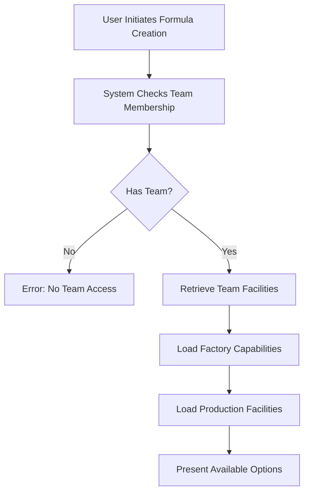
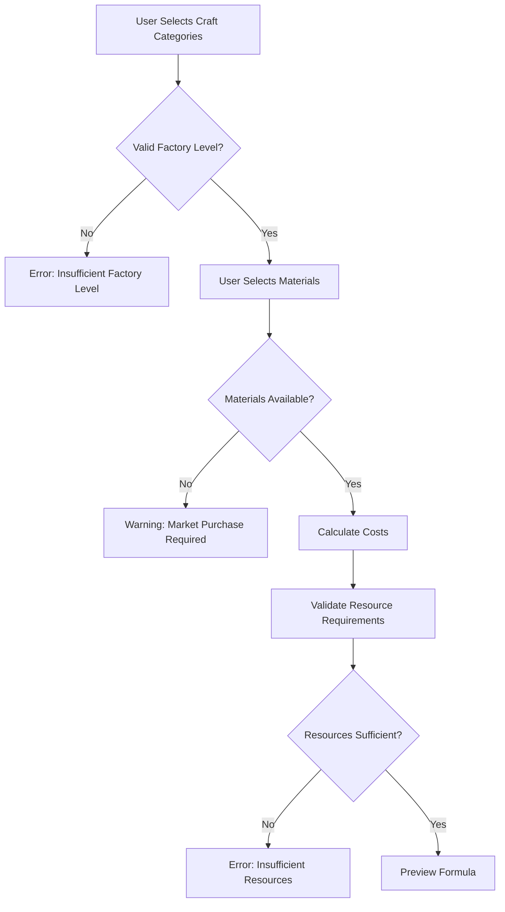
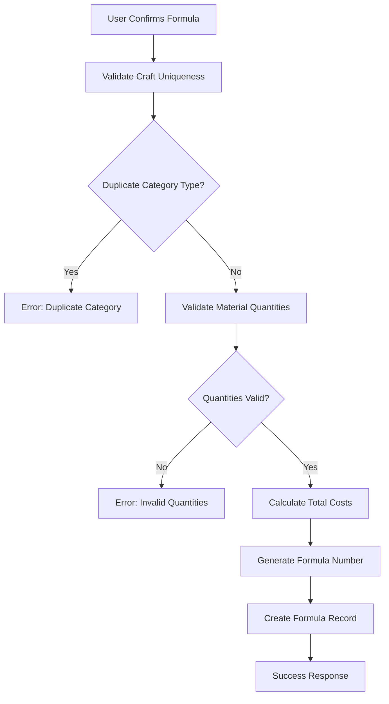

# Product Formula Creation - Business Rules & Process

## Executive Summary
This document defines the business rules and processes for team product formula creation, ensuring teams can only create formulas based on their actual facility capabilities and resource availability.

## Core Business Principles

### 1. Capability-Based Formula Creation
Teams can only create product formulas that match their current infrastructure:
- **Factory Level Constraint**: Craft categories technology level must be ≤ Factory level
- **Material Availability**: Raw materials must be producible by team facilities or available in market
- **Infrastructure Requirements**: All facilities must have water and power connections

### 2. Factory and Craft Category System

#### Factory Level System
Factories have levels 1-4 that determine which craft category levels they can use:

| Factory Level | Can Use Craft Levels | Example Capabilities |
|--------------|---------------------|---------------------|
| **Level 1** | LEVEL_1 only | Basic manufacturing, simple processing |
| **Level 2** | LEVEL_1, LEVEL_2 | Standard production, improved efficiency |
| **Level 3** | LEVEL_1, LEVEL_2, LEVEL_3 | Advanced technology, high yield |
| **Level 4** | All levels (1-4) | Peak technology, maximum efficiency |

#### Craft Category Types
Based on the system's 7 production categories, each with 4 technology levels:

1. **MECHANICAL_MANUFACTURING** - Industrial machinery (88-99% yield)
2. **MATERIALS_PROCESSING** - Raw material transformation (85-99% yield)
3. **BIOCHEMICAL** - Chemical/biological processes (70-97% yield)
4. **ELECTRONIC_EQUIPMENT** - Electronics manufacturing (65-98% yield)
5. **ENERGY_UTILIZATION** - Energy conversion (82-98% yield)
6. **CUTTING_TEXTILE** - Fabric and garments (82-98% yield)
7. **FOOD_PROCESSING** - Food production (80-98% yield)

## Business Process Flow

### Phase 1: Capability Assessment


### Phase 2: Formula Configuration


### Phase 3: Formula Validation & Creation


## Detailed Business Rules

### 1. Factory-Craft Category Matching Rules

#### Rule 1.1: Technology Level Requirement
- Craft category technology level ≤ Factory level
- Example: LEVEL_3 craft requires Factory Level 3 or higher
- Factory Level 4 can use all craft levels (1-4)
- Factory Level 2 can only use LEVEL_1 and LEVEL_2 crafts

#### Rule 1.2: Available Craft Categories
```typescript
function getAvailableCrafts(factoryLevel: number): CraftCategory[] {
  // All 7 category types are available to all factories
  const categoryTypes = [
    'MECHANICAL_MANUFACTURING',
    'MATERIALS_PROCESSING', 
    'BIOCHEMICAL',
    'ELECTRONIC_EQUIPMENT',
    'ENERGY_UTILIZATION',
    'CUTTING_TEXTILE',
    'FOOD_PROCESSING'
  ];
  
  // Factory level determines max craft level
  const maxCraftLevel = factoryLevel; // 1-4
  
  return crafts.filter(craft => {
    const craftLevel = parseInt(craft.technologyLevel.replace('LEVEL_', ''));
    return craftLevel <= maxCraftLevel;
  });
}
```

### 2. Material Availability Rules

#### Rule 2.1: Material Production Requirements
- Materials can only be produced by matching facility types:
  - FARM facilities → FARM origin materials
  - MINE facilities → MINE origin materials
  - QUARRY facilities → QUARRY origin materials
  - FOREST facilities → FOREST origin materials
  - RANCH facilities → RANCH origin materials  
  - FISHERY facilities → FISHERY origin materials
- All production facilities must have active water and power connections

#### Rule 2.2: Instant Production Model
- Production is instant when resources are paid
- No waiting or processing time
- Flow: REQUEST → VALIDATE → PAY → PRODUCE → STORE

#### Rule 2.3: Material Origin Types
```typescript
const VALID_MATERIAL_ORIGINS = [
  'FARM',      // Agricultural products
  'RANCH',     // Livestock products
  'MINE',      // Mineral resources
  'QUARRY',    // Stone and sand
  'FOREST',    // Wood and forest products
  'FISHERY',   // Aquatic resources
  'SHOPS'      // Processed/imported goods (market only)
];
```

### 3. Cost Calculation Rules

#### Rule 3.1: Total Material Cost (A)
```
A = Σ(Material Quantity × Material Unit Cost)
```

#### Rule 3.2: Setup Costs
```
Water Cost = Σ(Craft Category Fixed Water Cost)
Power Cost = Σ(Craft Category Fixed Power Cost)
Gold Cost = Σ(Craft Category Fixed Gold Cost)
```

#### Rule 3.3: Variable Costs
```
Water % = Σ(Craft Category Variable Water %)
Power % = Σ(Craft Category Variable Power %)
Gold % = Σ(Craft Category Variable Gold %)
Total % = Water % + Power % + Gold %
```

#### Rule 3.4: Carbon Emission
```
Carbon = Σ(Material Quantity × Material Carbon Factor) × Factory Efficiency
```

### 4. Validation Rules

#### Rule 4.1: Craft Category Uniqueness
- Only one craft category per `categoryType` allowed
- Prevents: [MECHANICAL_LEVEL_1, MECHANICAL_LEVEL_2]
- Allows: [MECHANICAL_LEVEL_2, ELECTRONIC_LEVEL_3]

#### Rule 4.2: Material Limits
- Minimum materials: 1
- Maximum materials: 99
- No duplicate materials in single formula
- Quantity range: 0.001 - 999.999

#### Rule 4.3: Formula Number Generation
- Auto-incremented within activity scope
- Format: `{ActivityYear}-{SequenceNumber}`
- Example: `2024-001`, `2024-002`

### 5. Resource Constraint Rules

#### Rule 5.1: Factory Capacity Check
```typescript
interface CapacityCheck {
  dailyProductionCapacity: number;
  formulaRequirement: number;
  utilizationRate: number;
  canProduce: boolean;
}

// Formula cannot exceed 80% of daily capacity
const MAX_UTILIZATION = 0.8;
canProduce = (formulaRequirement / dailyCapacity) <= MAX_UTILIZATION;
```

#### Rule 5.2: Resource Availability
- Water supply must meet formula requirements
- Power capacity must support production
- Gold reserves must cover setup costs

## Quality & Efficiency Factors

### Factory Efficiency Bonuses
| Factory Type | Base Efficiency | Quality Bonus | Cost Reduction |
|--------------|----------------|---------------|----------------|
| ULTRA | 95% | +15% | -10% |
| HEAVY | 88% | +10% | -7% |
| LIGHT | 82% | +5% | -5% |
| BASIC | 75% | 0% | 0% |

### Material Quality Impact
| Source | Quality Grade | Yield Impact | Cost Impact |
|--------|--------------|--------------|-------------|
| Self-Produced (High) | A | +5% | -15% |
| Self-Produced (Standard) | B | 0% | -10% |
| Market Purchase | C | -5% | +20% |
| Emergency Supply | D | -10% | +50% |

## Exception Handling

### Common Exceptions & Resolutions

#### 1. Insufficient Factory Level
**Scenario**: User selects LEVEL_3 craft with only HEAVY factory
**Resolution**: 
- Show available alternatives at current level
- Suggest factory upgrade path
- Allow saving as draft for future

#### 2. Material Unavailability
**Scenario**: Required material not produced by team
**Resolution**:
- Offer market purchase option with cost comparison
- Suggest alternative materials if available
- Show nearest production facility for acquisition

#### 3. Resource Overcapacity
**Scenario**: Formula exceeds factory daily capacity
**Resolution**:
- Suggest production batching
- Recommend formula optimization
- Show capacity upgrade options

## Audit & Compliance

### Tracking Requirements
1. **Formula Creation Audit**
   - User ID and timestamp
   - Team ID and activity context
   - All input parameters
   - Calculated costs and emissions

2. **Change History**
   - Formula modifications tracked
   - Version control for formulas
   - Approval workflow for high-value formulas

3. **Performance Metrics**
   - Formula creation success rate
   - Average time to create formula
   - Most common validation errors
   - Resource utilization patterns

## Integration Points

### 1. Facility Management System
- Real-time factory status
- Production capacity updates
- Technology level changes

### 2. Resource Management
- Material inventory levels
- Resource consumption tracking
- Cost accounting integration

### 3. Market System
- Current material prices
- Supply/demand indicators
- Trade transaction history

### 4. Activity Management
- Activity-specific constraints
- Fiscal year considerations
- Competition rules enforcement

## Future Enhancements

### Phase 1 (Q2 2024)
- AI-powered formula optimization
- Bulk formula import/export
- Template library system

### Phase 2 (Q3 2024)
- Real-time collaboration on formulas
- Supply chain integration
- Predictive cost modeling

### Phase 3 (Q4 2024)
- Machine learning for demand forecasting
- Automated formula suggestions
- Cross-team formula sharing

## Appendix: Decision Matrix

### Factory Selection Logic
```typescript
function selectOptimalFactory(
  requiredLevel: number,
  categoryType: string,
  teamFactories: Factory[]
): Factory {
  return teamFactories
    .filter(f => f.technologyLevel >= requiredLevel)
    .filter(f => f.supportedCategories.includes(categoryType))
    .sort((a, b) => {
      // Prioritize by: 1) Exact level match, 2) Efficiency, 3) Available capacity
      const levelDiffA = Math.abs(a.technologyLevel - requiredLevel);
      const levelDiffB = Math.abs(b.technologyLevel - requiredLevel);
      if (levelDiffA !== levelDiffB) return levelDiffA - levelDiffB;
      if (a.efficiency !== b.efficiency) return b.efficiency - a.efficiency;
      return b.availableCapacity - a.availableCapacity;
    })[0];
}
```

### Material Sourcing Priority
1. Own production facilities (lowest cost)
2. Alliance/partner teams (negotiated rates)
3. Open market (standard rates)
4. Emergency suppliers (premium rates)