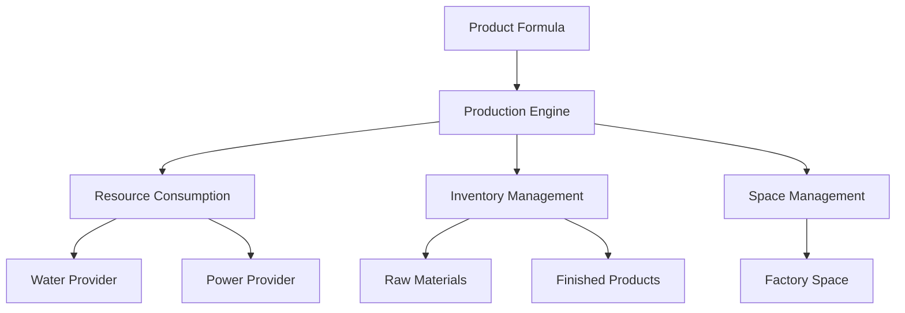

# Product Production System

## Overview

The Product Production System enables teams to manufacture products in FACTORY facilities using predefined Product Formulas. The system implements sophisticated cost calculations, multi-stage yield processing, smart space management, and infrastructure resource consumption tracking.

## Key Features

### 🏭 Production Process
- **Instant Production**: Manufacturing occurs immediately upon resource payment
- **Factory-Based**: Production happens in FACTORY type facilities
- **Formula-Driven**: Uses predefined ProductFormula recipes with materials and craft categories
- **Infrastructure-Dependent**: Requires active water and power connections

### 💰 Cost Calculation System
Implements a two-tier cost structure:

#### Fixed Setup Costs
```
Setup Water = Σ(craftCategory.fixedWaterCost)
Setup Power = Σ(craftCategory.fixedPowerCost)  
Setup Gold = Σ(craftCategory.fixedGoldCost)
```

#### Variable Costs (Percentage-Based)
```
Water Consumption = ⌈Setup Water + (Material Cost A × Water%)⌉
Power Consumption = ⌈Setup Power + (Material Cost A × Power%)⌉
Gold Cost = Setup Gold + (Material Cost A × Gold%)
```

Where `Material Cost A` = Total raw material cost for production

### 📊 Yield Calculation
Multi-stage yield application from craft categories:
```
Output = Input × Yield₁ × Yield₂ × ... × Yieldₙ
```

Example: 100 units × 98% × 82% = 80.36 → 80 units (rounded down)

### 📦 Smart Space Management
Intelligent space calculation considering material consumption:
```
Net Space = Product Space Needed - Material Space Freed
```
- Production allowed if net space ≤ available space
- Space measured in carbon emission units

### ⚡ Infrastructure Integration
- Consumes water/power through InfrastructureConnection system
- Creates ResourceTransaction records with `PRODUCT_MANUFACTURING` purpose
- Tracks provider and consumer teams for cross-team cooperation

## System Architecture

### Core Components



### Data Models

#### Existing Models Used
- **TileFacilityInstance**: Factory facilities
- **ProductFormula**: Product recipes with pre-calculated costs
- **CraftCategory**: Production methods with yields
- **FacilityInventoryItem**: Material and product storage
- **InfrastructureConnection**: Water/power connections
- **ResourceTransaction**: Resource consumption tracking
- **FacilitySpaceInventory**: Space management

#### New Models Required
1. **ProductProduction**: Main production record
2. **ProductionInventoryChange**: Inventory change tracking

## Production Flow

### 1. Pre-Production Phase
```typescript
// Validate prerequisites
✓ Factory is active and operational
✓ Has water and power connections
✓ All required materials present
✓ Sufficient space available (smart calculation)
✓ Team has sufficient funds
```

### 2. Cost Calculation Phase
```typescript
// Calculate production costs
1. Material Cost A = Σ(material.quantity × material.cost) × quantity
2. Setup Costs = Aggregate fixed costs from craft categories
3. Variable Percentages = Aggregate percentages from craft categories
4. Final Costs = Apply formula with infrastructure pricing
5. Carbon Emission = (Total Setup + A × Total%) × 1%
```

### 3. Execution Phase
```typescript
// Atomic transaction
BEGIN TRANSACTION
  1. Consume raw materials from inventory
  2. Charge water/power through infrastructure
  3. Deduct gold from team treasury
  4. Calculate yield (multiple craft categories)
  5. Add products to inventory
  6. Update space usage (smart net calculation)
  7. Create production history record
  8. Create resource transactions
COMMIT
```

### 4. Post-Production Phase
```typescript
// Record keeping
✓ Production history saved
✓ Resource transactions recorded
✓ Team dashboard refreshed
```

## API Endpoints

### Core Endpoints

| Method | Endpoint | Description |
|--------|----------|-------------|
| GET | `/api/user/product-production/factories` | List available factories with material availability |
| POST | `/api/user/product-production/calculate-cost` | Calculate production costs |
| POST | `/api/user/product-production/produce` | Execute production |
| GET | `/api/user/product-production/history` | Get production history |

### Example: Calculate Cost
```typescript
POST /api/user/product-production/calculate-cost
{
  "activityId": 1,
  "factoryId": "factory-123",
  "formulaId": "formula-456",
  "quantity": 50
}

Response:
{
  "costs": {
    "waterConsumption": 102,
    "powerConsumption": 672,
    "goldCost": 202,
    "totalCost": 976
  },
  "expectedOutput": 40,
  "spaceImpact": {
    "netChange": -50  // Negative = freeing space
  }
}
```

## Business Rules

### Material Requirements
- All formula materials must be present in the factory
- Materials are consumed instantly upon production
- Partial material availability blocks production

### Space Management
- Raw materials and products share the same space pool
- Space freed from material consumption offsets product space needs
- Production allowed if: `(Product Space - Material Space Freed) ≤ Available Space`

### Infrastructure Requirements
- Factory MUST have active water connection
- Factory MUST have active power connection
- Infrastructure providers must have sufficient capacity
- Resource costs charged to consuming team

### Yield Application
- Multiple craft categories apply yields sequentially
- Combined yield = Product of all individual yields
- Output always rounded down (no partial products)

## Cost Formula Examples

### Example 1: Electronic Equipment IV + Energy Utilization I

#### Given:
- Electronic Equipment IV: Water(42), Power(240), Gold(84), Yield(98%)
- Energy Utilization I: Water(20), Power(60), Gold(30), Yield(82%)
- Material Cost A: 1000 gold

#### Calculation:
```
Setup Costs:
- Water: 42 + 20 = 62
- Power: 240 + 60 = 300
- Gold: 84 + 30 = 114

Variable Percentages:
- Water%: 2% + 2% = 4%
- Power%: 31.2% + 6% = 37.2%
- Gold%: 6.8% + 2% = 8.8%

Final Costs:
- Water: ⌈62 + 1000×4%⌉ = 102 units
- Power: ⌈300 + 1000×37.2%⌉ = 672 units
- Gold: 114 + 1000×8.8% = 202 gold

Yield:
- 100 units × 98% × 82% = 80 units
```

## Implementation Status

### ✅ Completed Documentation
- [Business Rules](./business-rules.md) - Complete production logic and formulas
- [Data Model](./data-model.md) - Database schema aligned with existing models
- [API Specification](./api-specification.md) - REST API endpoint definitions
- [Production Flow](./production-flow.md) - Step-by-step production process
- [Cost Calculation Guide](./cost-calculation-guide.md) - Detailed formula examples

### 🔄 Integration Points
- **Existing**: ProductFormula, CraftCategory, FacilityInventoryItem
- **New Required**: ProductProduction, ProductionInventoryChange

### 📋 Implementation Checklist
- [ ] Create ProductProduction Prisma model
- [ ] Create ProductionInventoryChange model
- [ ] Implement production service
- [ ] Implement cost calculation logic
- [ ] Implement yield calculation
- [ ] Integrate with ResourceTransaction
- [ ] Update FacilityInventoryItem for products
- [ ] Update FacilitySpaceInventory
- [ ] Create API endpoints
- [ ] Add production history views
- [ ] Create unit tests
- [ ] Create integration tests
- [ ] Performance testing

## Performance Considerations

### Optimizations
1. **Pre-calculated Costs**: ProductFormula stores pre-calculated cost values
2. **Batch Processing**: Support multiple productions in single transaction
3. **Index Strategy**: Indexes on factoryId, teamId, formulaId, dates

### Scalability
- Production records archived after 6 months
- Resource transactions referenced by ID only

## Error Handling

### Common Failure Scenarios
| Error | Cause | Resolution |
|-------|-------|------------|
| `INSUFFICIENT_MATERIALS` | Not enough raw materials | Check inventory before production |
| `NO_SPACE` | Insufficient factory space | Use smart space calculation |
| `NO_INFRASTRUCTURE` | Missing water/power | Verify connections first |
| `INSUFFICIENT_FUNDS` | Team lacks gold | Check balance before confirming |
| `INFRASTRUCTURE_DISCONNECTED` | Connection lost during production | Rollback and refund |

## Security Considerations

### Authorization
- Users must belong to team that owns factory
- Only Manager/Worker roles can initiate production
- Admin oversight through history records

### Data Validation
- All quantities must be positive integers
- Formula must belong to same activity
- Factory must be FACTORY type
- Infrastructure connections must be active

## Support

### Documentation
- Business Rules: Core production logic
- API Specification: Endpoint reference
- Cost Calculation Guide: Formula examples
- Production Flow: Step-by-step process

### Troubleshooting
1. Check factory has infrastructure connections
2. Verify all materials are in factory inventory
3. Use smart space calculation for space issues
4. Ensure team has sufficient funds
5. Check formula craft categories for yield

## Future Enhancements

### Potential Features
- [ ] Production queuing system
- [ ] Bulk production discounts
- [ ] Quality variations based on factory level
- [ ] Production speed modifiers
- [ ] Material substitution options
- [ ] Production templates
- [ ] Automated production chains
- [ ] Cross-team production cooperation

### Performance Improvements
- [ ] Real-time production status via WebSocket
- [ ] Predictive cost calculations
- [ ] Machine learning for yield optimization

## Summary

The Product Production System provides a comprehensive manufacturing solution that:
1. **Calculates costs** using sophisticated two-tier formula
2. **Manages space** intelligently with net calculations
3. **Consumes resources** through infrastructure connections
4. **Applies yields** from multiple craft categories
5. **Tracks everything** for complete auditability
6. **Integrates seamlessly** with existing systems

This creates realistic business simulation while maintaining educational value for the target audience of 15-22 year old students engaged in team-based entrepreneurship simulation.