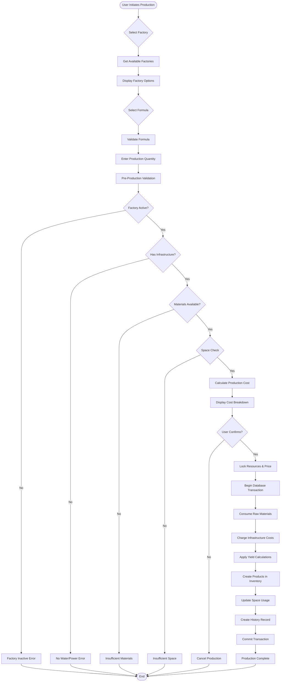

# Product Production Flow

## Overview

This document provides a detailed step-by-step guide to the product production process, from initial planning through execution and completion. The flow ensures data consistency, resource management, and proper transaction handling.

## Production Flow Diagram



## Detailed Production Steps

### Phase 1: Preparation

#### Step 1.1: Factory Selection

```typescript
async function selectProductionFactory(teamId: string, activityId: number) {
  // 1. Get all team factories
  const factories = await getTeamFactories(teamId, activityId);
  
  // 2. Filter active factories only
  const activeFactories = factories.filter(f => 
    f.facilityType === 'FACTORY' && 
    f.status === 'ACTIVE'
  );
  
  // 3. Check infrastructure connections
  for (const factory of activeFactories) {
    factory.infrastructure = {
      hasWater: await hasActiveConnection(factory.id, 'WATER'),
      hasPower: await hasActiveConnection(factory.id, 'POWER'),
      waterProvider: await getConnectionDetails(factory.id, 'WATER'),
      powerProvider: await getConnectionDetails(factory.id, 'POWER')
    };
  }
  
  // 4. Get space information
  for (const factory of activeFactories) {
    factory.space = await getSpaceInventory(factory.id);
  }
  
  // 5. Return factories with their capabilities
  return activeFactories;
}
```

#### Step 1.2: Formula Selection

```typescript
async function selectProductFormula(factoryId: string, teamId: string) {
  // 1. Get all active formulas for the activity
  const formulas = await getActiveFormulas(activityId);
  
  // 2. Check material availability for each formula
  const inventory = await getFacilityInventory(factoryId);
  
  for (const formula of formulas) {
    const capability = checkProductionCapability(formula, inventory);
    formula.canProduce = capability.canProduce;
    formula.maxQuantity = capability.maxQuantity;
    formula.missingMaterials = capability.missingMaterials;
  }
  
  // 3. Return formulas with production capability
  return formulas.sort((a, b) => {
    // Prioritize formulas that can be produced
    if (a.canProduce && !b.canProduce) return -1;
    if (!a.canProduce && b.canProduce) return 1;
    return b.maxQuantity - a.maxQuantity;
  });
}
```

#### Step 1.3: Quantity Input

```typescript
interface QuantityValidation {
  validateQuantity(
    quantity: number,
    formula: ProductFormula,
    inventory: FacilityInventory
  ): ValidationResult {
    const errors: string[] = [];
    
    // Basic range check
    if (quantity < 1) {
      errors.push('Quantity must be at least 1');
    }
    if (quantity > 9999) {
      errors.push('Quantity cannot exceed 9999');
    }
    
    // Material availability check
    for (const material of formula.materials) {
      const required = material.quantity * quantity;
      const available = inventory.getMaterial(material.rawMaterialId)?.quantity || 0;
      
      if (required > available) {
        errors.push(`Insufficient ${material.name}: need ${required}, have ${available}`);
      }
    }
    
    return {
      valid: errors.length === 0,
      errors,
      suggestedQuantity: calculateMaxPossibleQuantity(formula, inventory)
    };
  }
}
```

### Phase 2: Validation

#### Step 2.1: Comprehensive Pre-Production Validation

```typescript
async function validateProduction(request: ProductionRequest): Promise<ValidationResult> {
  const validations = [];
  
  // 1. Factory validation
  validations.push(await validateFactory(request.factoryId));
  
  // 2. Formula validation  
  validations.push(await validateFormula(request.formulaId));
  
  // 3. Team ownership validation
  validations.push(await validateTeamOwnership(request.teamId, request.factoryId));
  
  // 4. Infrastructure validation
  validations.push(await validateInfrastructure(request.factoryId));
  
  // 5. Material availability
  validations.push(await validateMaterials(
    request.factoryId, 
    request.formulaId, 
    request.quantity
  ));
  
  // 6. Space availability (smart check)
  validations.push(await validateSpace(
    request.factoryId,
    request.formulaId,
    request.quantity
  ));
  
  // 7. Fund availability
  const costs = await calculateProductionCosts(request);
  validations.push(await validateFunds(request.teamId, costs.totalCost));
  
  return combineValidations(validations);
}
```

#### Step 2.2: Infrastructure Validation Detail

```typescript
async function validateInfrastructure(factoryId: string): Promise<ValidationResult> {
  const errors: string[] = [];
  
  // Check water connection
  const waterConnection = await getActiveConnection(factoryId, 'WATER');
  if (!waterConnection) {
    errors.push('Factory has no active water connection');
  } else {
    // Verify provider has capacity
    const waterProvider = await getFacility(waterConnection.providerId);
    const availableCapacity = await getAvailableCapacity(waterProvider);
    if (availableCapacity <= 0) {
      errors.push('Water provider has no available capacity');
    }
  }
  
  // Check power connection
  const powerConnection = await getActiveConnection(factoryId, 'POWER');
  if (!powerConnection) {
    errors.push('Factory has no active power connection');
  } else {
    // Verify provider has capacity
    const powerProvider = await getFacility(powerConnection.providerId);
    const availableCapacity = await getAvailableCapacity(powerProvider);
    if (availableCapacity <= 0) {
      errors.push('Power provider has no available capacity');
    }
  }
  
  return {
    valid: errors.length === 0,
    errors
  };
}
```

#### Step 2.3: Smart Space Validation

```typescript
async function validateSpace(
  factoryId: string,
  formulaId: number,
  quantity: number
): Promise<ValidationResult> {
  // Get current space inventory
  const spaceInventory = await getSpaceInventory(factoryId);
  const formula = await getProductFormula(formulaId);
  
  // Calculate space that will be freed from consuming materials
  let spaceToFree = 0;
  for (const material of formula.materials) {
    const consumed = material.quantity * quantity;
    spaceToFree += consumed * material.rawMaterial.carbonEmission;
  }
  
  // Calculate space needed for products
  const spaceNeeded = quantity * formula.productFormulaCarbonEmission;
  
  // Net space change (negative means freeing space)
  const netSpaceChange = spaceNeeded - spaceToFree;
  
  // Validation
  const hasSpace = netSpaceChange <= spaceInventory.availableSpace;
  
  return {
    valid: hasSpace,
    details: {
      currentAvailable: spaceInventory.availableSpace,
      willFree: spaceToFree,
      willUse: spaceNeeded,
      netChange: netSpaceChange,
      afterProduction: spaceInventory.availableSpace - netSpaceChange
    },
    errors: hasSpace ? [] : [`Insufficient space: need ${netSpaceChange}, have ${spaceInventory.availableSpace}`]
  };
}
```

### Phase 3: Cost Calculation

#### Step 3.1: Detailed Cost Calculation

```typescript
async function calculateProductionCosts(request: ProductionRequest): Promise<ProductionCosts> {
  const formula = await getProductFormula(request.formulaId);
  const quantity = request.quantity;
  
  // 1. Calculate material cost A
  const materialCostA = formula.materials.reduce((sum, material) => {
    return sum + (material.quantity * material.rawMaterial.totalCost * quantity);
  }, 0);
  
  // 2. Get setup costs from craft categories
  const setupCosts = {
    water: 0,
    power: 0,
    gold: 0
  };
  
  for (const craftCategory of formula.craftCategories) {
    setupCosts.water += craftCategory.fixedWaterCost;
    setupCosts.power += craftCategory.fixedPowerCost;
    setupCosts.gold += craftCategory.fixedGoldCost;
  }
  
  // 3. Get variable percentages
  const variablePercents = {
    water: 0,
    power: 0,
    gold: 0
  };
  
  for (const craftCategory of formula.craftCategories) {
    variablePercents.water += craftCategory.variableWaterPercent;
    variablePercents.power += craftCategory.variablePowerPercent;
    variablePercents.gold += craftCategory.variableGoldPercent;
  }
  
  // 4. Calculate final consumption
  const waterConsumption = Math.ceil(
    setupCosts.water + (materialCostA * variablePercents.water / 100)
  );
  const powerConsumption = Math.ceil(
    setupCosts.power + (materialCostA * variablePercents.power / 100)
  );
  const goldCost = setupCosts.gold + (materialCostA * variablePercents.gold / 100);
  
  // 5. Get infrastructure prices
  const waterConnection = await getActiveConnection(request.factoryId, 'WATER');
  const powerConnection = await getActiveConnection(request.factoryId, 'POWER');
  
  const waterCost = waterConsumption * waterConnection.unitPrice;
  const powerCost = powerConsumption * powerConnection.unitPrice;
  
  // 6. Calculate carbon emission
  const totalPercent = variablePercents.water + variablePercents.power + variablePercents.gold;
  const carbonEmission = (setupCosts.water + setupCosts.power + setupCosts.gold + 
                          materialCostA * totalPercent / 100) * 0.01;
  
  return {
    materialCostA,
    setupCosts,
    variablePercents,
    waterConsumption,
    waterCost,
    powerConsumption,
    powerCost,
    goldCost,
    totalCost: waterCost + powerCost + goldCost,
    carbonEmission
  };
}
```

#### Step 3.2: Cost Display and Confirmation

```typescript
interface CostDisplay {
  displayProductionCosts(costs: ProductionCosts): CostBreakdown {
    return {
      summary: {
        totalCost: costs.totalCost,
        expectedDuration: 'Instant',
        canAfford: checkTeamBalance(costs.totalCost)
      },
      
      breakdown: {
        materials: {
          label: 'Raw Materials',
          amount: costs.materialCostA,
          percentage: (costs.materialCostA / costs.totalCost) * 100
        },
        water: {
          label: 'Water Resources',
          units: costs.waterConsumption,
          unitPrice: costs.waterCost / costs.waterConsumption,
          amount: costs.waterCost,
          percentage: (costs.waterCost / costs.totalCost) * 100
        },
        power: {
          label: 'Power Resources',
          units: costs.powerConsumption,
          unitPrice: costs.powerCost / costs.powerConsumption,
          amount: costs.powerCost,
          percentage: (costs.powerCost / costs.totalCost) * 100
        },
        labor: {
          label: 'Labor & Operations',
          amount: costs.goldCost,
          percentage: (costs.goldCost / costs.totalCost) * 100
        }
      },
      
      environmental: {
        carbonEmission: costs.carbonEmission,
        sustainabilityRating: calculateSustainabilityRating(costs.carbonEmission)
      },
      
      confirmation: {
        message: 'Do you want to proceed with production?',
        expiresIn: 60, // seconds
        actions: ['Confirm', 'Cancel']
      }
    };
  }
}
```

### Phase 4: Execution

#### Step 4.1: Resource Locking

```typescript
async function lockProductionResources(request: ConfirmedProductionRequest) {
  const lockDuration = 60000; // 60 seconds
  
  // Create production request with locked prices
  const productionRequest = await createProductionRequest({
    ...request,
    status: 'CONFIRMED',
    lockedPrices: {
      waterUnitPrice: request.waterConnection.unitPrice,
      powerUnitPrice: request.powerConnection.unitPrice,
      materialPrices: request.formula.materials.map(m => ({
        materialId: m.rawMaterialId,
        unitPrice: m.rawMaterial.totalCost
      }))
    },
    expiresAt: new Date(Date.now() + lockDuration)
  });
  
  // Lock inventory items
  await lockInventoryItems(
    request.factoryId,
    request.formula.materials.map(m => ({
      itemId: m.rawMaterialId,
      quantity: m.quantity * request.quantity
    }))
  );
  
  return productionRequest;
}
```

#### Step 4.2: Transaction Execution

```typescript
async function executeProduction(productionRequest: ProductionRequest) {
  const transaction = await database.beginTransaction();
  
  try {
    // 1. Update status to processing
    await updateProductionStatus(productionRequest.id, 'PROCESSING');
    
    // 2. Consume raw materials
    const consumptionRecords = await consumeMaterials(
      productionRequest.factoryId,
      productionRequest.formula.materials,
      productionRequest.quantity,
      transaction
    );
    
    // 3. Charge water resources
    await chargeWaterResources(
      productionRequest.waterConnectionId,
      productionRequest.waterConsumption,
      productionRequest.waterCost,
      transaction
    );
    
    // 4. Charge power resources
    await chargePowerResources(
      productionRequest.powerConnectionId,
      productionRequest.powerConsumption,
      productionRequest.powerCost,
      transaction
    );
    
    // 5. Deduct gold from team
    await deductTeamFunds(
      productionRequest.teamId,
      productionRequest.goldCost,
      transaction
    );
    
    // 6. Calculate yield
    const producedQuantity = calculateYieldedOutput(
      productionRequest.quantity,
      productionRequest.formula.craftCategories
    );
    
    // 7. Add products to inventory
    await addProductsToInventory(
      productionRequest.factoryId,
      productionRequest.formulaId,
      producedQuantity,
      transaction
    );
    
    // 8. Update space usage
    await updateSpaceUsage(
      productionRequest.factoryId,
      productionRequest.netSpaceChange,
      transaction
    );
    
    // 9. Create history record
    const history = await createProductionHistory({
      productionRequestId: productionRequest.id,
      status: 'SUCCESS',
      producedQuantity,
      // ... other history fields
    }, transaction);
    
    // 10. Create resource consumption records
    await createResourceConsumptionRecords(history.id, {
      water: productionRequest.waterConsumption,
      power: productionRequest.powerConsumption
    }, transaction);
    
    // 11. Create inventory transactions
    await createInventoryTransactions(history.id, {
      consumed: consumptionRecords,
      produced: [{
        itemId: productionRequest.formulaId,
        quantity: producedQuantity
      }]
    }, transaction);
    
    // 12. Commit transaction
    await transaction.commit();
    
    // 13. Update status to completed
    await updateProductionStatus(productionRequest.id, 'COMPLETED');
    
    return {
      success: true,
      productionId: productionRequest.id,
      historyId: history.id,
      producedQuantity
    };
    
  } catch (error) {
    // Rollback on any error
    await transaction.rollback();
    
    // Update status to failed
    await updateProductionStatus(productionRequest.id, 'FAILED', error.message);
    
    // Unlock resources
    await unlockInventoryItems(productionRequest.factoryId);
    
    throw error;
  }
}
```

#### Step 4.3: Material Consumption

```typescript
async function consumeMaterials(
  factoryId: string,
  materials: FormulaMaterial[],
  quantity: number,
  transaction: Transaction
): Promise<ConsumptionRecord[]> {
  const records: ConsumptionRecord[] = [];
  const inventory = await getFacilityInventory(factoryId);
  
  for (const material of materials) {
    const requiredQuantity = material.quantity * quantity;
    const inventoryItem = inventory.getItem(material.rawMaterialId);
    
    if (!inventoryItem || inventoryItem.quantity < requiredQuantity) {
      throw new Error(`Insufficient ${material.name}`);
    }
    
    // Update inventory
    const newQuantity = inventoryItem.quantity - requiredQuantity;
    await updateInventoryItem(
      inventoryItem.id,
      { quantity: newQuantity },
      transaction
    );
    
    // Record consumption
    records.push({
      materialId: material.rawMaterialId,
      quantityBefore: inventoryItem.quantity,
      quantityConsumed: requiredQuantity,
      quantityAfter: newQuantity,
      spaceFreed: requiredQuantity * material.rawMaterial.carbonEmission
    });
  }
  
  return records;
}
```

#### Step 4.4: Yield Calculation

```typescript
function calculateYieldedOutput(
  inputQuantity: number,
  craftCategories: CraftCategory[]
): number {
  // Start with input quantity
  let output = inputQuantity;
  
  // Apply each craft category yield sequentially
  for (const category of craftCategories) {
    output = output * (category.yieldPercentage / 100);
  }
  
  // Round down to nearest integer
  return Math.floor(output);
}

// Example:
// Input: 100 units
// Electronic Equipment IV: 98% yield
// Energy Utilization I: 82% yield
// Output: 100 × 0.98 × 0.82 = 80.36 → 80 units
```

#### Step 4.5: Product Creation

```typescript
async function addProductsToInventory(
  factoryId: string,
  formulaId: number,
  quantity: number,
  transaction: Transaction
): Promise<void> {
  const inventory = await getFacilityInventory(factoryId);
  const formula = await getProductFormula(formulaId);
  
  // Check if product already exists in inventory
  let productItem = inventory.getProductItem(formulaId);
  
  if (productItem) {
    // Update existing item
    await updateInventoryItem(
      productItem.id,
      { quantity: productItem.quantity + quantity },
      transaction
    );
  } else {
    // Create new item
    await createInventoryItem({
      facilityId: factoryId,
      itemType: 'PRODUCT',
      productFormulaId: formulaId,
      quantity: quantity,
      spaceUsed: quantity * formula.productFormulaCarbonEmission
    }, transaction);
  }
}
```

### Phase 5: Post-Production

#### Step 5.1: History Recording

```typescript
async function createProductionHistory(data: ProductionHistoryData): Promise<ProductionHistory> {
  return await ProductionHistory.create({
    productionRequestId: data.requestId,
    activityId: data.activityId,
    teamId: data.teamId,
    userId: data.userId,
    factoryId: data.factoryId,
    formulaId: data.formulaId,
    
    // Quantities
    requestedQuantity: data.requestedQuantity,
    producedQuantity: data.producedQuantity,
    yieldPercentage: (data.producedQuantity / data.requestedQuantity) * 100,
    
    // Resources
    waterConsumed: data.waterConsumed,
    waterCost: data.waterCost,
    powerConsumed: data.powerConsumed,
    powerCost: data.powerCost,
    goldCost: data.goldCost,
    totalCost: data.totalCost,
    
    // Environmental
    carbonEmissionGenerated: data.carbonEmission,
    
    // Space
    spaceFreed: data.spaceFreed,
    spaceUsed: data.spaceUsed,
    netSpaceChange: data.netSpaceChange,
    
    // Details
    materialsConsumed: JSON.stringify(data.materialsConsumed),
    craftCategoriesUsed: JSON.stringify(data.craftCategories),
    
    // Timing
    startedAt: data.startedAt,
    completedAt: new Date(),
    duration: Date.now() - data.startedAt.getTime(),
    
    status: 'SUCCESS'
  });
}
```

#### Step 5.2: Dashboard Update

```typescript
async function updateDashboardAfterProduction(
  production: ProductionResult
): Promise<void> {
  // Update team dashboard
  await refreshTeamDashboard(production.teamId);
  
  // Update inventory display
  await refreshFactoryInventory(production.factoryId);
}
```

## Error Handling

### Common Error Scenarios

#### 1. Infrastructure Disconnection During Production

```typescript
async function handleInfrastructureDisconnection(
  productionId: string,
  disconnectionType: 'WATER' | 'POWER'
): Promise<void> {
  // Mark production as failed
  await updateProductionStatus(productionId, 'FAILED', 
    `${disconnectionType} connection lost during production`);
  
  // Attempt partial refund if materials were not fully consumed
  const production = await getProductionRequest(productionId);
  if (production.status === 'PROCESSING') {
    await refundPartialMaterials(production);
  }
}
```

#### 2. Insufficient Funds During Charge

```typescript
async function handleInsufficientFunds(
  production: ProductionRequest,
  shortfall: number
): Promise<void> {
  // Rollback material consumption
  await rollbackMaterialConsumption(production);
  
  // Mark as failed
  await updateProductionStatus(production.id, 'FAILED',
    `Insufficient funds: need ${shortfall} more gold`);
  
  // Suggest solutions
  await suggestFundingSolutions(production.teamId, shortfall);
}
```

#### 3. Transaction Failure Recovery

```typescript
async function recoverFromTransactionFailure(
  productionId: string,
  error: Error
): Promise<void> {
  const production = await getProductionRequest(productionId);
  
  // Log the failure
  await logProductionFailure({
    productionId,
    error: error.message,
    stack: error.stack,
    timestamp: new Date()
  });
  
  // Cleanup locks
  await cleanupProductionLocks(production);
  
  // Restore inventory state
  await restoreInventoryState(production.factoryId);
  
  // Mark as failed
  await updateProductionStatus(productionId, 'FAILED', 
    'Transaction failed - resources have been restored');
}
```

## Performance Optimizations

### 1. Batch Validation

```typescript
async function batchValidateProductions(
  requests: ProductionRequest[]
): Promise<Map<string, ValidationResult>> {
  // Group by factory for efficient validation
  const byFactory = groupBy(requests, 'factoryId');
  const results = new Map<string, ValidationResult>();
  
  for (const [factoryId, factoryRequests] of byFactory) {
    // Load factory data once
    const factory = await getFacility(factoryId);
    const inventory = await getFacilityInventory(factoryId);
    const space = await getSpaceInventory(factoryId);
    
    // Validate each request with loaded data
    for (const request of factoryRequests) {
      results.set(request.id, await validateWithData(request, {
        factory, inventory, space
      }));
    }
  }
  
  return results;
}
```

### 2. Parallel Processing

```typescript
async function processProductionAsync(request: ProductionRequest) {
  // Run independent operations in parallel
  const [
    materials,
    waterCharge,
    powerCharge,
    goldCharge
  ] = await Promise.all([
    consumeMaterials(request),
    chargeWater(request),
    chargePower(request),
    chargeGold(request)
  ]);
  
  // Sequential operations that depend on above
  const output = calculateYield(request);
  await addProducts(request, output);
  await updateSpace(request);
  await createHistory(request, output);
  
  return output;
}
```


## Summary

The production flow ensures:
1. **Thorough validation** before resource commitment
2. **Atomic transactions** for data consistency
3. **Smart space management** with net calculations
4. **Accurate cost calculation** using the specified formula
5. **Proper resource consumption** from infrastructure
6. **Complete history tracking** for auditability
7. **Error recovery** mechanisms for reliability