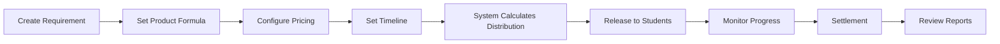
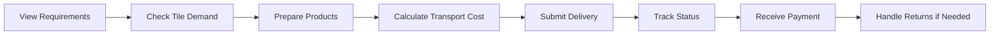

# MTO Type 1 API Specification

## Overview

This document defines all API endpoints for the MTO Type 1 system, clearly separated by user role (Manager vs Student). MTO Type 1 is a population-based procurement system where managers create requirements that are automatically distributed across tiles based on population, and student teams fulfill these requirements by delivering products.

## Key User Roles

### Manager Role
- Creates and configures MTO requirements
- Sets pricing and quantities
- Monitors fulfillment progress
- Manages settlements
- Reviews reports and analytics

### Student Role (Teams)
- Views available MTO requirements
- Checks tile-specific demand
- Submits product deliveries
- Tracks delivery status
- Manages product returns

## Base Configuration

```
Base URL: http://localhost:2999/api
Content-Type: application/json
Authentication: JWT Bearer Token
```

## Response Format

All responses follow this standardized format:

```typescript
interface ApiResponse<T> {
  success: boolean;
  businessCode: number;
  message: string;
  data: T;
  timestamp: string;
  path?: string;
  extra?: {
    pagination?: PaginationMeta;
    debug?: any;
  };
}

interface PaginationMeta {
  total: number;        // Total number of items
  page: number;         // Current page (1-indexed)
  limit: number;        // Items per page
  pages: number;        // Total number of pages
  hasNext: boolean;     // Has next page
  hasPrev: boolean;     // Has previous page
}

interface SearchParams {
  q?: string;           // General search query
  page?: number;        // Page number (default: 1)
  limit?: number;       // Items per page (default: 20, max: 100)
  sortBy?: string;      // Field to sort by
  sortOrder?: 'asc' | 'desc';  // Sort direction (default: 'desc')
  dateFrom?: string;    // Filter by date range start
  dateTo?: string;      // Filter by date range end
}
```

## 1. Manager Endpoints (Manager Panel)

### Manager Workflow Overview



### 1.1 Create MTO Type 1 Requirement

**Purpose:** Managers create a new procurement requirement that will be automatically distributed to tiles based on population

**Endpoint:** `POST /api/user/manager/mto-type1/requirements`

**Authorization:** Manager with `MTO_MANAGE` permission

**Request Body:**
```typescript
{
  "activityId": "cuid_string",
  "managerProductFormulaId": 123,
  "purchaseGoldPrice": 100.50,
  "basePurchaseNumber": 100,
  "releaseTime": "2024-03-01T00:00:00Z",
  "settlementTime": "2024-03-05T00:00:00Z",
  "overallPurchaseNumber": 10000,
  "baseCountPopulationNumber": 1000
}
```

**Validation Rules:**
```typescript
class CreateMtoType1Dto {
  @IsString()
  activityId: string;

  @IsInt()
  managerProductFormulaId: number;

  @IsNumber()
  @Min(0.01)
  purchaseGoldPrice: number;

  @IsInt()
  @Min(1)
  basePurchaseNumber: number;

  @IsISO8601()
  @IsFutureDate()
  releaseTime: string;

  @IsISO8601()
  @IsAfter('releaseTime')
  settlementTime: string;

  @IsInt()
  @Min(1)
  overallPurchaseNumber: number;

  @IsInt()
  @Min(2)
  baseCountPopulationNumber: number;
}
```

**Success Response (201):**
```json
{
  "success": true,
  "businessCode": 0,
  "message": "MTO Type 1 requirement created successfully",
  "data": {
    "id": 1,
    "activityId": "cuid_activity_123",
    "status": "DRAFT",
    "overallPurchaseBudget": 1005000.00,
    "tileRequirements": [
      {
        "mapTileId": 42,
        "tileName": "Tile A",
        "initialRequirement": 500,
        "adjustedRequirement": 500,
        "requirementBudget": 50250.00
      }
    ]
  }
}
```

### 1.2 Update MTO Type 1 Requirement

**Endpoint:** `PATCH /api/user/manager/mto-type1/requirements/:id`

**Authorization:** Manager with `MTO_MANAGE` permission

**Request Body:** (Partial update)
```json
{
  "purchaseGoldPrice": 110.00,
  "basePurchaseNumber": 150
}
```

**Constraints:**
- Can only update if status is `DRAFT`
- Cannot change after `RELEASED`

### 1.3 Get MTO Type 1 Requirements (List with Pagination & Search)

**Purpose:** Managers search and browse all MTO requirements with filtering and pagination

**Endpoint:** `GET /api/user/manager/mto-type1/requirements`

**Authorization:** Manager with `MTO_VIEW` permission

**Query Parameters:**
```typescript
{
  // Filtering
  "activityId"?: string;              // Filter by activity
  "status"?: MtoType1Status;          // Filter by status (DRAFT, RELEASED, IN_PROGRESS, etc.)
  "managerProductFormulaId"?: number; // Filter by product formula
  "q"?: string;                       // Search in product name and description

  // Date range filters
  "releaseDateFrom"?: string;         // ISO 8601 date
  "releaseDateTo"?: string;           // ISO 8601 date
  "settlementDateFrom"?: string;      // ISO 8601 date
  "settlementDateTo"?: string;        // ISO 8601 date

  // Pagination
  "page"?: number;                    // Page number (default: 1)
  "limit"?: number;                   // Items per page (default: 20, max: 100)

  // Sorting
  "sortBy"?: string;                  // Options: "createdAt", "releaseTime", "settlementTime", "overallPurchaseNumber", "fulfillmentRate"
  "sortOrder"?: "asc" | "desc";       // Sort direction (default: "desc")
}
```

**Success Response (200):**
```json
{
  "success": true,
  "businessCode": 0,
  "message": "Requirements fetched successfully",
  "data": [
    {
      "id": "uuid",
      "activityId": "uuid",
      "status": "RELEASED",
      "releaseTime": "2024-03-01T00:00:00Z",
      "settlementTime": "2024-03-05T00:00:00Z",
      "overallPurchaseNumber": 10000,
      "overallPurchaseBudget": 1005000.00,
      "fulfillmentRate": 75.5,
      "participatingTeams": 25
    }
  ],
  "extra": {
    "pagination": {
      "total": 50,
      "page": 1,
      "limit": 20,
      "pages": 3,
      "hasNext": true,
      "hasPrev": false
    },
    "filters": {
      "activeFilters": ["status", "activityId"],
      "totalBeforeFilter": 150
    }
  }
}
```

### 1.4 Get MTO Type 1 Requirement Details

**Endpoint:** `GET /api/user/manager/mto-type1/requirements/:id`

**Authorization:** Manager with `MTO_VIEW` permission

**Success Response (200):** Full requirement with all relations

### 1.5 Cancel MTO Type 1 Requirement

**Endpoint:** `POST /api/user/manager/mto-type1/requirements/:id/cancel`

**Authorization:** Manager with `MTO_MANAGE` permission

**Request Body:**
```json
{
  "reason": "Market conditions changed"
}
```

### 1.6 Force Settlement

**Endpoint:** `POST /api/user/manager/mto-type1/requirements/:id/force-settle`

**Authorization:** Manager with `MTO_MANAGE` permission

**Description:** Manually trigger settlement before scheduled time

### 1.7 Get Calculation History

**Purpose:** Managers view the detailed calculation process showing how requirements were distributed

**Endpoint:** `GET /api/user/manager/mto-type1/requirements/:id/calculation-history`

**Authorization:** Manager with `MTO_VIEW` permission

**Query Parameters:**
```typescript
{
  "stepType"?: CalculationStepType;    // Filter by specific step type
  "includeDetails"?: boolean;          // Include full tile adjustment details (default: true)
}
```

**Success Response (200):**
```json
{
  "success": true,
  "businessCode": 0,
  "message": "Calculation history retrieved",
  "data": {
    "mtoType1Id": 1,
    "totalSteps": 5,
    "calculationSummary": {
      "initialTotalRequirement": 15000,
      "finalTotalRequirement": 10000,
      "tilesEliminated": 5,
      "totalBudgetSaved": 502500.00
    },
    "steps": [
      {
        "step": 1,
        "stepType": "INITIAL_CALCULATION",
        "stepDescription": "Initial requirement calculation based on tile populations",
        "timestamp": "2024-03-01T00:00:00Z",
        "totalBefore": 0,
        "totalAfter": 15000,
        "tilesAffected": 25,
        "tileDetails": [
          {
            "tileId": 42,
            "tileName": "Industrial Zone A",
            "population": 5500,
            "initialRequirement": 500,
            "adjustedRequirement": 500,
            "reason": "Initial calculation"
          }
        ]
      },
      {
        "step": 2,
        "stepType": "BUDGET_CONSTRAINT_CHECK",
        "stepDescription": "Total requirement (15000) exceeds overall limit (10000)",
        "timestamp": "2024-03-01T00:00:01Z",
        "totalBefore": 15000,
        "totalAfter": 15000,
        "budgetExcess": 5000
      },
      {
        "step": 3,
        "stepType": "TILE_ELIMINATION",
        "stepDescription": "Eliminated 3 tile(s) with max requirement 800",
        "timestamp": "2024-03-01T00:00:02Z",
        "totalBefore": 15000,
        "totalAfter": 12600,
        "tilesEliminated": 3,
        "budgetSaved": 241200.00,
        "eliminatedTiles": [
          {
            "tileId": 15,
            "tileName": "Metro Center",
            "population": 8200,
            "originalRequirement": 800,
            "reason": "Eliminated: had max requirement of 800"
          }
        ]
      },
      {
        "step": 4,
        "stepType": "TILE_ELIMINATION",
        "stepDescription": "Eliminated 2 tile(s) with max requirement 700",
        "timestamp": "2024-03-01T00:00:03Z",
        "totalBefore": 12600,
        "totalAfter": 11200,
        "tilesEliminated": 2,
        "budgetSaved": 140700.00
      },
      {
        "step": 5,
        "stepType": "FINAL_DISTRIBUTION",
        "stepDescription": "Final distribution calculation complete",
        "timestamp": "2024-03-01T00:00:04Z",
        "totalRequirement": 10000,
        "totalBudget": 1005000.00,
        "activeTiles": 20,
        "eliminatedTiles": 5
      }
    ]
  }
}
```

### 1.8 Get Settlement History

**Purpose:** Managers view the detailed settlement process history showing validation and payment details

**Endpoint:** `GET /api/user/manager/mto-type1/requirements/:id/settlement-history`

**Authorization:** Manager with `MTO_VIEW` permission

**Query Parameters:**
```typescript
{
  "stepType"?: SettlementStepType;     // Filter by specific step type
  "tileId"?: number;                   // Filter by specific tile
  "includeValidationDetails"?: boolean; // Include detailed validation results (default: true)
  "page"?: number;                     // Page number (default: 1)
  "limit"?: number;                    // Items per page (default: 50, max: 200)
}
```

**Success Response (200):**
```json
{
  "success": true,
  "businessCode": 0,
  "message": "Settlement history retrieved",
  "data": {
    "mtoType1Id": 1,
    "settlementStatus": "SETTLED",
    "settlementStarted": "2024-03-05T00:00:00Z",
    "settlementCompleted": "2024-03-05T00:15:30Z",
    "summary": {
      "totalTilesProcessed": 20,
      "totalDeliveriesProcessed": 125,
      "totalProductsValidated": 8750,
      "totalProductsSettled": 7500,
      "totalProductsRejected": 1250,
      "totalPaymentsProcessed": 753750.00,
      "totalProcessingTime": 930000
    },
    "steps": [
      {
        "step": 1,
        "stepType": "SETTLEMENT_INITIATED",
        "stepDescription": "Settlement process initiated",
        "timestamp": "2024-03-05T00:00:00Z"
      },
      {
        "step": 2,
        "stepType": "TILE_PROCESSING_START",
        "stepDescription": "Starting settlement for tile Industrial Zone A",
        "tileId": 42,
        "tileName": "Industrial Zone A",
        "tileRequirement": 500
      },
      {
        "step": 3,
        "stepType": "PRODUCT_VALIDATION",
        "stepDescription": "Validated products for delivery D123",
        "productsValidated": 10,
        "productsSettled": 8,
        "productsRejected": 2,
        "validationDetails": [
          {
            "productId": "P001",
            "valid": true,
            "settled": true,
            "paymentAmount": 100.50
          },
          {
            "productId": "P002",
            "valid": false,
            "reason": "Material quantity mismatch for material 101",
            "details": {
              "required": 2,
              "provided": 3
            }
          }
        ]
      },
      {
        "step": 4,
        "stepType": "PAYMENT_PROCESSING",
        "stepDescription": "Processed payment for team T456",
        "totalPaymentAmount": 804.00,
        "teamId": "T456"
      },
      {
        "step": 5,
        "stepType": "TILE_PROCESSING_COMPLETE",
        "stepDescription": "Completed settlement for tile Industrial Zone A",
        "productsSettled": 500,
        "processingDuration": 45000
      },
      {
        "step": 50,
        "stepType": "SETTLEMENT_SUMMARY",
        "stepDescription": "Settlement process summary",
        "finalStats": {
          "fulfillmentRate": 75.00,
          "rejectionRate": 14.29,
          "averageProcessingTimePerTile": 46500
        }
      }
    ]
  }
}
```


## 2. Student Team Endpoints

### Student Workflow Overview



### Key Differences: Manager vs Student View

| Aspect | Manager View | Student View |
|--------|--------------|--------------|
| **Requirement Creation** | Can create and configure | Cannot create or modify |
| **Status Visibility** | Sees all statuses (DRAFT, RELEASED, etc.) | Only sees RELEASED and IN_PROGRESS |
| **Pricing** | Sets purchase price | Sees offered price |
| **Distribution** | Sees all tiles and allocations | Sees available tiles with remaining demand |
| **Timeline** | Sets release and settlement times | Sees countdown to settlement |
| **Monitoring** | Full visibility of all teams | Only sees own deliveries |
| **Settlement** | Controls and reviews settlement | Receives payments automatically |
| **Reports** | Comprehensive analytics | Own performance metrics |
| **Access Control** | Full access to all requirements | Limited to released requirements in their activity |

### 2.1 Get Available Requirements (with Search & Pagination)

**Purpose:** Students view released MTO requirements they can fulfill (only RELEASED and IN_PROGRESS status visible)

**Endpoint:** `GET /api/team/mto-type1/requirements`

**Authorization:** Student team member (Worker/Manager role)

**Access Control:**
- Students can ONLY see requirements with status: RELEASED or IN_PROGRESS
- Cannot see DRAFT, SETTLING, SETTLED, or CANCELLED requirements
- Only requirements for their current activity are visible

**Query Parameters:**
```typescript
{
  // Required
  "activityId": string;                // Current activity (must match team's activity)

  // Filtering (limited options for students)
  "tileId"?: string;                      // Filter by specific tile
  "q"?: string;                           // Search in product name

  // Price range filter
  "minPrice"?: number;                    // Minimum purchase price
  "maxPrice"?: number;                    // Maximum purchase price

  // Time filters
  "settlingSoon"?: boolean;               // Requirements settling in next 24 hours
  "newlyReleased"?: boolean;              // Released in last 24 hours

  // Pagination
  "page"?: number;                        // Page number (default: 1)
  "limit"?: number;                       // Items per page (default: 20, max: 50)

  // Sorting
  "sortBy"?: "releaseTime" | "settlementTime" | "purchaseGoldPrice" | "overallProgress";
  "sortOrder"?: "asc" | "desc";          // Sort direction (default: "desc")
}
```

**Success Response (200):**
```json
{
  "success": true,
  "businessCode": 0,
  "message": "Available requirements fetched",
  "data": [
    {
      "id": "uuid",
      "status": "RELEASED",  // Only RELEASED or IN_PROGRESS shown
      "productFormula": {
        "id": "uuid",
        "formulaName": "Standard Package A",
        "components": [...]
      },
      "purchaseGoldPrice": 100.50,
      "releaseTime": "2024-03-01T00:00:00Z",
      "settlementTime": "2024-03-05T00:00:00Z",
      "timeRemaining": 86400,
      "overallProgress": 45.5
    }
  ],
  "extra": {
    "pagination": {
      "total": 12,
      "page": 1,
      "limit": 20,
      "pages": 1,
      "hasNext": false,
      "hasPrev": false
    }
  }
}
```

**Error Responses:**
- `403`: Access denied - requirement not released or not in user's activity
- `404`: Requirement not found

### 2.2 Get Tile Requirements (with Filtering & Sorting)

**Purpose:** Students check specific tile demands for RELEASED requirements only

**Endpoint:** `GET /api/team/mto-type1/requirements/:id/tiles`

**Authorization:** Student team member

**Access Control:**
- Can only access if requirement status is RELEASED or IN_PROGRESS
- Must belong to team's current activity

**Query Parameters:**
```typescript
{
  // Filtering
  "hasRemaining"?: boolean;           // Only show tiles with remaining demand
  "nearFacility"?: string;            // Filter by proximity to facility ID
  "maxDistance"?: number;             // Maximum distance from facility (hex units)

  // Sorting
  "sortBy"?: "tileName" | "remainingNumber" | "progressPercentage" | "estimatedTransportCost";
  "sortOrder"?: "asc" | "desc";       // Sort direction (default: "asc" for tileName, "desc" for others)

  // Pagination (for large maps)
  "page"?: number;                    // Page number (default: 1)
  "limit"?: number;                   // Items per page (default: 50, max: 100)
}
```

**Success Response (200):**
```json
{
  "success": true,
  "businessCode": 0,
  "message": "Tile requirements fetched",
  "data": [
    {
      "tileId": "uuid",
      "tileName": "Industrial Zone A",
      "tilePopulation": 5500,
      "requiredNumber": 500,
      "deliveredNumber": 200,
      "remainingNumber": 300,
      "progressPercentage": 40.0,
      "estimatedTransportCost": 50.00
    }
  ],
  "extra": {
    "pagination": {
      "total": 25,
      "page": 1,
      "limit": 50,
      "pages": 1,
      "hasNext": false,
      "hasPrev": false
    },
    "summary": {
      "totalTiles": 25,
      "tilesWithDemand": 18,
      "totalRemainingDemand": 3500
    }
  }
}
```

### 2.3 View Team Inventory for MTO Delivery Preparation

**Purpose:** Students need to check their team's inventory across facilities to identify products matching MTO requirements before making deliveries.

**Important:** Students should use the existing Facility Space and Transportation APIs to view their inventory:

#### Step 1: Get Team Facility Overview
Use the Facility Space API to get an overview of all team facilities:
- **Endpoint:** `GET /api/user/facility-space/team/overview`
- **Description:** Returns all facilities owned by the team with space utilization metrics
- **Key Data:** Facility IDs, types, locations, and space usage

#### Step 2: Get Facility Details (Optional)
For specific facility information:
- **Endpoint:** `GET /api/user/facility-space/facilities/:facilityInstanceId`
- **Description:** Returns detailed space status and inventory summary for a specific facility
- **Key Data:** Inventory summary including top items by space

#### Step 3: Get Detailed Inventory Items
Use the Transportation API to get all items in a facility:
- **Endpoint:** `GET /api/transportation/facilities/:inventoryId/items`
- **Description:** Returns comprehensive inventory details including products and raw materials
- **Key Data:**
  - Product formula IDs and names
  - Quantities available
  - Space occupied
  - Unit costs and values
  - Metadata including batch numbers and quality grades

**Query Parameters for Inventory Items:**
```typescript
{
  "itemType"?: "PRODUCT";         // Filter for products only
  "sortBy"?: "quantity";          // Sort by quantity available
  "search"?: string;              // Search by product name
}
```

**Important Notes:**
- Students must verify that product formula IDs match the MTO requirement's formula ID
- Check facility locations to estimate transportation costs to target tiles
- Ensure sufficient quantity is available before attempting delivery
- Products must exactly match the Manager Product Formula specifications

### 2.4 Get Distribution Summary (Student View)

**Purpose:** Students can view a simplified explanation of how requirements were distributed

**Endpoint:** `GET /api/team/mto-type1/requirements/:id/distribution-summary`

**Authorization:** Student team member

**Success Response (200):**
```json
{
  "success": true,
  "businessCode": 0,
  "message": "Distribution summary retrieved",
  "data": {
    "distributionMethod": "Population-based with budget constraint",
    "parameters": {
      "basePurchaseNumber": 100,
      "baseCountPopulationNumber": 1000,
      "overallLimit": 10000,
      "pricePerUnit": 100.50
    },
    "summary": {
      "totalTiles": 25,
      "activeTiles": 20,
      "eliminatedTiles": 5,
      "eliminationReason": "Budget constraint - tiles with highest requirements removed",
      "totalDistributed": 10000,
      "totalBudget": 1005000.00
    },
    "eliminatedTilesList": [
      {
        "tileName": "Metro Center",
        "originalRequirement": 800,
        "reason": "Exceeded budget allocation"
      },
      {
        "tileName": "Downtown Hub",
        "originalRequirement": 800,
        "reason": "Exceeded budget allocation"
      }
    ]
  }
}
```

### 2.5 Submit Delivery

**Purpose:** Students deliver products to fulfill tile requirements of RELEASED MTO requirements

**Endpoint:** `POST /api/team/mto-type1/deliveries`

**Authorization:** Student team with products in inventory

**Access Control:**
- Can only deliver to requirements with status RELEASED or IN_PROGRESS
- Cannot deliver to DRAFT, SETTLING, SETTLED, or CANCELLED requirements
- Must be within the delivery window (between releaseTime and settlementTime)

**Request Body:**
```typescript
{
  "mtoType1Id": 1,
  "mapTileId": 42,
  "productInventoryItemIds": ["cuid_item1", "cuid_item2", "cuid_item3"],
  "sourceFacilityInstanceId": "cuid_facility_123"
}
```

**Validation:**
- **Team can only deliver once per tile** (409 error if already delivered to this tile)
- Products must be owned by team
- Products must be in specified facility
- **Products must EXACTLY match formula** (see validation details below)
- Team must have balance for transportation

**Product-Formula Alignment Requirements:**
Products delivered must precisely match the Manager Product Formula:

1. **Craft Categories**: All required craft categories must be present (no more, no less)
2. **Raw Materials**: Exact material types and quantities as specified
3. **No Substitutions**: Cannot replace materials or alter quantities
4. **No Additions**: Cannot include extra materials not in formula

```typescript
interface ProductValidation {
  craftCategories: number[];     // Must match formula exactly
  materials: {
    materialId: number;
    quantity: number;            // Must match formula exactly
  }[];
}
```

**Validation Errors:**
- `409`: Team has already delivered to this tile (one delivery per tile limit)
- `4003`: Formula validation failed - craft categories mismatch
- `4013`: Formula validation failed - missing required material
- `4014`: Formula validation failed - material quantity mismatch
- `4015`: Formula validation failed - unauthorized material included

**Success Response (201):**
```json
{
  "success": true,
  "businessCode": 0,
  "message": "Delivery submitted successfully",
  "data": {
    "deliveryId": "uuid",
    "deliveryNumber": 3,
    "transportationFee": 50.00,
    "estimatedSettlementAmount": 301.50,
    "deliveredAt": "2024-03-02T14:30:00Z"
  }
}
```

### 2.6 Get Team Deliveries (with Advanced Search)

**Purpose:** Students track their delivery history and status with comprehensive search

**Endpoint:** `GET /api/team/mto-type1/deliveries`

**Authorization:** Student team member

**Query Parameters:**
```typescript
{
  // Filtering
  "mtoType1Id"?: string;                      // Filter by specific MTO requirement
  "status"?: DeliverySettlementStatus;        // PENDING, PARTIALLY_SETTLED, FULLY_SETTLED, etc.
  "tileId"?: string;                          // Filter by delivery tile
  "settlementStatus"?: "settled" | "unsettled" | "mixed";  // Quick filter

  // Date range filters
  "fromDate"?: string;                        // ISO 8601 date
  "toDate"?: string;                          // ISO 8601 date
  "dateType"?: "delivered" | "settled";       // Which date to filter by (default: "delivered")

  // Amount filters
  "minAmount"?: number;                       // Minimum settlement amount
  "maxAmount"?: number;                       // Maximum settlement amount

  // Pagination
  "page"?: number;                            // Page number (default: 1)
  "limit"?: number;                           // Items per page (default: 20, max: 100)

  // Sorting
  "sortBy"?: "deliveredAt" | "settlementAmount" | "deliveryNumber" | "status";
  "sortOrder"?: "asc" | "desc";               // Sort direction (default: "desc")

  // Grouping
  "groupBy"?: "mtoType1" | "tile" | "status"; // Group results by field
}
```

### 2.7 Get Team Settlement Results

**Purpose:** Students view their own settlement results to understand which products were accepted/rejected

**Endpoint:** `GET /api/team/mto-type1/requirements/:id/settlement-results`

**Authorization:** Student team member

**Success Response (200):**
```json
{
  "success": true,
  "businessCode": 0,
  "message": "Settlement results retrieved",
  "data": {
    "settlementCompleted": true,
    "settlementDate": "2024-03-05T00:15:30Z",
    "teamResults": {
      "totalDelivered": 150,
      "totalSettled": 120,
      "totalRejected": 30,
      "totalPaymentReceived": 12060.00,
      "rejectionReasons": [
        {
          "reason": "Craft categories mismatch",
          "count": 15
        },
        {
          "reason": "Material quantity mismatch for material 101",
          "count": 10
        },
        {
          "reason": "Tile requirement already fulfilled",
          "count": 5
        }
      ]
    },
    "deliveryResults": [
      {
        "deliveryId": "D123",
        "tileId": 42,
        "tileName": "Industrial Zone A",
        "delivered": 10,
        "settled": 8,
        "rejected": 2,
        "paymentReceived": 804.00,
        "rejectionDetails": [
          {
            "productId": "P002",
            "reason": "Material quantity mismatch"
          },
          {
            "productId": "P005",
            "reason": "Craft categories mismatch"
          }
        ]
      }
    ]
  }
}
```

### 2.8 Request Product Return

**Purpose:** Students retrieve unsettled products after settlement

**Endpoint:** `POST /api/team/mto-type1/deliveries/:id/return`

**Authorization:** Student team (owner of delivery)

**Request Body:**
```json
{
  "returnFacilityId": "uuid",
  "acceptTransportationFee": true
}
```

**Constraints:**
- Only for unsettled products
- Facility must have space
- No time limitation for returns

### 2.9 Get Delivery Status

**Purpose:** Students check delivery and payment status

**Endpoint:** `GET /api/team/mto-type1/deliveries/:id`

**Authorization:** Student team (owner of delivery)

**Success Response (200):**
```json
{
  "success": true,
  "businessCode": 0,
  "message": "Delivery status fetched",
  "data": {
    "id": "uuid",
    "status": "PARTIALLY_SETTLED",
    "deliveredNumber": 10,
    "settledNumber": 7,
    "unsettledNumber": 3,
    "settlementAmount": 703.50,
    "canRequestReturn": true
  }
}
```

## 3. System/Automated Endpoints

### 3.1 Trigger Release (Cron Job)

**Endpoint:** `POST /api/system/mto-type1/trigger-release`

**Authorization:** System token

**Description:** Automatically called at release time

### 3.2 Trigger Settlement (Cron Job)

**Endpoint:** `POST /api/system/mto-type1/trigger-settlement`

**Authorization:** System token

**Description:** Automatically called at settlement time

### 3.3 Process Returns (Cron Job)

**Endpoint:** `POST /api/system/mto-type1/process-returns`

**Authorization:** System token

**Description:** Process expired return requests

## Error Responses

### Common Business Errors

```json
{
  "success": false,
  "businessCode": 4001,
  "message": "Insufficient team balance for transportation fee",
  "data": null,
  "timestamp": "2024-03-01T12:00:00Z",
  "path": "/api/team/mto-type1/deliveries"
}
```

### Business Error Codes

| Code | Description |
|------|-------------|
| 4001 | Insufficient balance |
| 4002 | Products not owned by team |
| 4003 | Formula validation failed - craft categories mismatch |
| 4004 | Delivery window closed |
| 4005 | Tile requirement fulfilled |
| 4006 | Invalid status transition |
| 4008 | Facility space insufficient |
| 4009 | Activity not found |
| 4010 | Permission denied |
| 4011 | Access denied - requirement not released |
| 4012 | Access denied - requirement not in your activity |
| 4013 | Formula validation failed - missing required material |
| 4014 | Formula validation failed - material quantity mismatch |
| 4015 | Formula validation failed - unauthorized material included |

## Rate Limiting

| Endpoint Type | Rate Limit |
|---------------|------------|
| Manager endpoints | 100/minute |
| Team endpoints | 60/minute |
| Public endpoints | 30/minute |
| Delivery submission | 10/minute |

## Example Scenarios

### Manager Scenario: Creating a Requirement

**Step 1:** Manager creates requirement for 10,000 units
```http
POST /api/user/manager/mto-type1/requirements
{
  "managerProductFormulaId": 123,
  "purchaseGoldPrice": 100.50,
  "basePurchaseNumber": 100,
  "overallPurchaseNumber": 10000,
  "baseCountPopulationNumber": 1000
}
```

**Step 2:** System automatically calculates distribution
- Tile A (pop: 5500): 500 units allocated
- Tile B (pop: 3200): 300 units allocated
- Tile C (pop: 800): 0 units (below threshold)

**Step 3:** Manager monitors progress
```http
GET /api/user/manager/mto-type1/requirements/1/fulfillment-status
```

### Student Scenario: Fulfilling a Requirement

**Step 1:** Student views available requirements
```http
GET /api/team/mto-type1/requirements?activityId=current
```

**Step 2:** Student checks tile-specific demands
```http
GET /api/team/mto-type1/requirements/1/tiles
```
Sees: Tile A needs 300 more units, transport cost: 50 gold

**Step 3:** Student submits delivery
```http
POST /api/team/mto-type1/deliveries
{
  "mtoType1Id": 1,
  "mapTileId": 42,
  "productInventoryItemIds": ["item1", "item2", "item3"],
  "sourceFacilityInstanceId": "facility_123"
}
```

**Step 4:** After settlement, student checks payment
```http
GET /api/team/mto-type1/deliveries/delivery_456
```
Result: 3 units settled, payment: 301.50 gold received

## API Versioning

Current version: `v1`

Version header: `X-API-Version: 1`

Deprecated endpoints will include:
```
X-Deprecated: true
X-Sunset-Date: 2024-06-01
```