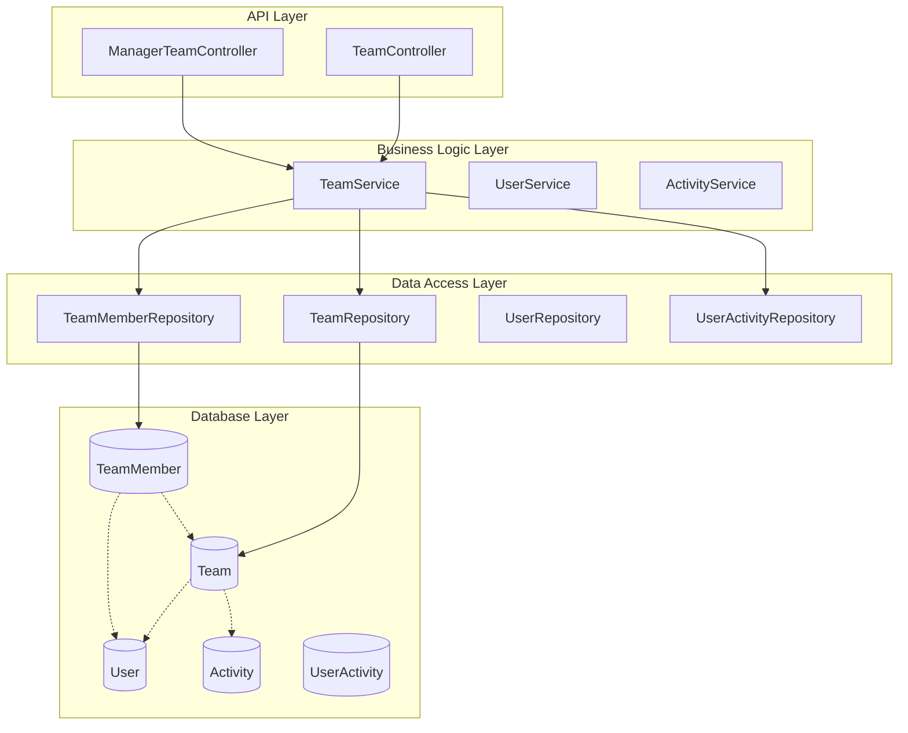
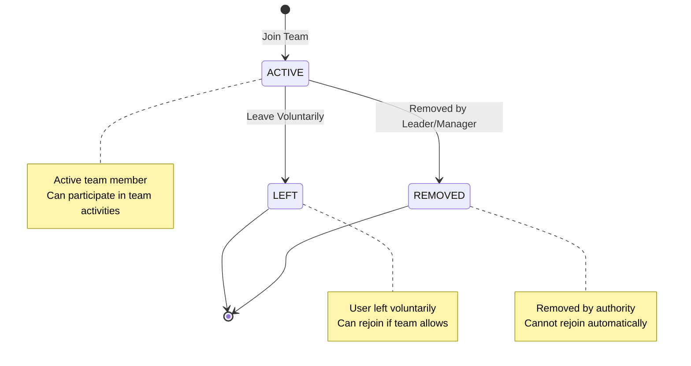
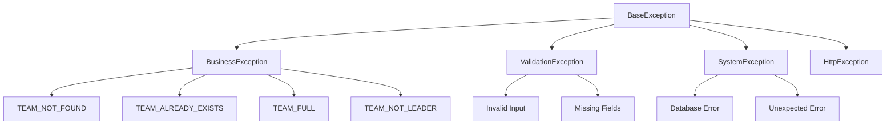

# Team System Overview

## Introduction

The Team System is a core component of the ServerIdeomni business simulation platform that enables collaborative teamwork within activities. It provides a structured environment where users can form teams, manage memberships, and work together under defined leadership structures.

## System Architecture

### High-Level Architecture



### Core Components

#### 1. Controllers
- **TeamController** (`/api/user/team/*`)
  - Handles user-facing team operations
  - Authentication via JWT tokens
  - Input validation through DTOs
  - Response formatting and error handling

- **ManagerTeamController** (`/api/user/manage/teams/*`)
  - Provides manager-level team administration
  - Enhanced permissions for activity managers
  - Bulk operations and administrative functions

#### 2. Services
- **TeamService** (`src/user/team.service.ts`)
  - Core business logic implementation
  - Team lifecycle management
  - Membership operations
  - Leadership transfers
  - Manager administrative functions

#### 3. Repositories
- **TeamRepository** (`src/user/team.repository.ts`)
  - Team entity data access
  - Complex queries with relationships
  - Pagination support
  - Activity-scoped operations

- **TeamMemberRepository** (`src/user/team.repository.ts`)
  - Team membership data access
  - Status tracking
  - Bulk membership operations

#### 4. Data Transfer Objects
- **Request DTOs** - Input validation and API documentation
- **Response DTOs** - Consistent API response formatting
- **Internal DTOs** - Service layer data transfer

## Core Concepts

### Team Lifecycle

1. **Creation**
   - User creates team within their current activity
   - Creator automatically becomes team leader
   - Team gets unique name within activity scope

2. **Growth**
   - Leader invites new members
   - Users can discover and join available teams
   - Membership tracked with status and timestamps

3. **Management**
   - Leaders can manage team settings and membership
   - Members can leave voluntarily
   - Managers can intervene when necessary

4. **Dissolution**
   - Teams can be disbanded by leaders
   - Managers can force disband problematic teams
   - Soft deletion preserves audit trail

### Membership Model



### Leadership Model

- **Single Leader**: Each team has exactly one leader
- **Leader Privileges**:
  - Manage team settings (name, description, max members)
  - Invite and remove team members
  - Transfer leadership to other members
  - Disband the team

- **Leadership Transfer**:
  - Can be initiated by current leader
  - Automatic transfer if leader leaves team
  - Manager override capabilities

## Data Model

### Team Entity
```typescript
interface Team {
  id: string;           // Unique identifier
  name: string;         // Team name (unique per activity)
  description?: string; // Optional team description
  maxMembers: number;   // Maximum team size (default: 4)
  
  // Relationships
  leaderId: string;     // Current team leader
  activityId: string;   // Associated activity
  members: TeamMember[]; // Team memberships
  
  // Audit fields
  createdAt: Date;
  updatedAt: Date;
  deletedAt?: Date;
}
```

### TeamMember Entity
```typescript
interface TeamMember {
  id: string;                    // Unique identifier
  status: TeamMemberStatus;      // ACTIVE, LEFT, REMOVED
  joinedAt: Date;               // When user joined
  
  // Relationships
  userId: string;               // Team member user
  teamId: string;              // Associated team
  
  // Audit fields
  createdAt: Date;
  updatedAt: Date;
  deletedAt?: Date;
}

enum TeamMemberStatus {
  ACTIVE = 'ACTIVE',
  LEFT = 'LEFT',
  REMOVED = 'REMOVED'
}
```

## Integration Points

### Authentication System
- **JWT Token Validation**: All endpoints require valid JWT tokens
- **User Context**: Extract user ID and permissions from tokens
- **Role-Based Access**: Different permissions for users vs managers

### Activity System
- **Activity Context**: Teams exist within specific activities
- **User-Activity Enrollment**: Users must be enrolled in activity to create/join teams
- **Activity Isolation**: Teams are scoped to their parent activity

### User Management System
- **User Validation**: Verify user existence and active status
- **Permission Checking**: Validate user permissions for operations
- **User Type Handling**: Different capabilities for different user types

## Business Rules

### Team Creation Rules
1. Users can create only one team per activity
2. Team names must be unique within the activity
3. Creator becomes the team leader automatically
4. Maximum member limit is configurable (default: 4)

### Membership Rules
1. Users can join only one team per activity
2. Teams cannot exceed their maximum member capacity
3. Members can leave teams voluntarily
4. Leaders can remove members from their teams
5. Managers can remove members from any team in their activity

### Leadership Rules
1. Each team has exactly one leader
2. Leaders can transfer leadership to team members
3. If leader leaves, leadership transfers automatically
4. Managers can override leadership assignments
5. New leaders must be existing team members

## Security Considerations

### Access Control
- **Authentication**: JWT token validation on all endpoints
- **Authorization**: Role-based permissions (User/Manager)
- **Team Access**: Users can only access teams in their current activity
- **Leadership Validation**: Leader-only operations properly protected

### Data Protection
- **Input Validation**: Comprehensive DTO validation with class-validator
- **SQL Injection Prevention**: Prisma ORM with parameterized queries
- **XSS Protection**: Proper input sanitization and output encoding

### Business Logic Security
- **Team Isolation**: Prevent cross-activity team access
- **Member Limits**: Enforce maximum team size constraints
- **Status Validation**: Ensure valid state transitions

## Performance Considerations

### Database Optimization
- **Indexing**: Proper indexes on foreign keys and query fields
- **Pagination**: Efficient pagination for team listings
- **Query Optimization**: Optimized joins and relationship loading

### Caching Strategy
- **Team Data**: Cache frequently accessed team information
- **User Context**: Cache user activity enrollment status
- **Permission Data**: Cache user permissions for repeated validations

### Scalability
- **Connection Pooling**: Efficient database connection management
- **Query Batching**: Batch related database operations
- **Async Processing**: Non-blocking operations where possible

## Error Handling

### Exception Hierarchy


### Common Error Scenarios
- **Team Not Found**: Referenced team doesn't exist or is deleted
- **Team Already Exists**: User already has a team in the activity
- **Team Full**: Team has reached maximum member capacity
- **Not Leader**: Operation requires team leader privileges
- **No Activity**: User has no current activity enrollment

## Monitoring and Logging

### Operation Logging
- **Team Operations**: All CRUD operations logged with user context
- **Membership Changes**: Join/leave/remove operations tracked
- **Leadership Changes**: Leadership transfers and assignments logged
- **Error Tracking**: Business and system exceptions monitored

### Metrics Collection
- **Team Statistics**: Team count, size distribution, activity levels
- **User Engagement**: Team creation, join rates, participation metrics
- **Performance Metrics**: Response times, database query performance
- **Error Rates**: Exception frequency and types

## Future Enhancements

### Planned Features
- **Team Communication**: Integrated messaging system
- **Team Resources**: Resource allocation and tracking
- **Team Analytics**: Performance metrics and insights
- **Team Templates**: Quick team setup with predefined configurations

### Scalability Improvements
- **Event-Driven Architecture**: Real-time notifications and updates
- **Microservice Migration**: Team service extraction for independent scaling
- **Advanced Search**: Elasticsearch integration for team discovery
- **Caching Layer**: Redis integration for improved performance

### Integration Enhancements
- **External APIs**: Integration with external collaboration tools
- **Webhook Support**: Real-time event notifications
- **Export Capabilities**: Team data export in various formats
- **Audit Trail**: Enhanced audit logging and reporting

---

*This overview provides the foundational understanding needed to work with the Team System. For detailed implementation information, refer to the specific documentation sections.*