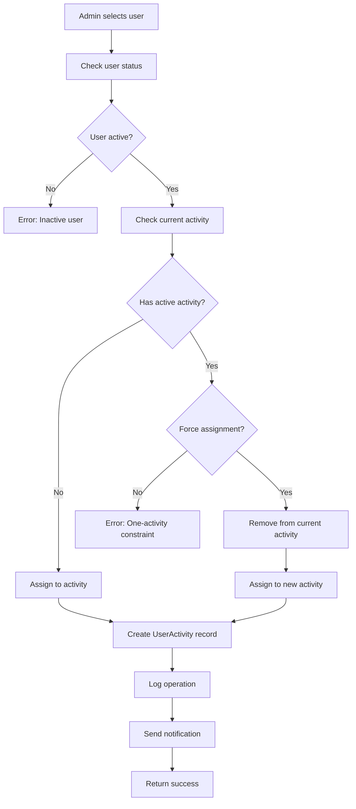

# Admin User Activity Management - Comprehensive Guide

## Table of Contents
1. [System Overview](#system-overview)
2. [Architecture & Key Concepts](#architecture--key-concepts)
3. [API Endpoints Reference](#api-endpoints-reference)
4. [Data Models & Relationships](#data-models--relationships)
5. [Operational Workflows](#operational-workflows)
6. [Advanced Features](#advanced-features)
7. [Examples & Use Cases](#examples--use-cases)
8. [Best Practices & Guidelines](#best-practices--guidelines)
9. [Troubleshooting](#troubleshooting)

---

## System Overview

The Admin User Activity Management system is a sophisticated business simulation platform that provides comprehensive tools for managing user participation in business simulation activities. This system is designed for enterprise-grade usage with advanced permission controls, audit logging, and scalable operations.

### Key Features
- **Two-Tier Admin System**: Super Admin and Limited Admin with distinct permission levels
- **One-Activity-Per-User Constraint**: Each user can only participate in one active activity at a time
- **Comprehensive Team Management**: Full team creation, assignment, and disbanding capabilities
- **Advanced Search & Filtering**: Complex query capabilities with pagination support
- **Bulk Operations**: Efficient mass assignment and transfer operations  
- **Real-time Statistics**: Dashboard-ready analytics and reporting
- **Full Audit Trail**: Complete operation logging for compliance and security
- **Export Capabilities**: Data export in multiple formats (CSV, Excel, JSON)
- **Internationalization**: Multi-language support (English/Chinese)

### Business Context
This platform supports business simulation activities where:
- **Users** represent participants (Managers, Workers, Students)
- **Activities** are business simulation sessions with specific types and schedules
- **Teams** organize users within activities for collaborative simulation
- **Admins** manage the entire ecosystem with role-based permissions

---

## Architecture & Key Concepts

### System Architecture

```
┌─────────────────────────────────────────────────────────────┐
│                    Admin Layer                              │
│  ┌──────────────────┐    ┌──────────────────────────────────┐│
│  │   Super Admin    │    │      Limited Admin              ││
│  │  - Full Control  │    │  - Role-based Permissions       ││
│  │  - All Operations│    │  - Restricted Operations        ││
│  └──────────────────┘    └──────────────────────────────────┘│
└─────────────────────────────────────────────────────────────┘
                              │
                              ▼
┌─────────────────────────────────────────────────────────────┐
│                Management Layer                             │
│  ┌─────────────────┐  ┌─────────────────┐  ┌──────────────┐ │
│  │ User-Activity   │  │ Activity        │  │ Team         │ │
│  │ Management      │  │ Management      │  │ Management   │ │
│  └─────────────────┘  └─────────────────┘  └──────────────┘ │
└─────────────────────────────────────────────────────────────┘
                              │
                              ▼
┌─────────────────────────────────────────────────────────────┐
│                    Data Layer                               │
│  ┌─────────────────┐  ┌─────────────────┐  ┌──────────────┐ │
│  │     Users       │  │   Activities    │  │    Teams     │ │
│  │  - Managers     │  │ - BizSim 2.0    │  │ - Team Data  │ │
│  │  - Workers      │  │ - BizSim 2.2    │  │ - Members    │ │
│  │  - Students     │  │ - BizSim 3.1    │  │ - Leaders    │ │
│  └─────────────────┘  └─────────────────┘  └──────────────┘ │
└─────────────────────────────────────────────────────────────┘
```

### Core Concepts

#### 1. Admin Hierarchy
- **Super Admin**: Full system access, can perform all operations
- **Limited Admin**: Role-based permissions, restricted operations

#### 2. User Types
- **Manager (Type 1)**: Can create Workers and Students
- **Worker (Type 2)**: Regular participants in business simulations
- **Student (Type 3)**: Learning-focused participants

#### 3. Activity Types
- **BizSimulation2.0**: Base business simulation platform
- **BizSimulation2.2**: Enhanced version with additional features
- **BizSimulation3.1**: Latest version with advanced capabilities

#### 4. User Activity States
- **ENROLLED**: User is registered and active in the activity
- **COMPLETED**: User has finished the activity successfully
- **CANCELLED**: User's participation was cancelled
- **NO_SHOW**: User was registered but didn't participate

#### 5. One-Activity-Per-User Constraint
The system enforces that each user can only participate in **one active activity** at a time. This constraint:
- Prevents resource conflicts in business simulations
- Ensures focused participant engagement
- Simplifies team management and coordination
- Can be overridden by Super Admins with force assignment

---

## API Endpoints Reference

### Base Configuration
- **Base URL**: `http://localhost:2999/api`
- **Authentication**: Bearer token required for all endpoints
- **Content-Type**: `application/json`

### 1. User-Activity Search & Management

#### Search Users by Activity Status
**Endpoint**: `GET /admin/user-activities/search`

**Description**: Advanced user search with activity participation filtering.

**Authentication**: Super Admin only

**Query Parameters**:
```typescript
{
  q?: string;                          // Search query (username, email, name)
  userType?: number;                   // 1=Manager, 2=Worker, 3=Student
  activityStatus?: 'assigned' | 'unassigned' | 'all';
  activityId?: string;                 // Filter by specific activity
  enrollmentStatus?: 'ENROLLED' | 'COMPLETED' | 'CANCELLED' | 'NO_SHOW';
  includeInactive?: boolean;           // Include inactive users
  sortBy?: 'username' | 'email' | 'createdAt' | 'enrolledAt' | 'firstName' | 'lastName';
  sortOrder?: 'asc' | 'desc';
  page?: number;                       // Default: 1
  pageSize?: number;                   // Default: 20, Max: 100
}
```

**Example Request**:
```bash
curl -X GET "http://localhost:2999/api/admin/user-activities/search?activityStatus=assigned&userType=3&page=1&pageSize=20" \
  -H "Authorization: Bearer <super_admin_token>" \
  -H "Content-Type: application/json"
```

**Response**:
```typescript
{
  "data": [
    {
      "id": "cuid_user_123",
      "username": "john_student",
      "email": "john@example.com",
      "firstName": "John",
      "lastName": "Doe",
      "userType": 3,
      "isActive": true,
      "createdAt": "2024-01-15T10:30:00Z",
      "currentActivity": {
        "id": "cuid_activity_456",
        "name": "Business Strategy Simulation",
        "activityType": "BizSimulation2_2",
        "startAt": "2024-02-01T09:00:00Z",
        "endAt": "2024-02-15T17:00:00Z",
        "status": "ENROLLED",
        "enrolledAt": "2024-01-20T14:30:00Z",
        "addedBy": {
          "id": "cuid_admin_789",
          "username": "admin_user",
          "email": "admin@example.com"
        }
      },
      "currentTeam": {
        "id": "cuid_team_321",
        "name": "Alpha Team",
        "isLeader": false,
        "memberCount": 4,
        "maxMembers": 6,
        "isOpen": true,
        "joinedAt": "2024-01-22T11:15:00Z"
      }
    }
  ],
  "total": 150,
  "page": 1,
  "pageSize": 20,
  "totalPages": 8,
  "hasNext": true,
  "hasPrevious": false
}
```

#### Assign User to Activity
**Endpoint**: `POST /admin/user-activities/assign`

**Description**: Assign a user to an activity with one-activity constraint handling.

**Authentication**: Super Admin only

**Request Body**:
```typescript
{
  userId: string;              // User ID to assign
  activityId: string;          // Target activity ID
  reason?: string;             // Optional assignment reason
  forceAssignment?: boolean;   // Override one-activity constraint
}
```

**Example Request**:
```bash
curl -X POST "http://localhost:2999/api/admin/user-activities/assign" \
  -H "Authorization: Bearer <super_admin_token>" \
  -H "Content-Type: application/json" \
  -d '{
    "userId": "cuid_user_123",
    "activityId": "cuid_activity_456",
    "reason": "Student requested transfer to advanced simulation",
    "forceAssignment": false
  }'
```

**Response**:
```typescript
{
  "success": true,
  "previousActivity": "cuid_activity_old",
  "message": "User successfully assigned to activity"
}
```

#### Transfer User Between Activities
**Endpoint**: `PUT /admin/user-activities/transfer`

**Description**: Transfer a user from their current activity to a new one.

**Authentication**: Super Admin only

**Request Body**:
```typescript
{
  userId: string;           // User ID to transfer
  newActivityId: string;    // Destination activity ID
  reason?: string;          // Transfer reason
}
```

**Response**:
```typescript
{
  "previousActivity": "cuid_activity_old",
  "newActivity": "cuid_activity_new",
  "transferredAt": "2024-01-25T15:45:00Z"
}
```

#### Remove User from Activity
**Endpoint**: `DELETE /admin/user-activities/users/{userId}/activity`

**Description**: Remove a user from their current activity assignment.

**Authentication**: Super Admin only

**Request Body**:
```typescript
{
  reason?: string;    // Optional removal reason
}
```

**Response**:
```typescript
{
  "success": true,
  "removedFromActivity": "cuid_activity_456",
  "message": "User successfully removed from activity"
}
```

#### Bulk Assign Users to Activity
**Endpoint**: `POST /admin/user-activities/bulk-assign`

**Description**: Assign multiple users to an activity in a single operation.

**Authentication**: Super Admin only

**Request Body**:
```typescript
{
  userIds: string[];           // Array of user IDs
  activityId: string;          // Target activity ID
  reason?: string;             // Bulk assignment reason
  forceAssignment?: boolean;   // Override constraints for all users
}
```

**Response**:
```typescript
{
  "successCount": 8,
  "failedCount": 2,
  "totalCount": 10,
  "details": [
    {
      "userId": "cuid_user_123",
      "success": true,
      "previousActivity": "cuid_activity_old",
      "newActivity": "cuid_activity_new"
    },
    {
      "userId": "cuid_user_456",
      "success": false,
      "error": "User is already assigned to another activity"
    }
  ]
}
```

### 2. Activity Management

#### Get Activity Participants
**Endpoint**: `GET /admin/activities/{activityId}/participants`

**Description**: Get list of users participating in a specific activity.

**Authentication**: Admin with appropriate permissions

**Query Parameters**:
```typescript
{
  status?: 'ENROLLED' | 'COMPLETED' | 'CANCELLED' | 'NO_SHOW';
  userType?: number;          // Filter by user type
  searchName?: string;        // Search by user name
  includeInactive?: boolean; // Include inactive users
}
```

**Response**:
```typescript
[
  {
    "id": "cuid_user_123",
    "username": "john_student",
    "email": "john@example.com",
    "firstName": "John",
    "lastName": "Doe",
    "userType": 3,
    "status": "ENROLLED",
    "enrolledAt": "2024-01-20T14:30:00Z",
    "teamId": "cuid_team_321",
    "teamName": "Alpha Team",
    "isTeamLeader": false
  }
]
```

#### Add Users to Activity
**Endpoint**: `POST /admin/activities/{activityId}/participants`

**Description**: Add multiple users to an activity as participants.

**Authentication**: Admin with ACTIVITY_ADD_PARTICIPANTS permission

**Request Body**:
```typescript
{
  userIds: string[];          // User IDs to add
  enrollmentStatus?: string;  // Initial status (default: ENROLLED)
  notifyUsers?: boolean;      // Send notification emails
}
```

#### Update User Activity Status
**Endpoint**: `PUT /admin/activities/{activityId}/participants/status`

**Description**: Update participation status of a user in an activity.

**Authentication**: Admin with ACTIVITY_UPDATE_PARTICIPANT_STATUS permission

**Request Body**:
```typescript
{
  userId: string;                    // User to update
  status: 'ENROLLED' | 'COMPLETED' | 'CANCELLED' | 'NO_SHOW';
  reason?: string;                   // Status change reason
  notifyUser?: boolean;              // Send notification
}
```

### 3. Team Management

#### Get All Teams
**Endpoint**: `GET /admin/user-activities/teams`

**Description**: View all teams across activities with filtering options.

**Authentication**: Super Admin only

**Query Parameters**:
```typescript
{
  q?: string;                // Search by team name
  activityId?: string;       // Filter by activity
  includeInactive?: boolean; // Include teams with inactive members
  sortBy?: 'name' | 'createdAt' | 'memberCount';
  sortOrder?: 'asc' | 'desc';
  page?: number;
  pageSize?: number;
}
```

**Response**:
```typescript
{
  "data": [
    {
      "id": "cuid_team_321",
      "name": "Alpha Team",
      "description": "Advanced strategy team",
      "memberCount": 4,
      "maxMembers": 6,
      "isOpen": true,
      "createdAt": "2024-01-22T10:00:00Z",
      "activity": {
        "id": "cuid_activity_456",
        "name": "Business Strategy Simulation",
        "activityType": "BizSimulation2_2"
      },
      "leader": {
        "id": "cuid_user_789",
        "username": "team_leader",
        "email": "leader@example.com"
      }
    }
  ],
  "total": 25,
  "page": 1,
  "pageSize": 20,
  "totalPages": 2,
  "hasNext": true,
  "hasPrevious": false
}
```

#### Assign User to Team
**Endpoint**: `POST /admin/user-activities/teams/assign`

**Description**: Assign a user to a team within their current activity.

**Authentication**: Super Admin only

**Request Body**:
```typescript
{
  userId: string;      // User ID to assign
  teamId: string;      // Target team ID
  reason?: string;     // Assignment reason
}
```

**Response**:
```typescript
{
  "success": true,
  "message": "User successfully assigned to team"
}
```

#### Remove User from Team
**Endpoint**: `DELETE /admin/user-activities/users/{userId}/team`

**Description**: Remove a user from their current team.

**Authentication**: Super Admin only

**Response**:
```typescript
{
  "success": true,
  "teamId": "cuid_team_321",
  "message": "User successfully removed from team"
}
```

#### Force Disband Team
**Endpoint**: `DELETE /admin/user-activities/teams/{teamId}/disband`

**Description**: Forcibly disband a team and remove all members.

**Authentication**: Super Admin only

**Request Body**:
```typescript
{
  reason?: string;    // Disbanding reason
}
```

**Response**:
```typescript
{
  "success": true,
  "message": "Team successfully disbanded"
}
```

### 4. Statistics & Analytics

#### Get User-Activity Statistics
**Endpoint**: `GET /admin/user-activities/statistics`

**Description**: Get comprehensive statistics for admin dashboard.

**Authentication**: Super Admin only

**Response**:
```typescript
{
  "totalUsers": 1000,
  "usersWithActivity": 850,
  "usersWithoutActivity": 150,
  "byUserType": {
    "managers": {
      "total": 50,
      "withActivity": 45,
      "withoutActivity": 5
    },
    "workers": {
      "total": 300,
      "withActivity": 280,
      "withoutActivity": 20
    },
    "students": {
      "total": 650,
      "withActivity": 525,
      "withoutActivity": 125
    }
  },
  "byActivity": [
    {
      "activityId": "cuid_activity_456",
      "activityName": "Business Strategy Simulation",
      "totalParticipants": 120,
      "enrolledCount": 100,
      "completedCount": 15,
      "cancelledCount": 3,
      "noShowCount": 2
    }
  ],
  "recentAssignments": {
    "today": 15,
    "thisWeek": 75,
    "thisMonth": 320
  },
  "teamStatistics": {
    "totalTeams": 45,
    "usersInTeams": 380,
    "usersWithoutTeams": 470,
    "averageTeamSize": 8.4,
    "teamsByActivity": [
      {
        "activityId": "cuid_activity_456",
        "activityName": "Business Strategy Simulation",
        "totalTeams": 15,
        "totalMembers": 120,
        "averageTeamSize": 8.0
      }
    ]
  }
}
```

#### Get Unassigned Users
**Endpoint**: `GET /admin/user-activities/unassigned`

**Description**: Get users not assigned to any activity.

**Authentication**: Super Admin only

**Query Parameters**:
```typescript
{
  userType?: number;         // Filter by user type
  includeInactive?: boolean; // Include inactive users
  page?: number;
  pageSize?: number;
}
```

### 5. Export & Reporting

#### Export User-Activity Data
**Endpoint**: `GET /admin/user-activities/export`

**Description**: Export user-activity relationship data in various formats.

**Authentication**: Super Admin only

**Query Parameters**:
```typescript
{
  format?: 'csv' | 'excel' | 'json';    // Export format
  includeUnassigned?: boolean;          // Include users without activities
  includeInactive?: boolean;            // Include inactive users
  userType?: number;                    // Filter by user type
  activityId?: string;                  // Filter by activity
  fields?: string[];                    // Specific fields to export
}
```

**Response**:
```typescript
{
  "success": true,
  "data": {
    "downloadUrl": "/downloads/user-activities-2024-01-25.csv",
    "filename": "user-activities-2024-01-25.csv",
    "recordCount": 850,
    "format": "csv",
    "expiresAt": "2024-01-26T15:45:00Z"
  },
  "message": "Export completed successfully"
}
```

---

## Data Models & Relationships

### Core Database Schema

#### Activity Model
```prisma
model Activity {
  id           String       @id @default(cuid())
  name         String
  activityType ActivityType // BizSimulation2_0, BizSimulation2_2, BizSimulation3_1
  startAt      DateTime
  endAt        DateTime
  description  String?
  isActive     Boolean      @default(true)
  createdAt    DateTime     @default(now())
  updatedAt    DateTime     @updatedAt
  deletedAt    DateTime?    // Soft delete support
  
  // Admin who created this activity
  creator      String
  createdBy    Admin        @relation("ActivityCreator", fields: [creator], references: [id])
  
  // Map template used for simulation
  mapTemplateId Int
  mapTemplate   MapTemplate @relation(fields: [mapTemplateId], references: [id])
  
  // Relationships
  participants UserActivity[]      // Users in this activity
  tileStates   ActivityTileState[] // Map state for this activity
  teams        Team[]              // Teams within this activity
  
  @@map("activities")
}
```

#### UserActivity Model
```prisma
model UserActivity {
  id         String    @id @default(cuid())
  userId     String
  activityId String
  status     UserActivityStatus @default(ENROLLED)
  enrolledAt DateTime  @default(now())
  updatedAt  DateTime  @updatedAt
  deletedAt  DateTime? // Soft delete support
  
  // Admin who added this user to the activity
  addedBy      String?
  addedByAdmin Admin?  @relation("UserActivityAdder", fields: [addedBy], references: [id])
  
  // Relationships
  user       User      @relation(fields: [userId], references: [id], onDelete: Cascade)
  activity   Activity  @relation(fields: [activityId], references: [id], onDelete: Cascade)
  
  // Constraints
  @@unique([userId, activityId])           // Prevent duplicate enrollments
  @@index([userId, deletedAt])             // Support one-activity-per-user queries
  @@map("user_activities")
}
```

#### User Model
```prisma
model User {
  id            String    @id @default(cuid())
  username      String    @unique
  email         String    @unique
  password      String    // Hashed
  firstName     String?
  lastName      String?
  userType      Int       @default(3) // 1=Manager, 2=Worker, 3=Student
  isActive      Boolean   @default(true)
  lastLoginAt   DateTime?
  createdAt     DateTime  @default(now())
  updatedAt     DateTime  @updatedAt
  deletedAt     DateTime? // Soft delete support
  
  // User hierarchy (Manager can create Workers/Students)
  creator       String?   
  createdBy     User?     @relation("UserCreator", fields: [creator], references: [id])
  createdUsers  User[]    @relation("UserCreator")
  
  // Relationships
  activities        UserActivity[]    // Activity participations
  ledTeams         Team[]           @relation("TeamLeader")
  teamMemberships  TeamMember[]     // Team memberships
  roles            UserRole[]       // RBAC roles
  
  @@map("users")
}
```

#### Team Model
```prisma
model Team {
  id          String   @id @default(cuid())
  name        String
  description String?
  maxMembers  Int      @default(10)
  isOpen      Boolean  @default(true)
  createdAt   DateTime @default(now())
  updatedAt   DateTime @updatedAt
  deletedAt   DateTime?
  
  // Activity this team belongs to
  activityId  String
  activity    Activity @relation(fields: [activityId], references: [id], onDelete: Cascade)
  
  // Team leader
  leaderId    String
  leader      User     @relation("TeamLeader", fields: [leaderId], references: [id])
  
  // Team members
  members     TeamMember[]
  
  @@map("teams")
}
```

### Relationship Diagram

```
┌─────────────────┐       ┌─────────────────┐       ┌─────────────────┐
│      Admin      │       │      User       │       │    Activity     │
│                 │       │                 │       │                 │
│ - id            │◄─────┐│ - id            │       │ - id            │
│ - username      │      ││ - username      │       │ - name          │
│ - adminType     │      ││ - email         │       │ - activityType  │
│ - permissions   │      ││ - userType      │       │ - startAt       │
└─────────────────┘      │└─────────────────┘       │ - endAt         │
                         │        │                 └─────────────────┘
                         │        │                          │
                         │        ▼                          │
                         │┌─────────────────┐                │
                         ││  UserActivity   │◄───────────────┘
                         ││                 │
                         ││ - userId        │
                         │├─ activityId     │
                         ││ - status        │
                         ││ - enrolledAt    │
                         ├┤ - addedBy       │
                         │└─────────────────┘
                         │        │
                         │        ▼
                         │┌─────────────────┐
                         ││      Team       │
                         ││                 │
                         ││ - id            │
                         ││ - name          │
                         ├┤ - activityId    │
                         ││ - leaderId      │
                         ││ - maxMembers    │
                         │└─────────────────┘
                         │        │
                         │        ▼
                         │┌─────────────────┐
                         ││   TeamMember    │
                         ││                 │
                         ││ - teamId        │
                         └┤ - userId        │
                          │ - joinedAt      │
                          └─────────────────┘
```

### Enums and Constants

#### UserActivityStatus
```typescript
enum UserActivityStatus {
  ENROLLED = "ENROLLED",      // Active participation
  COMPLETED = "COMPLETED",    // Successfully finished
  CANCELLED = "CANCELLED",    // Enrollment cancelled
  NO_SHOW = "NO_SHOW"        // Registered but didn't participate
}
```

#### ActivityType
```typescript
enum ActivityType {
  BizSimulation2_0 = "BizSimulation2.0",
  BizSimulation2_2 = "BizSimulation2.2", 
  BizSimulation3_1 = "BizSimulation3.1"
}
```

#### UserType Constants
```typescript
const USER_TYPES = {
  MANAGER: 1,    // Can create Workers and Students
  WORKER: 2,     // Regular participants
  STUDENT: 3     // Learning-focused participants
} as const;
```

---

## Operational Workflows

### 1. User Assignment Workflow

#### Standard Assignment Process


#### Code Implementation Pattern
```typescript
// Example: Assign user to activity with constraint checking
async assignUserToActivity(
  userId: string, 
  activityId: string, 
  adminId: string, 
  forceAssignment = false,
  reason?: string
): Promise<AssignmentResult> {
  
  // 1. Validate inputs
  const user = await this.userRepository.findById(userId);
  if (!user || !user.isActive) {
    throw BusinessException.notFound('User', userId);
  }
  
  const activity = await this.activityRepository.findById(activityId);
  if (!activity || !activity.isActive) {
    throw BusinessException.notFound('Activity', activityId);
  }
  
  // 2. Check one-activity constraint
  const currentActivity = await this.userActivityRepository.findActiveByUserId(userId);
  if (currentActivity && !forceAssignment) {
    throw BusinessException.conflict('User already assigned to activity', {
      userId,
      currentActivityId: currentActivity.activityId
    });
  }
  
  // 3. Handle constraint override
  let previousActivity: string | undefined;
  if (currentActivity && forceAssignment) {
    await this.userActivityRepository.deactivate(currentActivity.id);
    previousActivity = currentActivity.activityId;
  }
  
  // 4. Create assignment
  await this.userActivityRepository.create({
    userId,
    activityId,
    status: UserActivityStatus.ENROLLED,
    addedBy: adminId
  });
  
  // 5. Log operation
  await this.logOperation({
    adminId,
    action: 'ASSIGN_USER_TO_ACTIVITY',
    resourceId: activityId,
    metadata: { userId, previousActivity, reason }
  });
  
  return {
    success: true,
    previousActivity,
    message: 'User successfully assigned to activity'
  };
}
```

### 2. Bulk Assignment Workflow

#### Bulk Processing Pattern
```typescript
async bulkAssignUsersToActivity(
  userIds: string[],
  activityId: string,
  adminId: string,
  forceAssignment = false,
  reason?: string
): Promise<BulkOperationResult> {
  
  const results: BulkOperationDetail[] = [];
  let successCount = 0;
  let failedCount = 0;
  
  // Process in batches to avoid memory issues
  const BATCH_SIZE = 10;
  for (let i = 0; i < userIds.length; i += BATCH_SIZE) {
    const batch = userIds.slice(i, i + BATCH_SIZE);
    
    const batchPromises = batch.map(async (userId) => {
      try {
        const result = await this.assignUserToActivity(
          userId, 
          activityId, 
          adminId, 
          forceAssignment, 
          reason
        );
        
        successCount++;
        return {
          userId,
          success: true,
          previousActivity: result.previousActivity,
          newActivity: activityId
        };
        
      } catch (error) {
        failedCount++;
        return {
          userId,
          success: false,
          error: error.message
        };
      }
    });
    
    const batchResults = await Promise.all(batchPromises);
    results.push(...batchResults);
  }
  
  return {
    successCount,
    failedCount,
    totalCount: userIds.length,
    details: results
  };
}
```

### 3. Team Management Workflow

#### Team Assignment Process
1. **Validation**: Check user has active activity
2. **Constraint Check**: Verify user not already in a team
3. **Capacity Check**: Ensure team has available slots
4. **Assignment**: Create team membership record
5. **Notification**: Inform team leader and members
6. **Logging**: Record operation for audit

#### Team Disbanding Process
```typescript
async forceDisbandTeam(adminId: string, teamId: string): Promise<DisbandResult> {
  return await this.prismaService.executeTransaction(async (tx) => {
    // 1. Get team details
    const team = await tx.team.findUnique({
      where: { id: teamId },
      include: { members: true, leader: true }
    });
    
    if (!team) {
      throw BusinessException.notFound('Team', teamId);
    }
    
    // 2. Remove all members
    await tx.teamMember.deleteMany({
      where: { teamId }
    });
    
    // 3. Soft delete team
    await tx.team.update({
      where: { id: teamId },
      data: { deletedAt: new Date() }
    });
    
    // 4. Log operation
    await this.logOperation({
      adminId,
      action: 'FORCE_DISBAND_TEAM',
      resourceId: teamId,
      metadata: { 
        memberCount: team.members.length,
        leaderId: team.leaderId
      }
    });
    
    return {
      success: true,
      message: `Team ${team.name} successfully disbanded`
    };
  });
}
```

### 4. Data Export Workflow

#### Export Process Steps
1. **Parameter Validation**: Verify export parameters
2. **Permission Check**: Ensure admin has export rights
3. **Data Query**: Build filtered query based on parameters
4. **Format Processing**: Convert data to requested format
5. **File Generation**: Create downloadable file
6. **Cleanup Scheduling**: Schedule file cleanup after expiration

#### Export Implementation
```typescript
async exportUserActivityData(
  format: 'csv' | 'excel' | 'json',
  filters: ExportFilters,
  adminId: string
): Promise<ExportResult> {
  
  // 1. Build query based on filters
  const query = this.buildExportQuery(filters);
  
  // 2. Fetch data with pagination for large datasets
  const data = await this.fetchExportData(query);
  
  // 3. Process data based on format
  const filename = `user-activities-${new Date().toISOString().split('T')[0]}.${format}`;
  const filePath = await this.generateExportFile(data, format, filename);
  
  // 4. Schedule cleanup
  this.scheduleFileCleanup(filePath, 24 * 60 * 60 * 1000); // 24 hours
  
  // 5. Log export operation
  await this.logOperation({
    adminId,
    action: 'EXPORT_USER_ACTIVITY_DATA',
    metadata: { 
      format, 
      recordCount: data.length,
      filters: JSON.stringify(filters)
    }
  });
  
  return {
    downloadUrl: `/downloads/${filename}`,
    filename,
    recordCount: data.length,
    format,
    expiresAt: new Date(Date.now() + 24 * 60 * 60 * 1000)
  };
}
```

---

## Advanced Features

### 1. Permission-Based Access Control

#### RBAC Integration
The system integrates with a comprehensive Role-Based Access Control (RBAC) system:

```typescript
// Permission definitions for user-activity management
const USER_ACTIVITY_PERMISSIONS = {
  // User-Activity Management
  'USER_ACTIVITY_VIEW': 'View user activity assignments',
  'USER_ACTIVITY_ASSIGN': 'Assign users to activities',
  'USER_ACTIVITY_TRANSFER': 'Transfer users between activities',
  'USER_ACTIVITY_REMOVE': 'Remove users from activities',
  'USER_ACTIVITY_BULK_ASSIGN': 'Bulk assign users to activities',
  
  // Team Management
  'TEAM_VIEW_ALL': 'View all teams across activities',
  'TEAM_ASSIGN_USERS': 'Assign users to teams',
  'TEAM_REMOVE_USERS': 'Remove users from teams',
  'TEAM_DISBAND': 'Disband teams',
  
  // Statistics and Reporting
  'USER_ACTIVITY_STATISTICS': 'View user-activity statistics',
  'USER_ACTIVITY_EXPORT': 'Export user-activity data',
  
  // Admin Operations
  'USER_ACTIVITY_ADMIN_ALL': 'Full administrative access to user-activity system'
} as const;
```

#### Permission Guards
```typescript
// Example: Custom permission guard usage
@AdminPermissionAuth('USER_ACTIVITY_ASSIGN', 'USER_ACTIVITY_BULK_ASSIGN')
async assignUserToActivity(/* ... */) {
  // Implementation
}

// Super Admin bypass
@SuperAdminAuth()  // Bypasses all permission checks
async forceTransferUser(/* ... */) {
  // Implementation
}
```

### 2. Advanced Search & Filtering

#### Complex Query Builder
```typescript
class UserActivitySearchBuilder {
  private query: Prisma.UserFindManyArgs = {
    include: {
      activities: {
        include: {
          activity: true,
          addedByAdmin: true
        }
      },
      teamMemberships: {
        include: {
          team: true
        }
      }
    }
  };
  
  withActivityStatus(status: 'assigned' | 'unassigned' | 'all') {
    if (status === 'assigned') {
      this.query.where = {
        ...this.query.where,
        activities: {
          some: {
            deletedAt: null,
            activity: {
              isActive: true,
              deletedAt: null
            }
          }
        }
      };
    } else if (status === 'unassigned') {
      this.query.where = {
        ...this.query.where,
        activities: {
          none: {
            deletedAt: null,
            activity: {
              isActive: true,
              deletedAt: null
            }
          }
        }
      };
    }
    return this;
  }
  
  withUserType(userType: number) {
    this.query.where = {
      ...this.query.where,
      userType
    };
    return this;
  }
  
  withTextSearch(searchText: string) {
    this.query.where = {
      ...this.query.where,
      OR: [
        { username: { contains: searchText, mode: 'insensitive' } },
        { email: { contains: searchText, mode: 'insensitive' } },
        { firstName: { contains: searchText, mode: 'insensitive' } },
        { lastName: { contains: searchText, mode: 'insensitive' } }
      ]
    };
    return this;
  }
  
  build(): Prisma.UserFindManyArgs {
    return this.query;
  }
}
```

### 3. Real-time Notifications

#### Event-Driven Notifications
```typescript
// Event emitter for user-activity operations
class UserActivityEventEmitter {
  
  async emitUserAssigned(data: UserAssignedEvent) {
    // Notify user
    await this.notificationService.sendToUser(data.userId, {
      type: 'ACTIVITY_ASSIGNED',
      title: 'Activity Assignment',
      message: `You have been assigned to ${data.activityName}`,
      metadata: data
    });
    
    // Notify activity managers
    await this.notificationService.sendToActivityManagers(data.activityId, {
      type: 'NEW_PARTICIPANT',
      title: 'New Participant Added',
      message: `${data.userName} has been added to ${data.activityName}`,
      metadata: data
    });
    
    // Real-time updates via WebSocket
    this.websocketService.broadcast(`activity:${data.activityId}`, {
      event: 'participant_added',
      data
    });
  }
  
  async emitTeamAssignment(data: TeamAssignedEvent) {
    // Notify user
    await this.notificationService.sendToUser(data.userId, {
      type: 'TEAM_ASSIGNED',
      title: 'Team Assignment',
      message: `You have been assigned to team ${data.teamName}`,
      metadata: data
    });
    
    // Notify team members
    await this.notificationService.sendToTeamMembers(data.teamId, {
      type: 'NEW_TEAM_MEMBER',
      title: 'New Team Member',
      message: `${data.userName} has joined your team`,
      metadata: data
    });
  }
}
```

### 4. Audit Trail & Compliance

#### Comprehensive Logging
```typescript
interface OperationLogEntry {
  id: string;
  adminId: string;
  action: string;
  resource: string;
  resourceId?: string;
  description: string;
  metadata: Record<string, any>;
  ipAddress?: string;
  userAgent?: string;
  timestamp: Date;
}

class AuditLogger {
  async logUserActivityOperation(
    adminId: string,
    operation: UserActivityOperation
  ): Promise<void> {
    
    const logEntry: OperationLogEntry = {
      id: generateCuid(),
      adminId,
      action: operation.action,
      resource: 'UserActivity',
      resourceId: operation.resourceId,
      description: this.generateDescription(operation),
      metadata: {
        ...operation.metadata,
        constraints: {
          oneActivityPerUser: true,
          teamCapacityCheck: true
        },
        validationResults: operation.validationResults
      },
      ipAddress: operation.context?.ipAddress,
      userAgent: operation.context?.userAgent,
      timestamp: new Date()
    };
    
    await this.operationLogRepository.create(logEntry);
    
    // Also send to external audit system if configured
    if (this.config.externalAuditEnabled) {
      await this.externalAuditService.sendLog(logEntry);
    }
  }
  
  private generateDescription(operation: UserActivityOperation): string {
    const templates = {
      'ASSIGN_USER_TO_ACTIVITY': 'Assigned user {{userId}} to activity {{activityId}}',
      'TRANSFER_USER_ACTIVITY': 'Transferred user {{userId}} from {{previousActivity}} to {{newActivity}}',
      'BULK_ASSIGN_USERS_TO_ACTIVITY': 'Bulk assigned {{userCount}} users to activity {{activityId}}',
      'REMOVE_USER_FROM_ACTIVITY': 'Removed user {{userId}} from activity {{activityId}}',
      'FORCE_DISBAND_TEAM': 'Force disbanded team {{teamId}} with {{memberCount}} members'
    };
    
    const template = templates[operation.action] || 'Performed {{action}} operation';
    return this.interpolateTemplate(template, operation.metadata);
  }
}
```

### 5. Performance Optimization

#### Query Optimization Strategies

```typescript
// Optimized user search with activity information
class OptimizedUserActivityService {
  
  async searchUsersWithActivityStatus(
    searchDto: AdminUserActivitySearchDto,
    adminId: string
  ): Promise<PaginationResult<UserWithActivityDto>> {
    
    // Use raw SQL for complex queries when needed
    if (searchDto.activityStatus && searchDto.userType) {
      return this.executeOptimizedSearch(searchDto);
    }
    
    // Use Prisma for simpler queries with proper includes
    return this.executeStandardSearch(searchDto);
  }
  
  private async executeOptimizedSearch(
    searchDto: AdminUserActivitySearchDto
  ): Promise<PaginationResult<UserWithActivityDto>> {
    
    // Raw SQL for complex filtering with proper indexing
    const sqlQuery = `
      SELECT 
        u.*,
        ua.id as user_activity_id,
        ua.status as activity_status,
        ua.enrolled_at,
        a.id as activity_id,
        a.name as activity_name,
        a.activity_type,
        a.start_at,
        a.end_at,
        admin.username as added_by_username,
        t.id as team_id,
        t.name as team_name,
        tm.is_leader as is_team_leader
      FROM users u
      LEFT JOIN user_activities ua ON u.id = ua.user_id 
        AND ua.deleted_at IS NULL
      LEFT JOIN activities a ON ua.activity_id = a.id 
        AND a.is_active = true 
        AND a.deleted_at IS NULL
      LEFT JOIN admins admin ON ua.added_by = admin.id
      LEFT JOIN team_members tm ON u.id = tm.user_id 
        AND tm.deleted_at IS NULL
      LEFT JOIN teams t ON tm.team_id = t.id 
        AND t.deleted_at IS NULL
      WHERE u.deleted_at IS NULL
        ${this.buildWhereClause(searchDto)}
      ORDER BY ${this.buildOrderClause(searchDto)}
      LIMIT ${searchDto.pageSize || 20} 
      OFFSET ${((searchDto.page || 1) - 1) * (searchDto.pageSize || 20)}
    `;
    
    const results = await this.prisma.$queryRaw(sqlQuery);
    const totalCount = await this.getSearchCount(searchDto);
    
    return this.formatSearchResults(results, totalCount, searchDto);
  }
  
  // Cache frequently accessed statistics
  @CacheResult(300) // 5 minutes cache
  async getUserActivityStatistics(adminId: string): Promise<UserActivityStatisticsDto> {
    // Implementation with caching
  }
}
```

#### Database Indexing Strategy
```sql
-- Essential indexes for user-activity management
CREATE INDEX CONCURRENTLY idx_user_activities_user_id_active 
ON user_activities (user_id, deleted_at) 
WHERE deleted_at IS NULL;

CREATE INDEX CONCURRENTLY idx_user_activities_activity_id_status 
ON user_activities (activity_id, status, deleted_at) 
WHERE deleted_at IS NULL;

CREATE INDEX CONCURRENTLY idx_users_search 
ON users USING gin((
  setweight(to_tsvector('english', coalesce(username, '')), 'A') ||
  setweight(to_tsvector('english', coalesce(email, '')), 'A') ||
  setweight(to_tsvector('english', coalesce(first_name, '')), 'B') ||
  setweight(to_tsvector('english', coalesce(last_name, '')), 'B')
));

CREATE INDEX CONCURRENTLY idx_users_filters 
ON users (user_type, is_active, deleted_at, created_at);

CREATE INDEX CONCURRENTLY idx_activities_active 
ON activities (is_active, deleted_at, activity_type, start_at, end_at) 
WHERE is_active = true AND deleted_at IS NULL;

CREATE INDEX CONCURRENTLY idx_teams_activity_id 
ON teams (activity_id, deleted_at) 
WHERE deleted_at IS NULL;

CREATE INDEX CONCURRENTLY idx_team_members_user_team 
ON team_members (user_id, team_id, deleted_at) 
WHERE deleted_at IS NULL;
```

---

## Examples & Use Cases

### 1. Common Administrative Scenarios

#### Scenario 1: Student Cohort Assignment
**Situation**: A new business simulation cohort of 50 students needs to be assigned to "Advanced Strategy Simulation" activity.

**Steps**:
1. **Preparation**: Admin prepares list of student IDs
2. **Bulk Assignment**: Use bulk assignment endpoint
3. **Team Formation**: Organize students into teams of 8-10 members
4. **Notification**: System sends welcome emails and activity details

**API Calls**:
```bash
# 1. Bulk assign students to activity
curl -X POST "http://localhost:2999/api/admin/user-activities/bulk-assign" \
  -H "Authorization: Bearer <super_admin_token>" \
  -H "Content-Type: application/json" \
  -d '{
    "userIds": ["student_001", "student_002", ..., "student_050"],
    "activityId": "activity_advanced_strategy",
    "reason": "New cohort assignment for Advanced Strategy Simulation",
    "forceAssignment": false
  }'

# 2. Check assignment results
curl -X GET "http://localhost:2999/api/admin/user-activities/search?activityId=activity_advanced_strategy&page=1&pageSize=50" \
  -H "Authorization: Bearer <super_admin_token>"

# 3. Create teams and assign students
curl -X POST "http://localhost:2999/api/admin/user-activities/teams/assign" \
  -H "Authorization: Bearer <super_admin_token>" \
  -H "Content-Type: application/json" \
  -d '{
    "userId": "student_001",
    "teamId": "team_alpha_01",
    "reason": "Team formation for simulation exercise"
  }'
```

#### Scenario 2: Activity Migration
**Situation**: "Business Fundamentals" activity is being discontinued, and all 120 participants need to be moved to "Enhanced Business Simulation".

**Steps**:
1. **Participant Identification**: Get all users from the discontinued activity
2. **Batch Transfer**: Transfer users in groups to avoid system overload
3. **Team Restructuring**: Reform teams in the new activity
4. **Validation**: Ensure all transfers completed successfully

**Implementation**:
```typescript
// Activity migration workflow
async migrateActivityParticipants(
  fromActivityId: string,
  toActivityId: string,
  adminId: string
): Promise<MigrationResult> {
  
  // 1. Get all participants from source activity
  const participants = await this.activityService.getActivityParticipants(
    fromActivityId,
    { status: 'ENROLLED' }
  );
  
  const userIds = participants.map(p => p.id);
  const BATCH_SIZE = 20;
  const results: BatchResult[] = [];
  
  // 2. Process in batches
  for (let i = 0; i < userIds.length; i += BATCH_SIZE) {
    const batch = userIds.slice(i, i + BATCH_SIZE);
    
    const batchResult = await this.bulkTransferUsers(
      batch,
      fromActivityId,
      toActivityId,
      adminId,
      `Activity migration from ${fromActivityId} to ${toActivityId}`
    );
    
    results.push(batchResult);
    
    // Brief pause between batches to avoid overwhelming the system
    await new Promise(resolve => setTimeout(resolve, 1000));
  }
  
  // 3. Aggregate results
  const totalSuccess = results.reduce((sum, r) => sum + r.successCount, 0);
  const totalFailed = results.reduce((sum, r) => sum + r.failedCount, 0);
  
  // 4. Log migration completion
  await this.logOperation({
    adminId,
    action: 'MIGRATE_ACTIVITY_PARTICIPANTS',
    resourceId: toActivityId,
    metadata: {
      fromActivityId,
      toActivityId,
      totalUsers: userIds.length,
      successCount: totalSuccess,
      failedCount: totalFailed,
      batches: results.length
    }
  });
  
  return {
    totalUsers: userIds.length,
    successCount: totalSuccess,
    failedCount: totalFailed,
    batchResults: results
  };
}
```

#### Scenario 3: Performance Monitoring & Optimization
**Situation**: System performance degrades during peak assignment periods. Need to monitor and optimize user-activity operations.

**Monitoring Implementation**:
```typescript
// Performance monitoring decorator
function MonitorPerformance(operation: string) {
  return function (target: any, propertyKey: string, descriptor: PropertyDescriptor) {
    const originalMethod = descriptor.value;
    
    descriptor.value = async function (...args: any[]) {
      const startTime = Date.now();
      const memoryBefore = process.memoryUsage();
      
      try {
        const result = await originalMethod.apply(this, args);
        
        const endTime = Date.now();
        const memoryAfter = process.memoryUsage();
        
        // Log performance metrics
        this.logger.log(`Performance [${operation}]: ${endTime - startTime}ms`, {
          operation,
          duration: endTime - startTime,
          memoryDelta: memoryAfter.heapUsed - memoryBefore.heapUsed,
          args: args.map(arg => typeof arg === 'object' ? JSON.stringify(arg).length : arg)
        });
        
        // Send metrics to monitoring system
        this.metricsService.recordOperation(operation, {
          duration: endTime - startTime,
          memoryUsage: memoryAfter.heapUsed - memoryBefore.heapUsed,
          success: true
        });
        
        return result;
        
      } catch (error) {
        const endTime = Date.now();
        
        this.metricsService.recordOperation(operation, {
          duration: endTime - startTime,
          success: false,
          error: error.message
        });
        
        throw error;
      }
    };
  };
}

// Usage in service methods
class UserActivityService {
  
  @MonitorPerformance('BULK_ASSIGN_USERS')
  async bulkAssignUsersToActivity(/* ... */) {
    // Implementation
  }
  
  @MonitorPerformance('SEARCH_USERS_WITH_ACTIVITY_STATUS')
  async searchUsersWithActivityStatus(/* ... */) {
    // Implementation  
  }
}
```

### 2. Integration Examples

#### Frontend Dashboard Integration
```typescript
// React component for admin dashboard
const UserActivityDashboard: React.FC = () => {
  const [statistics, setStatistics] = useState<UserActivityStatistics>();
  const [searchResults, setSearchResults] = useState<UserSearchResults>();
  const [loading, setLoading] = useState(false);
  
  useEffect(() => {
    fetchStatistics();
  }, []);
  
  const fetchStatistics = async () => {
    try {
      const response = await adminApi.getUserActivityStatistics();
      setStatistics(response.data);
    } catch (error) {
      console.error('Failed to fetch statistics:', error);
    }
  };
  
  const handleBulkAssignment = async (userIds: string[], activityId: string) => {
    setLoading(true);
    try {
      const response = await adminApi.bulkAssignUsersToActivity({
        userIds,
        activityId,
        reason: 'Bulk assignment from dashboard',
        forceAssignment: false
      });
      
      if (response.data.failedCount > 0) {
        // Handle partial failures
        showPartialSuccessNotification(response.data);
      } else {
        showSuccessNotification('All users assigned successfully');
      }
      
      // Refresh data
      fetchStatistics();
      
    } catch (error) {
      showErrorNotification('Bulk assignment failed');
    } finally {
      setLoading(false);
    }
  };
  
  return (
    <div className="user-activity-dashboard">
      <StatisticsCards statistics={statistics} />
      <UserSearchPanel 
        onSearch={setSearchResults}
        onBulkAssign={handleBulkAssignment}
        loading={loading}
      />
      <ActivityManagementPanel />
      <TeamManagementPanel />
    </div>
  );
};
```

#### External System Integration
```typescript
// Integration with external Learning Management System (LMS)
class LMSIntegrationService {
  
  async syncUserActivities(): Promise<SyncResult> {
    // 1. Fetch activity assignments from internal system
    const internalAssignments = await this.userActivityService.getAllActiveAssignments();
    
    // 2. Fetch assignments from external LMS
    const externalAssignments = await this.lmsApi.getEnrollments();
    
    // 3. Compare and identify discrepancies
    const discrepancies = this.compareAssignments(internalAssignments, externalAssignments);
    
    // 4. Sync discrepancies
    const syncResults = await Promise.allSettled(
      discrepancies.map(d => this.syncDiscrepancy(d))
    );
    
    // 5. Log sync results
    await this.logSyncOperation(syncResults);
    
    return this.aggregateSyncResults(syncResults);
  }
  
  private async syncDiscrepancy(discrepancy: AssignmentDiscrepancy): Promise<SyncResult> {
    switch (discrepancy.type) {
      case 'MISSING_INTERNAL':
        // User enrolled in LMS but not in internal system
        return await this.userActivityService.assignUserToActivity(
          discrepancy.userId,
          discrepancy.activityId,
          'system_sync',
          false,
          'LMS sync - missing internal assignment'
        );
        
      case 'MISSING_EXTERNAL':
        // User assigned internally but not in LMS
        return await this.lmsApi.enrollUser(
          discrepancy.userId,
          discrepancy.courseId,
          'Internal system sync'
        );
        
      case 'STATUS_MISMATCH':
        // Different statuses between systems
        return await this.reconcileStatusMismatch(discrepancy);
        
      default:
        throw new Error(`Unknown discrepancy type: ${discrepancy.type}`);
    }
  }
}
```

### 3. Automation Examples

#### Automated Team Formation
```typescript
// Automatic team formation based on user attributes
class AutoTeamFormationService {
  
  async formBalancedTeams(
    activityId: string,
    teamSize: number = 8,
    adminId: string
  ): Promise<TeamFormationResult> {
    
    // 1. Get all participants in the activity
    const participants = await this.activityService.getActivityParticipants(
      activityId,
      { status: 'ENROLLED' }
    );
    
    // 2. Filter out users already in teams
    const unassignedUsers = participants.filter(p => !p.teamId);
    
    // 3. Apply balancing algorithm
    const teams = this.balanceTeamsByAttributes(unassignedUsers, teamSize);
    
    // 4. Create teams and assign members
    const creationResults = [];
    for (const teamData of teams) {
      const team = await this.teamService.createTeam({
        name: this.generateTeamName(),
        activityId,
        leaderId: teamData.leader.id,
        maxMembers: teamSize
      });
      
      const assignmentResults = await Promise.all(
        teamData.members.map(member => 
          this.assignUserToTeam(adminId, member.id, team.id)
        )
      );
      
      creationResults.push({
        teamId: team.id,
        teamName: team.name,
        memberCount: teamData.members.length,
        assignmentResults
      });
    }
    
    return {
      teamsCreated: creationResults.length,
      totalAssigned: creationResults.reduce((sum, t) => sum + t.memberCount, 0),
      unassignedRemaining: unassignedUsers.length % teamSize,
      details: creationResults
    };
  }
  
  private balanceTeamsByAttributes(
    users: User[],
    teamSize: number
  ): TeamFormationData[] {
    // Balance teams by user type, experience level, etc.
    const teams: TeamFormationData[] = [];
    const usersByType = this.groupUsersByType(users);
    
    const numTeams = Math.floor(users.length / teamSize);
    
    for (let i = 0; i < numTeams; i++) {
      const team: TeamFormationData = {
        leader: null,
        members: []
      };
      
      // Assign one manager as leader if available
      if (usersByType.managers.length > i) {
        team.leader = usersByType.managers[i];
        team.members.push(team.leader);
      }
      
      // Fill remaining slots with workers and students
      const remainingSlots = teamSize - team.members.length;
      const availableUsers = [
        ...usersByType.workers,
        ...usersByType.students
      ].filter(u => !teams.some(t => t.members.includes(u)));
      
      team.members.push(...availableUsers.slice(0, remainingSlots));
      
      // If no manager available, assign most experienced user as leader
      if (!team.leader && team.members.length > 0) {
        team.leader = this.selectMostExperiencedUser(team.members);
      }
      
      teams.push(team);
    }
    
    return teams;
  }
}
```

---

## Best Practices & Guidelines

### 1. Performance Best Practices

#### Query Optimization
```typescript
// DO: Use specific selects and includes
const users = await this.prisma.user.findMany({
  select: {
    id: true,
    username: true,
    email: true,
    userType: true,
    activities: {
      select: {
        id: true,
        status: true,
        activity: {
          select: {
            id: true,
            name: true,
            activityType: true
          }
        }
      },
      where: {
        deletedAt: null,
        activity: {
          isActive: true,
          deletedAt: null
        }
      }
    }
  },
  where: { /* filters */ }
});

// DON'T: Use findMany without specific selects for large datasets
const users = await this.prisma.user.findMany({
  include: {
    activities: {
      include: {
        activity: true,
        addedByAdmin: true
      }
    },
    teamMemberships: true,
    roles: true
  }
});
```

#### Pagination Implementation
```typescript
// Always implement cursor-based pagination for large datasets
class PaginationService {
  
  async getPaginatedUsers(
    cursor?: string,
    limit: number = 20
  ): Promise<PaginatedResult<User>> {
    
    const users = await this.prisma.user.findMany({
      take: limit + 1, // Take one extra to check if there's a next page
      cursor: cursor ? { id: cursor } : undefined,
      orderBy: { id: 'asc' },
      where: { /* filters */ }
    });
    
    const hasNextPage = users.length > limit;
    const items = hasNextPage ? users.slice(0, -1) : users;
    const nextCursor = hasNextPage ? items[items.length - 1].id : null;
    
    return {
      items,
      nextCursor,
      hasNextPage,
      totalCount: await this.getTotalCount() // Cache this value
    };
  }
}
```

#### Bulk Operations Optimization
```typescript
// Process bulk operations in batches
async bulkUpdateUserActivity(
  operations: BulkUpdateOperation[]
): Promise<BulkResult> {
  
  const BATCH_SIZE = 50;
  const results: BatchResult[] = [];
  
  for (let i = 0; i < operations.length; i += BATCH_SIZE) {
    const batch = operations.slice(i, i + BATCH_SIZE);
    
    // Use transaction for each batch
    const batchResult = await this.prisma.$transaction(async (tx) => {
      return Promise.allSettled(
        batch.map(op => this.processSingleUpdate(tx, op))
      );
    });
    
    results.push({
      batchIndex: Math.floor(i / BATCH_SIZE),
      operations: batchResult
    });
  }
  
  return this.aggregateBatchResults(results);
}
```

### 2. Security Best Practices

#### Input Validation
```typescript
// Comprehensive validation for user-activity operations
class UserActivityValidator {
  
  validateAssignmentRequest(request: AssignUserToActivityDto): ValidationResult {
    const errors: ValidationError[] = [];
    
    // Validate user ID format
    if (!this.isValidCuid(request.userId)) {
      errors.push({
        field: 'userId',
        message: 'Invalid user ID format',
        code: 'INVALID_USER_ID'
      });
    }
    
    // Validate activity ID format
    if (!this.isValidCuid(request.activityId)) {
      errors.push({
        field: 'activityId',
        message: 'Invalid activity ID format',
        code: 'INVALID_ACTIVITY_ID'
      });
    }
    
    // Validate reason length
    if (request.reason && request.reason.length > 500) {
      errors.push({
        field: 'reason',
        message: 'Reason must not exceed 500 characters',
        code: 'REASON_TOO_LONG'
      });
    }
    
    // Sanitize input strings
    if (request.reason) {
      request.reason = this.sanitizeInput(request.reason);
    }
    
    return {
      isValid: errors.length === 0,
      errors,
      sanitizedInput: request
    };
  }
  
  private sanitizeInput(input: string): string {
    // Remove potentially harmful characters
    return input
      .replace(/<script\b[^<]*(?:(?!<\/script>)<[^<]*)*<\/script>/gi, '')
      .replace(/[<>]/g, '')
      .trim();
  }
}
```

#### Authentication & Authorization
```typescript
// Secure admin operation with comprehensive checks
@AdminAuth()
@RequirePermissions(['USER_ACTIVITY_ASSIGN'])
@RateLimited(60, 100) // 100 requests per 60 seconds
async assignUserToActivity(
  @Request() req: AdminRequest,
  @Body() assignDto: AssignUserToActivityDto
): Promise<AssignmentResult> {
  
  // Additional security checks
  const securityCheck = await this.securityService.validateAdminOperation({
    adminId: req.admin.id,
    operation: 'USER_ACTIVITY_ASSIGN',
    resourceId: assignDto.activityId,
    context: {
      ipAddress: req.ip,
      userAgent: req.get('User-Agent')
    }
  });
  
  if (!securityCheck.allowed) {
    throw new ForbiddenException(securityCheck.reason);
  }
  
  // Proceed with operation
  return await this.userActivityService.assignUserToActivity(
    assignDto.userId,
    assignDto.activityId,
    req.admin.id,
    assignDto.forceAssignment,
    assignDto.reason
  );
}
```

### 3. Error Handling Best Practices

#### Comprehensive Error Management
```typescript
// Custom exception handling for user-activity operations
class UserActivityExceptionHandler {
  
  handleAssignmentError(error: Error, context: OperationContext): never {
    // Log error with context
    this.logger.error('User activity assignment failed', {
      error: error.message,
      stack: error.stack,
      context,
      timestamp: new Date().toISOString()
    });
    
    // Determine appropriate response based on error type
    if (error instanceof ValidationException) {
      throw new BadRequestException({
        businessCode: 3001,
        message: 'Invalid assignment parameters',
        details: error.validationErrors,
        timestamp: new Date().toISOString(),
        path: context.requestPath
      });
    }
    
    if (error instanceof BusinessException) {
      if (error.message.includes('one-activity constraint')) {
        throw new ConflictException({
          businessCode: 4002,
          message: 'User is already assigned to another activity',
          data: {
            userId: context.userId,
            currentActivityId: context.currentActivityId,
            suggestedAction: 'Use forceAssignment parameter to override'
          },
          timestamp: new Date().toISOString(),
          path: context.requestPath
        });
      }
    }
    
    // Handle unexpected errors
    throw new InternalServerErrorException({
      businessCode: 1001,
      message: 'Internal server error during user assignment',
      data: null,
      timestamp: new Date().toISOString(),
      path: context.requestPath
    });
  }
}
```

#### Graceful Degradation
```typescript
// Service with fallback strategies
class ResilientUserActivityService {
  
  async searchUsersWithActivityStatus(
    searchDto: AdminUserActivitySearchDto,
    adminId: string
  ): Promise<UserActivitySearchResult> {
    
    try {
      // Primary search method
      return await this.performOptimizedSearch(searchDto, adminId);
      
    } catch (error) {
      this.logger.warn('Optimized search failed, falling back to basic search', {
        error: error.message,
        searchDto
      });
      
      try {
        // Fallback to basic search
        return await this.performBasicSearch(searchDto, adminId);
        
      } catch (fallbackError) {
        this.logger.error('Both search methods failed', {
          primaryError: error.message,
          fallbackError: fallbackError.message,
          searchDto
        });
        
        // Return minimal results with error indication
        return {
          data: [],
          total: 0,
          page: searchDto.page || 1,
          pageSize: searchDto.pageSize || 20,
          totalPages: 0,
          hasNext: false,
          hasPrevious: false,
          warning: 'Search temporarily unavailable, showing limited results'
        };
      }
    }
  }
}
```

### 4. Testing Best Practices

#### Comprehensive Test Coverage
```typescript
// Unit tests for user-activity operations
describe('UserActivityService', () => {
  let service: UserActivityService;
  let userRepository: jest.Mocked<UserRepository>;
  let activityRepository: jest.Mocked<ActivityRepository>;
  let userActivityRepository: jest.Mocked<UserActivityRepository>;
  
  beforeEach(async () => {
    const module = await Test.createTestingModule({
      providers: [
        UserActivityService,
        { provide: UserRepository, useValue: createMockRepository() },
        { provide: ActivityRepository, useValue: createMockRepository() },
        { provide: UserActivityRepository, useValue: createMockRepository() }
      ]
    }).compile();
    
    service = module.get<UserActivityService>(UserActivityService);
    userRepository = module.get(UserRepository);
    activityRepository = module.get(ActivityRepository);
    userActivityRepository = module.get(UserActivityRepository);
  });
  
  describe('assignUserToActivity', () => {
    
    it('should successfully assign user to activity', async () => {
      // Arrange
      const userId = 'test-user-id';
      const activityId = 'test-activity-id';
      const adminId = 'test-admin-id';
      
      userRepository.findById.mockResolvedValue(createMockUser({ id: userId }));
      activityRepository.findById.mockResolvedValue(createMockActivity({ id: activityId }));
      userActivityRepository.findActiveByUserId.mockResolvedValue(null);
      userActivityRepository.create.mockResolvedValue(createMockUserActivity());
      
      // Act
      const result = await service.assignUserToActivity(userId, activityId, adminId);
      
      // Assert
      expect(result.success).toBe(true);
      expect(userActivityRepository.create).toHaveBeenCalledWith({
        userId,
        activityId,
        status: UserActivityStatus.ENROLLED,
        addedBy: adminId
      });
    });
    
    it('should throw error when user already has active activity', async () => {
      // Arrange
      const userId = 'test-user-id';
      const activityId = 'test-activity-id';
      const adminId = 'test-admin-id';
      
      userRepository.findById.mockResolvedValue(createMockUser({ id: userId }));
      activityRepository.findById.mockResolvedValue(createMockActivity({ id: activityId }));
      userActivityRepository.findActiveByUserId.mockResolvedValue(
        createMockUserActivity({ userId, activityId: 'other-activity' })
      );
      
      // Act & Assert
      await expect(
        service.assignUserToActivity(userId, activityId, adminId, false)
      ).rejects.toThrow(BusinessException);
    });
    
    it('should override constraint when forceAssignment is true', async () => {
      // Arrange
      const userId = 'test-user-id';
      const activityId = 'test-activity-id';
      const adminId = 'test-admin-id';
      const existingUserActivity = createMockUserActivity({ 
        userId, 
        activityId: 'old-activity' 
      });
      
      userRepository.findById.mockResolvedValue(createMockUser({ id: userId }));
      activityRepository.findById.mockResolvedValue(createMockActivity({ id: activityId }));
      userActivityRepository.findActiveByUserId.mockResolvedValue(existingUserActivity);
      userActivityRepository.deactivate.mockResolvedValue(undefined);
      userActivityRepository.create.mockResolvedValue(createMockUserActivity());
      
      // Act
      const result = await service.assignUserToActivity(userId, activityId, adminId, true);
      
      // Assert
      expect(result.success).toBe(true);
      expect(result.previousActivity).toBe('old-activity');
      expect(userActivityRepository.deactivate).toHaveBeenCalledWith(existingUserActivity.id);
    });
  });
  
  describe('bulkAssignUsersToActivity', () => {
    
    it('should handle mixed success and failure results', async () => {
      // Arrange
      const userIds = ['user1', 'user2', 'user3'];
      const activityId = 'test-activity-id';
      const adminId = 'test-admin-id';
      
      // Mock successful assignment for user1 and user3, failure for user2
      jest.spyOn(service, 'assignUserToActivity')
        .mockResolvedValueOnce({ success: true, message: 'Success' })
        .mockRejectedValueOnce(new Error('User2 assignment failed'))
        .mockResolvedValueOnce({ success: true, message: 'Success' });
      
      // Act
      const result = await service.bulkAssignUsersToActivity(
        userIds, 
        activityId, 
        adminId
      );
      
      // Assert
      expect(result.successCount).toBe(2);
      expect(result.failedCount).toBe(1);
      expect(result.totalCount).toBe(3);
      expect(result.details).toHaveLength(3);
      expect(result.details[1].success).toBe(false);
      expect(result.details[1].error).toBe('User2 assignment failed');
    });
  });
});

// Integration tests
describe('UserActivityController (Integration)', () => {
  let app: INestApplication;
  let prisma: PrismaService;
  let authToken: string;
  
  beforeAll(async () => {
    const moduleFixture = await Test.createTestingModule({
      imports: [AppModule]
    }).compile();
    
    app = moduleFixture.createNestApplication();
    prisma = app.get<PrismaService>(PrismaService);
    await app.init();
    
    // Setup test admin and get auth token
    authToken = await setupTestAdmin(prisma);
  });
  
  afterAll(async () => {
    await cleanupTestData(prisma);
    await app.close();
  });
  
  describe('POST /admin/user-activities/assign', () => {
    
    it('should assign user to activity successfully', async () => {
      // Arrange
      const user = await createTestUser(prisma);
      const activity = await createTestActivity(prisma);
      
      // Act
      const response = await request(app.getHttpServer())
        .post('/api/admin/user-activities/assign')
        .set('Authorization', `Bearer ${authToken}`)
        .send({
          userId: user.id,
          activityId: activity.id,
          reason: 'Integration test assignment'
        })
        .expect(201);
      
      // Assert
      expect(response.body.success).toBe(true);
      
      // Verify in database
      const userActivity = await prisma.userActivity.findFirst({
        where: { userId: user.id, activityId: activity.id }
      });
      expect(userActivity).toBeDefined();
      expect(userActivity.status).toBe('ENROLLED');
    });
  });
});
```

---

## Troubleshooting

### 1. Common Issues and Solutions

#### Issue: "User already assigned to another activity" Error
**Symptoms**:
- Assignment operations fail with constraint violation
- Error code 4002 returned
- Multiple activity participation attempted

**Diagnosis**:
```bash
# Check user's current activity assignments
curl -X GET "http://localhost:2999/api/admin/user-activities/users/{userId}/current-activity" \
  -H "Authorization: Bearer <token>"

# Check all activities for specific user
curl -X GET "http://localhost:2999/api/admin/user-activities/search?q={userId}&activityStatus=assigned" \
  -H "Authorization: Bearer <token>"
```

**Solutions**:
1. **Use Force Assignment**: Override constraint with `forceAssignment: true`
2. **Transfer Instead**: Use transfer endpoint instead of assignment
3. **Remove First**: Remove user from current activity, then assign to new one

**Prevention**:
```typescript
// Always check current assignment before new assignment
async safeAssignUserToActivity(userId: string, activityId: string, adminId: string) {
  const currentAssignment = await this.getCurrentUserActivity(userId);
  
  if (currentAssignment) {
    // Offer user choice or automatically transfer
    return await this.transferUserActivity(userId, activityId, adminId, 
      'Automatic transfer from previous activity');
  }
  
  return await this.assignUserToActivity(userId, activityId, adminId);
}
```

#### Issue: Bulk Operations Timeout
**Symptoms**:
- Large bulk assignments fail with timeout errors
- Memory usage spikes during bulk operations
- System becomes unresponsive

**Diagnosis**:
```typescript
// Monitor bulk operation performance
class BulkOperationMonitor {
  
  async monitorBulkAssignment(userIds: string[], activityId: string) {
    console.log(`Starting bulk assignment for ${userIds.length} users`);
    console.log(`Memory usage: ${process.memoryUsage().heapUsed / 1024 / 1024} MB`);
    
    const startTime = Date.now();
    
    try {
      const result = await this.bulkAssignUsersToActivity(userIds, activityId, 'monitor');
      
      console.log(`Bulk assignment completed in ${Date.now() - startTime}ms`);
      console.log(`Success: ${result.successCount}, Failed: ${result.failedCount}`);
      console.log(`Final memory usage: ${process.memoryUsage().heapUsed / 1024 / 1024} MB`);
      
      return result;
      
    } catch (error) {
      console.error(`Bulk assignment failed after ${Date.now() - startTime}ms:`, error.message);
      throw error;
    }
  }
}
```

**Solutions**:
1. **Reduce Batch Size**: Use smaller batches (10-20 users per batch)
2. **Add Delays**: Insert delays between batches to prevent overload
3. **Use Queue System**: Implement background job processing
4. **Optimize Queries**: Use bulk insert operations instead of individual creates

**Implementation**:
```typescript
// Optimized bulk assignment with queue
async optimizedBulkAssignment(
  userIds: string[],
  activityId: string,
  adminId: string
): Promise<BulkOperationResult> {
  
  const BATCH_SIZE = 15;
  const DELAY_BETWEEN_BATCHES = 500; // ms
  
  // Queue large operations
  if (userIds.length > 100) {
    return await this.queueBulkOperation({
      type: 'BULK_ASSIGN',
      userIds,
      activityId,
      adminId,
      priority: 'normal'
    });
  }
  
  // Process smaller operations immediately with batching
  const results = [];
  for (let i = 0; i < userIds.length; i += BATCH_SIZE) {
    const batch = userIds.slice(i, i + BATCH_SIZE);
    
    const batchResult = await this.processBatch(batch, activityId, adminId);
    results.push(batchResult);
    
    // Brief delay between batches
    if (i + BATCH_SIZE < userIds.length) {
      await new Promise(resolve => setTimeout(resolve, DELAY_BETWEEN_BATCHES));
    }
  }
  
  return this.aggregateResults(results);
}
```

#### Issue: Search Performance Degradation
**Symptoms**:
- User search requests take longer than 5 seconds
- Database CPU usage spikes during search operations
- Frontend timeouts during user lookup

**Diagnosis**:
```sql
-- Check for missing indexes
EXPLAIN ANALYZE SELECT u.*, ua.*, a.* 
FROM users u 
LEFT JOIN user_activities ua ON u.id = ua.user_id 
LEFT JOIN activities a ON ua.activity_id = a.id 
WHERE u.user_type = 3 
  AND u.is_active = true 
  AND ua.deleted_at IS NULL 
  AND a.is_active = true;

-- Check index usage
SELECT schemaname, tablename, attname, n_distinct, correlation 
FROM pg_stats 
WHERE tablename IN ('users', 'user_activities', 'activities');
```

**Solutions**:
1. **Add Missing Indexes**: Create composite indexes for common query patterns
2. **Optimize Queries**: Use more specific selects and joins
3. **Implement Caching**: Cache frequently accessed search results
4. **Use Full-Text Search**: Implement PostgreSQL full-text search for text queries

**Implementation**:
```sql
-- Add optimized indexes
CREATE INDEX CONCURRENTLY idx_users_composite_search 
ON users (user_type, is_active, deleted_at) 
WHERE deleted_at IS NULL;

CREATE INDEX CONCURRENTLY idx_user_activities_composite 
ON user_activities (user_id, activity_id, status, deleted_at) 
WHERE deleted_at IS NULL;

CREATE INDEX CONCURRENTLY idx_users_fulltext_search 
ON users USING gin(to_tsvector('english', 
  coalesce(username, '') || ' ' || 
  coalesce(email, '') || ' ' || 
  coalesce(first_name, '') || ' ' || 
  coalesce(last_name, '')
));
```

#### Issue: Team Assignment Conflicts
**Symptoms**:
- Users assigned to multiple teams simultaneously
- Team capacity exceeded
- Team membership inconsistencies

**Diagnosis**:
```typescript
// Team consistency checker
async checkTeamConsistency(activityId: string): Promise<ConsistencyReport> {
  const issues = [];
  
  // Check for users in multiple teams
  const multipleTeamUsers = await this.prisma.$queryRaw`
    SELECT tm1.user_id, COUNT(DISTINCT tm1.team_id) as team_count
    FROM team_members tm1
    JOIN teams t1 ON tm1.team_id = t1.id
    WHERE t1.activity_id = ${activityId}
      AND tm1.deleted_at IS NULL
      AND t1.deleted_at IS NULL
    GROUP BY tm1.user_id
    HAVING COUNT(DISTINCT tm1.team_id) > 1
  `;
  
  if (multipleTeamUsers.length > 0) {
    issues.push({
      type: 'MULTIPLE_TEAM_MEMBERSHIP',
      count: multipleTeamUsers.length,
      details: multipleTeamUsers
    });
  }
  
  // Check for over-capacity teams
  const overCapacityTeams = await this.prisma.$queryRaw`
    SELECT t.id, t.name, t.max_members, COUNT(tm.id) as current_members
    FROM teams t
    LEFT JOIN team_members tm ON t.id = tm.team_id AND tm.deleted_at IS NULL
    WHERE t.activity_id = ${activityId}
      AND t.deleted_at IS NULL
    GROUP BY t.id, t.name, t.max_members
    HAVING COUNT(tm.id) > t.max_members
  `;
  
  if (overCapacityTeams.length > 0) {
    issues.push({
      type: 'OVER_CAPACITY_TEAMS',
      count: overCapacityTeams.length,
      details: overCapacityTeams
    });
  }
  
  return {
    activityId,
    issueCount: issues.length,
    issues,
    timestamp: new Date()
  };
}
```

**Solutions**:
1. **Database Constraints**: Add unique constraints to prevent multiple team memberships
2. **Application Validation**: Check team capacity before assignment
3. **Consistency Jobs**: Run periodic consistency checks and repairs
4. **Transaction Isolation**: Use proper transaction isolation levels

### 2. Monitoring and Alerting

#### Performance Monitoring
```typescript
// Performance metrics collection
class UserActivityMetrics {
  
  @Interval(60000) // Every minute
  async collectPerformanceMetrics() {
    const metrics = {
      timestamp: new Date(),
      
      // Operation metrics
      averageAssignmentTime: await this.getAverageOperationTime('ASSIGN_USER_TO_ACTIVITY'),
      averageSearchTime: await this.getAverageOperationTime('SEARCH_USERS_WITH_ACTIVITY_STATUS'),
      
      // System metrics
      activeUsers: await this.countActiveUsers(),
      activeActivities: await this.countActiveActivities(),
      pendingOperations: await this.countPendingOperations(),
      
      // Error metrics
      errorRate: await this.calculateErrorRate(),
      failedAssignments: await this.countFailedAssignments(),
      
      // Resource usage
      memoryUsage: process.memoryUsage(),
      cpuUsage: process.cpuUsage()
    };
    
    // Send to monitoring system
    await this.metricsCollector.record('user_activity_performance', metrics);
    
    // Check for alerts
    await this.checkAlertConditions(metrics);
  }
  
  private async checkAlertConditions(metrics: PerformanceMetrics) {
    // Alert on high error rate
    if (metrics.errorRate > 0.05) { // 5% error rate
      await this.alertService.sendAlert({
        type: 'HIGH_ERROR_RATE',
        severity: 'WARNING',
        message: `User activity error rate is ${(metrics.errorRate * 100).toFixed(2)}%`,
        metrics
      });
    }
    
    // Alert on slow operations
    if (metrics.averageAssignmentTime > 5000) { // 5 seconds
      await this.alertService.sendAlert({
        type: 'SLOW_OPERATIONS',
        severity: 'WARNING',
        message: `Average assignment time is ${metrics.averageAssignmentTime}ms`,
        metrics
      });
    }
    
    // Alert on high memory usage
    if (metrics.memoryUsage.heapUsed > 1024 * 1024 * 1024) { // 1GB
      await this.alertService.sendAlert({
        type: 'HIGH_MEMORY_USAGE',
        severity: 'CRITICAL',
        message: `Memory usage is ${(metrics.memoryUsage.heapUsed / 1024 / 1024).toFixed(2)}MB`,
        metrics
      });
    }
  }
}
```

#### Health Checks
```typescript
// Comprehensive health check endpoint
@Controller('health')
export class HealthController {
  
  @Get('user-activity')
  async checkUserActivityHealth(): Promise<HealthCheckResult> {
    const checks = [];
    
    try {
      // Database connectivity
      const dbStart = Date.now();
      await this.prisma.user.count();
      checks.push({
        name: 'database',
        status: 'healthy',
        responseTime: Date.now() - dbStart
      });
      
      // User assignment functionality
      const assignmentStart = Date.now();
      await this.testUserAssignment();
      checks.push({
        name: 'user_assignment',
        status: 'healthy',
        responseTime: Date.now() - assignmentStart
      });
      
      // Search functionality
      const searchStart = Date.now();
      await this.testUserSearch();
      checks.push({
        name: 'user_search',
        status: 'healthy',
        responseTime: Date.now() - searchStart
      });
      
    } catch (error) {
      checks.push({
        name: error.component || 'unknown',
        status: 'unhealthy',
        error: error.message
      });
    }
    
    const allHealthy = checks.every(check => check.status === 'healthy');
    
    return {
      status: allHealthy ? 'healthy' : 'degraded',
      timestamp: new Date(),
      checks,
      version: process.env.APP_VERSION
    };
  }
  
  private async testUserAssignment(): Promise<void> {
    // Test assignment logic without actual database changes
    const mockUser = { id: 'test', isActive: true };
    const mockActivity = { id: 'test', isActive: true };
    
    // Validate business logic
    if (!mockUser.isActive || !mockActivity.isActive) {
      throw new Error('Assignment validation failed');
    }
  }
  
  private async testUserSearch(): Promise<void> {
    // Test search with minimal query
    const result = await this.userActivityService.searchUsersWithActivityStatus(
      { page: 1, pageSize: 1 },
      'health-check'
    );
    
    if (typeof result.total !== 'number') {
      throw new Error('Search functionality is not working correctly');
    }
  }
}
```

### 3. Backup and Recovery

#### Data Backup Strategy
```typescript
// Automated backup system for user-activity data
class UserActivityBackupService {
  
  @Cron('0 2 * * *') // Daily at 2 AM
  async performDailyBackup(): Promise<BackupResult> {
    const backupId = `user-activity-${new Date().toISOString().split('T')[0]}`;
    
    try {
      // Backup user-activity relationships
      const userActivities = await this.exportAllUserActivities();
      await this.storageService.store(`backups/${backupId}/user-activities.json`, userActivities);
      
      // Backup team assignments
      const teamAssignments = await this.exportAllTeamAssignments();
      await this.storageService.store(`backups/${backupId}/team-assignments.json`, teamAssignments);
      
      // Backup operation logs
      const operationLogs = await this.exportRecentOperationLogs(7); // Last 7 days
      await this.storageService.store(`backups/${backupId}/operation-logs.json`, operationLogs);
      
      // Create backup manifest
      const manifest = {
        backupId,
        timestamp: new Date(),
        version: process.env.APP_VERSION,
        recordCounts: {
          userActivities: userActivities.length,
          teamAssignments: teamAssignments.length,
          operationLogs: operationLogs.length
        },
        checksums: {
          userActivities: this.calculateChecksum(userActivities),
          teamAssignments: this.calculateChecksum(teamAssignments),
          operationLogs: this.calculateChecksum(operationLogs)
        }
      };
      
      await this.storageService.store(`backups/${backupId}/manifest.json`, manifest);
      
      // Cleanup old backups (keep last 30 days)
      await this.cleanupOldBackups(30);
      
      return {
        success: true,
        backupId,
        recordCount: manifest.recordCounts,
        size: await this.calculateBackupSize(backupId)
      };
      
    } catch (error) {
      this.logger.error('Daily backup failed', { error: error.message, backupId });
      
      await this.alertService.sendAlert({
        type: 'BACKUP_FAILED',
        severity: 'CRITICAL',
        message: `Daily backup failed: ${error.message}`,
        backupId
      });
      
      throw error;
    }
  }
  
  async restoreFromBackup(backupId: string): Promise<RestoreResult> {
    this.logger.warn(`Starting restore from backup: ${backupId}`);
    
    // Load backup manifest
    const manifest = await this.storageService.load(`backups/${backupId}/manifest.json`);
    
    // Verify backup integrity
    const verification = await this.verifyBackupIntegrity(backupId, manifest);
    if (!verification.valid) {
      throw new Error(`Backup integrity check failed: ${verification.errors.join(', ')}`);
    }
    
    // Create restore point before proceeding
    const restorePointId = await this.createRestorePoint();
    
    try {
      // Restore user-activity relationships
      const userActivities = await this.storageService.load(`backups/${backupId}/user-activities.json`);
      await this.restoreUserActivities(userActivities);
      
      // Restore team assignments
      const teamAssignments = await this.storageService.load(`backups/${backupId}/team-assignments.json`);
      await this.restoreTeamAssignments(teamAssignments);
      
      this.logger.log(`Successfully restored from backup: ${backupId}`);
      
      return {
        success: true,
        backupId,
        restorePointId,
        restoredRecords: manifest.recordCounts
      };
      
    } catch (error) {
      this.logger.error('Restore failed, rolling back', { error: error.message, backupId });
      
      // Rollback to restore point
      await this.rollbackToRestorePoint(restorePointId);
      
      throw error;
    }
  }
}
```

This comprehensive documentation provides administrators with everything needed to effectively manage user activities in the business simulation platform. The guide covers all aspects from basic operations to advanced troubleshooting, ensuring smooth operation and maintenance of the system.