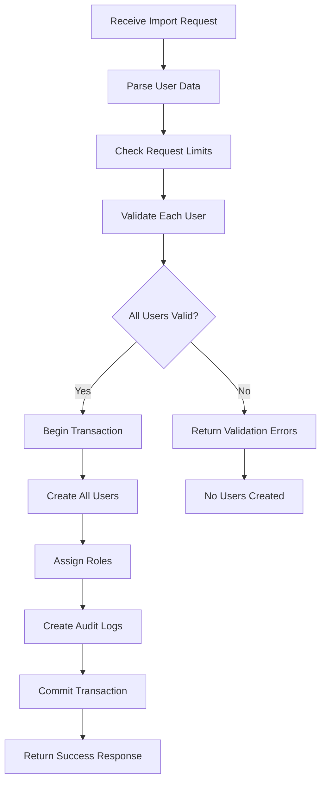

# User Bulk Import API Specification

## API Overview

The User Bulk Import API extends the existing admin user management capabilities to support controlled bulk user creation with all-or-nothing validation. The API validates all users before creating any, ensuring data integrity and consistency.

## Base URL
```
http://localhost:2999/api/admin/users
```

## Authentication
All endpoints require admin authentication using JWT Bearer tokens.

```
Authorization: Bearer <admin_jwt_token>
```

## Core Principle

**All-or-Nothing Approach**: The bulk import API follows a strict validation-first approach:
1. All users are validated before any creation
2. If ANY user fails validation, NO users are created
3. Only when ALL users pass validation are they created in a single transaction
4. This ensures data consistency and prevents partial imports
5. **Student-Only Restriction**: Bulk import is limited to student accounts (userType = 3) only

## Endpoints

### 1. Bulk Import Users
**POST** `/api/admin/users/bulk-import`

Bulk import users with complete validation before creation.

#### Request

**Headers:**
```
Content-Type: application/json
Authorization: Bearer <token>
```

**Body:**
```json
{
  "users": [
    {
      "username": "john_doe",
      "email": "john@example.com",
      "password": "SecurePass123!",
      "firstName": "John",
      "lastName": "Doe",
      "isActive": true,
      "roles": ["student_role_id"]
    },
    {
      "username": "jane_smith",
      "email": "jane@example.com",
      "password": "SecurePass456!",
      "firstName": "Jane",
      "lastName": "Smith",
      "isActive": true,
      "roles": ["student_role_id"]
    }
  ],
  "options": {
    "sendWelcomeEmail": false,
    "requirePasswordChange": false,
    "generatePasswordsIfMissing": true,
    "passwordLength": 12
  }
}
```

#### Validation Rules

Each user in the array must pass the following validation:

| Field | Validation Rules | Error Code |
|-------|-----------------|------------|
| username | Required, 3-50 chars, alphanumeric + underscore, unique in database and within batch | USERNAME_INVALID, USERNAME_DUPLICATE |
| email | Required, valid email format, unique in database and within batch | EMAIL_INVALID, EMAIL_DUPLICATE |
| password | Optional if generatePasswordsIfMissing=true, min 6 chars | PASSWORD_WEAK, PASSWORD_REQUIRED |
| firstName | Optional, 1-50 chars | NAME_INVALID |
| lastName | Optional, 1-50 chars | NAME_INVALID |
| userType | Ignored/Optional, always set to 3 (Student) | USERTYPE_INVALID |
| isActive | Optional, boolean, defaults to true | ACTIVE_INVALID |
| roles | Optional, array of student role IDs only | ROLE_INVALID, ROLE_NOT_STUDENT |

#### Response

**Success (201 Created) - All users created:**
```json
{
  "success": true,
  "businessCode": 0,
  "message": "All users created successfully",
  "data": {
    "created": true,
    "totalUsers": 2,
    "users": [
      {
        "username": "john_doe",
        "userId": "user_123",
        "email": "john@example.com",
        "temporaryPassword": null
      },
      {
        "username": "jane_smith",
        "userId": "user_124",
        "email": "jane@example.com",
        "temporaryPassword": null
      }
    ],
    "processingTime": 1.5
  },
  "timestamp": "2025-01-10T10:00:00Z"
}
```

**Validation Failed (400 Bad Request) - No users created:**
```json
{
  "success": false,
  "businessCode": 4001,
  "message": "Validation failed. No users were created.",
  "data": {
    "created": false,
    "validationErrors": [
      {
        "index": 0,
        "username": "john_doe",
        "errors": [
          {
            "field": "username",
            "code": "USERNAME_DUPLICATE",
            "message": "Username 'john_doe' already exists"
          }
        ]
      },
      {
        "index": 2,
        "username": "invalid_user",
        "errors": [
          {
            "field": "userType",
            "code": "USERTYPE_INVALID",
            "message": "Only students (userType=3) can be bulk imported"
          },
          {
            "field": "roles",
            "code": "ROLE_NOT_STUDENT",
            "message": "Role 'manager_role' is not allowed for student bulk import"
          }
        ]
      }
    ],
    "summary": {
      "totalSubmitted": 3,
      "validUsers": 1,
      "invalidUsers": 2,
      "totalErrors": 3
    }
  },
  "timestamp": "2025-01-10T10:00:00Z"
}
```

### 2. Validate Bulk Import
**POST** `/api/admin/users/bulk-import/validate`

Validate bulk import data without creating users (dry run).

#### Request

Same structure as Bulk Import Users endpoint.

#### Response

**Validation Success (200 OK):**
```json
{
  "success": true,
  "businessCode": 0,
  "message": "All users passed validation",
  "data": {
    "valid": true,
    "totalUsers": 2,
    "validationDetails": [
      {
        "index": 0,
        "username": "john_doe",
        "valid": true,
        "warnings": []
      },
      {
        "index": 1,
        "username": "jane_smith",
        "valid": true,
        "warnings": [
          {
            "field": "password",
            "message": "Password will be auto-generated"
          }
        ]
      }
    ]
  },
  "timestamp": "2025-01-10T10:00:00Z"
}
```

**Validation Failed (200 OK):**
```json
{
  "success": true,
  "businessCode": 0,
  "message": "Validation completed with errors",
  "data": {
    "valid": false,
    "validationErrors": [
      {
        "index": 1,
        "username": "duplicate_user",
        "errors": [
          {
            "field": "email",
            "code": "EMAIL_DUPLICATE",
            "message": "Email already exists in database"
          }
        ]
      }
    ],
    "summary": {
      "totalSubmitted": 3,
      "validUsers": 2,
      "invalidUsers": 1
    }
  },
  "timestamp": "2025-01-10T10:00:00Z"
}
```

## Data Structure

### User Object
```typescript
interface BulkImportUser {
  username: string;           // Required, unique
  email: string;              // Required, unique
  password?: string;          // Optional if generatePasswordsIfMissing is true
  firstName?: string;         // Optional
  lastName?: string;          // Optional
  userType?: 3;              // Optional, ignored (always set to 3 internally)
  isActive?: boolean;         // Optional, default: true
  roles?: string[];          // Optional, array of student role IDs only
}
```

### Options Object
```typescript
interface BulkImportOptions {
  sendWelcomeEmail?: boolean;        // Send welcome emails to new users
  requirePasswordChange?: boolean;    // Force password change on first login
  generatePasswordsIfMissing?: boolean; // Auto-generate passwords if not provided
  passwordLength?: number;            // Length of generated passwords (8-32)
}
```

## Error Codes

| Code | Description | HTTP Status |
|------|-------------|-------------|
| 4001 | Validation failed | 400 |
| 4002 | Username duplicate | 400 |
| 4003 | Email duplicate | 400 |
| 4004 | Invalid user type (not student) | 400 |
| 4005 | Invalid role (not student role) | 400 |
| 4006 | Password too weak | 400 |
| 4007 | Missing required field | 400 |
| 4008 | Too many users in single request | 400 |
| 4009 | Invalid email format | 400 |
| 4010 | Invalid username format | 400 |
| 5001 | Database error | 500 |
| 5002 | Transaction failed | 500 |

## Limits

- Maximum users per request: 300
- Maximum request size: 10MB
- Rate limit: 10 requests per minute per admin

## Transaction Handling

The bulk import uses database transactions to ensure atomicity:

```sql
BEGIN TRANSACTION;
-- Validate all users
-- Check for duplicates
-- If all valid:
  -- Insert all users with creator field set to adminId
  -- Create UserRole entries for role assignments
  -- Create AdminOperationLog entries for audit trail
  COMMIT;
-- If any invalid:
  ROLLBACK;
```

### Database Operations

1. **User Creation**: Each user is created with the `creator` field linking to the admin who performed the import
2. **Role Assignment**: UserRole junction table entries are created for each role
3. **Audit Logging**: AdminOperationLog entries track each user creation with metadata

## Validation Process



## Best Practices

1. **Batch Size**: Keep batches under 200 users for optimal performance
2. **Validation First**: Always use the validate endpoint before actual import
3. **Error Handling**: Check validation errors carefully before retry
4. **Unique Constraints**: Ensure usernames and emails are unique within the batch
5. **Password Security**: Use strong passwords or enable auto-generation
6. **Audit Trail**: All bulk operations are logged for security compliance
7. **Timeout Handling**: Set appropriate client timeouts (30s recommended)
8. **Retry Strategy**: Implement exponential backoff for failed requests

## Example Implementation

### TypeScript/JavaScript
```typescript
async function bulkImportUsers(users: BulkImportUser[], options?: BulkImportOptions) {
  // First validate
  const validationResponse = await fetch('/api/admin/users/bulk-import/validate', {
    method: 'POST',
    headers: {
      'Content-Type': 'application/json',
      'Authorization': `Bearer ${token}`
    },
    body: JSON.stringify({ users, options })
  });

  const validation = await validationResponse.json();

  if (!validation.data.valid) {
    console.error('Validation failed:', validation.data.validationErrors);
    return false;
  }

  // If valid, proceed with import
  const importResponse = await fetch('/api/admin/users/bulk-import', {
    method: 'POST',
    headers: {
      'Content-Type': 'application/json',
      'Authorization': `Bearer ${token}`
    },
    body: JSON.stringify({ users, options })
  });

  const result = await importResponse.json();

  if (result.success) {
    console.log(`Successfully created ${result.data.totalUsers} users`);
    return true;
  } else {
    console.error('Import failed:', result.message);
    return false;
  }
}
```

## Security Considerations

1. **Authentication**: Admin JWT token required
2. **Authorization**: Admin must have user management permissions
3. **Rate Limiting**: Prevents abuse and DoS attacks
4. **Input Validation**: Comprehensive validation before database operations
5. **SQL Injection Prevention**: Parameterized queries only
6. **Audit Logging**: All operations logged with admin ID and timestamp
7. **Password Security**: Passwords hashed with bcrypt before storage
8. **Transaction Isolation**: SERIALIZABLE isolation level for consistency